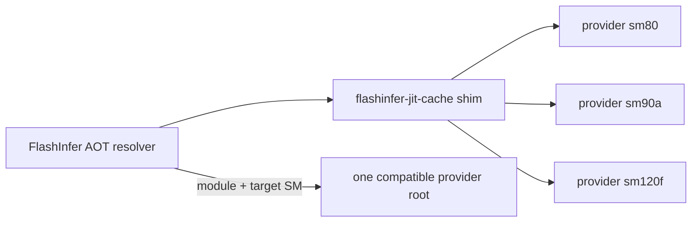

# JIT Cache Provider Wheels

## Status

This document describes an experimental replacement for the monolithic
`flashinfer-jit-cache` wheel. The runtime discovery contract and a single-arch
provider build prototype are implemented, but release workflows still build the
legacy wheel by default. The provider inventory must be validated on the fork
before this becomes the release format.

## Problem

The current wheel puts every generated AOT shared library in one distribution.
Adding a CUDA architecture adds code to many of those libraries, so the wheel
continues to grow and is already close to release-asset limits. A local-version
split such as `flashinfer-jit-cache+cu130.sm90` does not solve installation:
those artifacts are versions of the same distribution, and pip can install only
one of them at a time.

The published jit-cache wheels contain host code plus architecture-specific
SASS cubins. They do not contain PTX, so an sm80 cubin cannot provide a
forward-compatible fallback for a later GPU architecture.

The new layout must support both of these workflows:

- A normal installation gets every provider published for its CUDA and CPU
  platform.
- A size-sensitive installation gets only the provider for the target GPU, or
  an explicitly selected set of GPU architectures.

## Package Model

`flashinfer-jit-cache` becomes a small shim. For a CUDA 13.0 build, its version
remains aligned with FlashInfer, for example `0.6.16+cu130`, and its dependency
metadata names all providers built in that release.

Each binary wheel has a distinct distribution name and can therefore coexist:

| Distribution | Python package | Declared target |
| --- | --- | --- |
| `flashinfer-jit-cache-sm80` | `flashinfer_jit_cache.providers.sm80` | `sm80` |
| `flashinfer-jit-cache-sm90a` | `flashinfer_jit_cache.providers.sm90a` | `sm90a` |
| `flashinfer-jit-cache-sm120f` | `flashinfer_jit_cache.providers.sm120f` | `sm120f` |

CUDA compatibility remains in the version, and CPU compatibility remains in
the wheel platform tag. For example, an x86 CUDA 13 provider is
`flashinfer_jit_cache_sm120f-0.6.16+cu130-...-manylinux_2_28_x86_64.whl`.



Provider wheels register the `flashinfer.jit_cache.providers` entry-point group.
The entry point returns a generated manifest with this schema:

```json
{
  "schema_version": 1,
  "provider_id": "sm120f",
  "distribution": "flashinfer-jit-cache-sm120f",
  "version": "0.6.16+cu130",
  "cuda_architectures": ["sm120f"],
  "modules": ["module_name_1", "module_name_2"]
}
```

The module list is generated from the packaged files, rather than maintained by
hand. Runtime accepts a provider only when its FlashInfer version matches, its
manifest contains the requested module, and its architecture set covers every
target in the active compilation context. If no provider matches, normal JIT
compilation remains the fallback. The legacy monolithic directory is checked
first while both formats are supported.

## Installation Modes

The normal mode installs the shim with dependencies enabled:

```bash
flashinfer install-jit-cache-wheel
```

This leaves provider selection to the shim's static `Requires-Dist` metadata.
Pip does not detect GPUs and should not be asked to make a hardware-dependent
resolution decision.

Minimal mode installs the shim and selected providers in one no-dependencies
transaction:

```bash
flashinfer install-jit-cache-wheel --mode minimal
flashinfer install-jit-cache-wheel --mode minimal --sm sm120f
```

Without `--sm`, the CLI uses the visible CUDA devices. `--sm` may be repeated
when preparing an image on a different machine. The current prototype provider
is self-contained for one target. Minimal mode installs exactly the detected or
requested providers and never adds an implicit sm80 baseline.

## SM80 Is Not a Baseline Provider

FlashInfer's NVCC flags emit SASS targets such as `code=sm_80`; they do not emit
a PTX fallback such as `code=compute_80`. NVIDIA documents cubin compatibility
within a GPU architecture family, while PTX is the forward-compatible
representation. An sm80 cubin therefore cannot run on Hopper or Blackwell.

Artifact inspection confirms that this is also true of the published wheels,
not just the current source flags. Every CUDA-bearing `.so` in the complete
v0.4.0 cu128, cu129, and cu130 matrix for both x86_64 and AArch64 contained SASS
and no PTX. A complete scan of the v0.6.16.post1 cu130 AArch64 wheel also found
no PTX. The standalone `flashinfer-jit-cache` package has therefore never
provided the proposed compute_80 PTX fallback in the audited release range.

The sm80 provider remains useful for systems that actually contain Ampere GPUs.
It is an independent provider, not a dependency of sm90, sm100, sm120, or sm121
providers. Shim dependency lists are literal: sm80 is installed only when the
published all-provider set or an explicit user selection includes it.

The existing `sm80` capability in `flashinfer/aot.py` is a source and module
enumeration condition: it selects kernels whose implementation requires the
Ampere `cp.async` baseline. It does not establish binary portability. Adding
`8.0` to a Blackwell build can change which module names are generated, but it
does not make those modules usable on Blackwell, and it can conceal missing AOT
registration conditions.

For this design, use these terms precisely:

- **Common module**: a module name used by several runtime architectures.
- **Architecture module**: a module name selected only by architecture-specific
  dispatch.
- **Provider coverage**: the SASS or PTX targets actually present in every
  `.so` in a provider.

The initial provider build compiles the common and architecture modules together
for one target. This duplicates common modules across the complete provider set,
but it gives minimal installations correct native binaries and makes each wheel
small enough to publish independently. A later common-module split would be a
size optimization only. It is not needed for compatibility and should be added
only if inventory data shows that it materially reduces total size.

The first SM121 experiment found 652 SM121a-only modules, one host-only module,
and four SM90a-only FA3 attention-sink modules in a 657-module provider. The
foreign modules were 6.1 MB compressed out of a 250.2 MB compressed shared-object
payload. They came from unconditional FA3 registration, not from a reusable
binary base, and are now omitted unless the AOT target includes SM90. This is an
example of an AOT inventory bug that a provider-wide architecture label alone
would conceal.

Relevant CUDA compatibility references:

- [CUDA C Programming Guide: Binary Compatibility](https://docs.nvidia.com/cuda/cuda-c-programming-guide/index.html#binary-compatibility)
- [Blackwell Compatibility Guide](https://docs.nvidia.com/cuda/blackwell-compatibility-guide/index.html)

## Prototype Builds

The existing project remains a legacy monolithic build unless explicitly put in
shim mode. This keeps release jobs unchanged during fork testing.

Build one provider from `flashinfer-jit-cache-provider`:

```bash
FLASHINFER_JIT_CACHE_PROVIDER_ARCH=12.0f \
FLASHINFER_LOCAL_VERSION=cu130 \
python -m build --wheel flashinfer-jit-cache-provider
```

Build a shim whose default dependencies include the tested provider set:

```bash
# sm80 is an independent provider in this explicit all-provider set.
FLASHINFER_JIT_CACHE_WHEEL_KIND=shim \
FLASHINFER_JIT_CACHE_PROVIDER_ARCHS="8.0 9.0a 12.0f" \
FLASHINFER_LOCAL_VERSION=cu130 \
python -m build --wheel flashinfer-jit-cache
```

The provider backend forces `FLASHINFER_CUDA_ARCH_LIST` to exactly one declared
target, compiles the AOT inventory, and generates the manifest from the copied
libraries. Shim requirements exactly pin every provider to the shim version.

### One-off SM121 wheelhouse

On an AArch64 Docker host, the experiment can be built with:

```bash
scripts/build_jit_cache_provider_wheelhouse.sh
```

The wrapper defaults to the CUDA 13.0 PyTorch manylinux AArch64 builder, target
`12.1a`, local version `cu130`, one NVCC thread, and at most four concurrent
jobs. It builds these aligned-version artifacts under `dist/`:

- `flashinfer-python`
- `flashinfer-jit-cache-sm121a`
- `flashinfer-jit-cache`, with an exact dependency on the SM121 provider only

Set `OUTPUT_DIR`, `FLASHINFER_DEV_RELEASE_SUFFIX`, or
`FLASHINFER_JIT_CACHE_PROVIDER_ARCH` to override the one-off defaults. Existing
output is retained unless `CLEAN_OUTPUT=1` is explicit.

The build does not require a GPU. Its final validation checks distribution and
version metadata, the shim's exact provider pin, provider entry-point discovery,
manifest/module parity, and `cuobjdump --list-elf` output for every shared
library. It writes `wheelhouse.json` with sizes, hashes, the module inventory,
and observed per-module CUDA targets, plus a conventional `SHA256SUMS` file.
Strict CUDA target validation is the default; set
`CUDA_ARCHITECTURE_POLICY=report` only when inventorying a known mixed-target
prototype. After installing the resulting wheels on the target system, run the
JIT-disabled GPU gate with:

```bash
FLASHINFER_DISABLE_JIT=1 \
python scripts/smoke_test_jit_cache_provider.py --provider sm121a
```

The initial DGX Spark build produced a 250,767,917-byte provider wheel containing
657 modules (487,366,496 bytes uncompressed), a 16,105,950-byte
`flashinfer-python` wheel, and a 4,349-byte shim. The build generated 3,404 Ninja
steps with seven concurrent jobs. The installed provider resolved and launched
`silu_and_mul` on an SM121 GB10 with JIT disabled.

## Validation Gates

Before changing release workflows or making shim mode the default:

1. Build each CUDA and CPU matrix entry on the fork and record compressed size,
   uncompressed size, module count, and build time per provider.
2. Use `cuobjdump --list-elf` and `cuobjdump --list-ptx` on every packaged `.so`.
   Compare actual cubin targets with the provider manifest and require native
   providers to contain no PTX.
3. Compare module inventories from one-target builds with the current multi-arch
   build. Any module that appears only when `8.0` is added needs its AOT
   registration condition corrected or an explicit support decision.
4. Install only the target provider and run with `FLASHINFER_DISABLE_JIT=1` on
   representative sm80, sm90a, sm100a, sm120f, and sm121a systems.
5. Install the default shim with every provider and repeat the tests to verify
   deterministic architecture selection.
6. Test a process with heterogeneous visible GPUs. Until a provider contains
   all required targets, it should miss AOT cleanly and fall back to JIT.
7. Update release and nightly matrices, wheel-index parsing, documentation, and
   stale-provider uninstall behavior only after the inventories pass.

## Open Decisions

- Whether provider granularity should remain exact SM targets or combine targets
  only when every `.so` contains compatible code for the combined set.
- Whether a measured common module set warrants separate common-module
  providers as a size optimization.
- Whether provider manifests should include hashes and per-module code targets,
  rather than the provider-wide target list used by the prototype.
- How long to retain legacy monolithic wheel production after the shim becomes
  the default.
