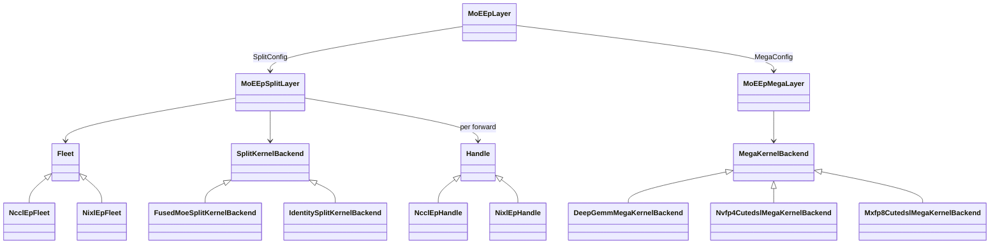
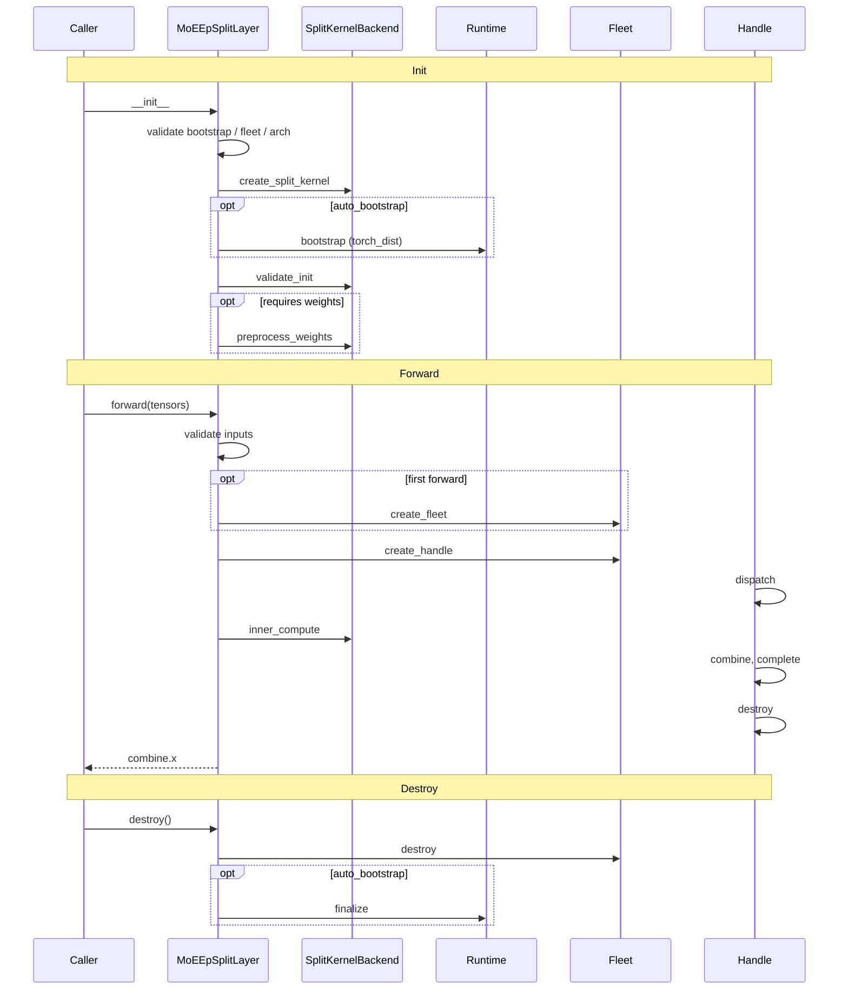
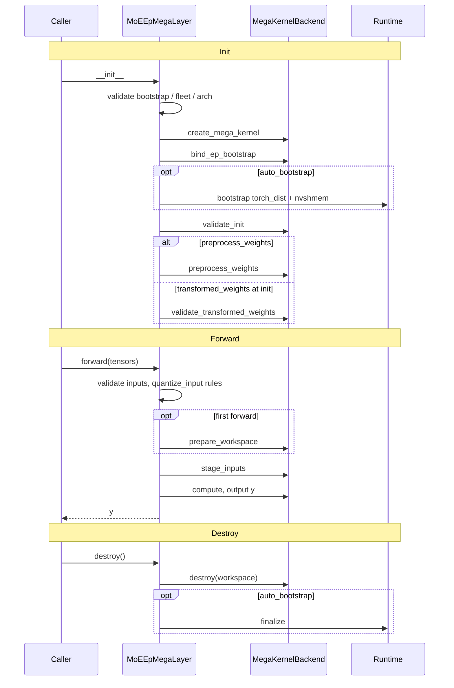

# moe_ep Design

> For build/test/how-to-extend instructions, see the
> [moe_ep runbook](./moe_ep_runbook.md).

Expert-Parallel MoE with two execution modes:

| Mode | Flow | When to use |
|------|------|-------------|
| **Split** | dispatch → inner kernel → combine | Pluggable comm + compute; NCCL-EP / NIXL-EP transport |
| **Mega** | fused comm + MoE kernel | Single symmetric-memory kernel; no separate Fleet/Handle |

Entry point: `MoEEpLayer(bootstrap, fleet_params, weights, fleet_knobs=(), backend=...)` → `MoEEpSplitLayer` or `MoEEpMegaLayer`.

## Layout

```
moe_ep/
  config.py, tensors.py, weights.py, layer.py, algo_knobs.py, errors.py
  core/comm, core/kernel, core/runtime, core/validation, core/bootstrap_utils.py
  backends/split/comm/{nccl_ep,nixl_ep}
  backends/split/kernel/{identity,fused_moe}
  backends/mega/kernel/{deep_gemm_mega,nvfp4_cutedsl,mxfp8_cutedsl,…}
  modes/{split_layer,mega_layer,config}.py
```

Kernels register via `@register_split_kernel` / `@register_mega_kernel` when `backends` is imported; comm fleets register when their `fleet.py` is imported from `__init__.py`.

## Core types

| Type | Role |
|------|------|
| `BootstrapConfig` | `world_size`, `rank`, `stream`, `nccl_comm`, `tcp_store`, optional `process_group` (EP comm; defaults to WORLD), `auto_bootstrap=True` |
| `FleetParams` | EP sizing only (no weights); split transport fields (`algorithm`, `layout`, `dtype_bytes`) default and are ignored by mega |
| `MoEEpTensors` | `hidden_states`, `topk_ids`, `topk_weights`; optional `scales`, `fc1_alpha`, `fc2_alpha`, `fc1_norm_const`, `recv_count`, `num_tokens_per_expert` |
| `MoEWeightPack` | Canonical `w13` / `w2` (+ optional `w13_scale` / `w2_scale`); required `weights` arg at layer construction; `dummy_moe_weights()` for comm-only split |
| `SplitConfig` | `comm` + `kernel` slots (default `NcclEpConfig` + `IdentityConfig`) |
| `MegaConfig` | `megakernel`, `quantize_input`, `preprocess_weights`, optional `transformed_weights` |

**Split:** pass `SplitConfig(comm=..., kernel=...)` or a comm string/config (kernel defaults to `IdentityConfig`). `fleet_knobs` tune transport. Fleet is lazy-created on first `forward()`; a new Handle per forward. `MoEEpSplitLayer.enable_timing` optionally records per-stage GPU ms in `last_timings_ms`.

**Split compute:** the `fused_moe` kernel bridges the 3D EP dispatch buffer to `flashinfer.fused_moe` (a token-major `MoEActivationPack`) via `backends/split/kernel/fused_moe/bridge.py`:

- LL **EXPERT_MAJOR** — `[num_local_experts, cap, hidden]` (`cap = max_tokens_per_rank * world`), each row pre-assigned to one expert; the bridge synthesizes `top_k=1` / `final_scales=1` and **combine owns the real top-k reweight**.
- LL **RANK_MAJOR** / **HT FLAT** — `[world, max_tokens_per_rank, hidden]` carrying received `topk_idx` / `topk_weights`; the runner uses the real `top_k` with non-local picks masked to weight 0, and combine just sums across ranks.

Both bf16 and NVFP4 are supported in the compute path (`MoEConfig.quant.variant`); NVFP4 activations are quantized in the bridge (linear SF layout). Correctness is currently validated for bf16 only (see **Tests**).

**Mega:** pass `MegaConfig(megakernel=...)`. Weights required as the layer's `weights` argument. Workspace allocated on first forward. Output is bf16 `[num_tokens, token_hidden_size]` where `num_tokens = MoEEpTensors.num_tokens` (may be `< max_tokens_per_rank`). `fleet_knobs` are ignored. NIXL-EP split layers require `BootstrapConfig.tcp_store` at init.

## Architecture



## Built-in plugins

| Kind | Name | Config |
|------|------|--------|
| Comm | `nccl_ep` | `NcclEpConfig` (`NCCLEPConfig` alias) |
| Comm | `nixl_ep` | `NvepConfig` (needs `tcp_store`) |
| Split kernel | `identity` | `IdentityConfig` — comm-only; `dummy_moe_weights` OK |
| Split kernel | `fused_moe` | `FusedMoeKernelConfig(moe_config=...)` — bridges to `flashinfer.fused_moe`; bf16 + NVFP4; LL EXPERT_MAJOR / RANK_MAJOR / HT FLAT |
| Mega kernel | `deep_gemm_mega` | `DeepGemmMegaMoeConfig` — FP8/FP4, sm_100+ |
| Mega kernel | `nvfp4_cutedsl` | `Nvfp4CutedslMegaMoeConfig` — NVFP4, sm_100+ |
| Mega kernel | `mxfp8_cutedsl` | `Mxfp8CutedslMegaMoeConfig` — MXFP8 (`kind` e4m3/e5m2), sm_100+ |

**Mega weights:** with `preprocess_weights=True` (default), canonical bf16 or pre-quantized `MoEWeightPack` is transformed at init. With `preprocess_weights=False`, supply `MegaConfig.transformed_weights` (from `preprocess_*_mega_weights`).

**Mega activations:** with `quantize_input=True` (default), bf16 `[T, hidden]` is quantized into symm workspace at forward. Non-bf16 with `quantize_input=True` raises `MoEEpConfigError`; use `quantize_input=False` and pre-quantized activations plus `MoEEpTensors.scales`.

## Runtime

Both paths call `ensure_moe_ep_cuda_device()` at init. With `auto_bootstrap=True` (default), layers acquire a ref-counted process runtime and release it in `destroy()`.

| Requirement | Used by |
|-------------|---------|
| `torch_dist` | split comm, all mega kernels |
| `nvshmem` | `nvfp4_cutedsl`, `mxfp8_cutedsl` (skip with `MEGA_NO_DIST=1`) |

**Host framework bootstrap (e.g. vLLM):** when the host already initialized `torch.distributed` and EP uses a subgroup, pass `BootstrapConfig(process_group=ep_group, world_size=ep_size, rank=ep_rank, auto_bootstrap=False)` and call `bootstrap_moe_ep_runtime(bootstrap, reqs)` once per worker after dist init. Mega kernels resolve comm via `bootstrap_comm_group` / `bootstrap_ep_rank_world` (`MegaKernelBackend.bind_ep_bootstrap`).

When `auto_bootstrap=False`: dist must be up at layer construction if `process_group` is set; rank/world cross-checks run at init or first `forward()`; call `bootstrap_moe_ep_runtime` yourself.

## Build / availability

Split comm backends ship native libs under `backends/split/comm/*/_libs/`. Probe with `have_nccl_ep()`, `have_nixl_ep()`, `available_backends()`. Missing libs raise `MoEEpNotBuiltError`.

**Recommended build:** `docker/install/build_flashinfer_ep_pytorch.sh` builds the full NCCL-EP + Mega environment inside the NVIDIA PyTorch base image (`nvcr.io/nvidia/pytorch`): it pins the NCCL-EP runtime wheels (`nvidia-nccl-cu13`, `nccl4py`, `cuda-core`, `cuda-bindings`), installs the mega deps (DeepGEMM, NVSHMEM, CUTLASS DSL), then runs `BUILD_NIXL_EP=0 pip install --no-build-isolation -e .`. The EP backends are ON by default: NCCL-EP needs no build step (`nccl4py>=0.3.1` is a base dependency), and the NIXL-EP meson build runs best-effort unless opted out with `BUILD_NIXL_EP=0` (set `BUILD_NIXL_EP=1` to make missing build deps a hard error; `BUILD_NVEP=0` turns both backends off).

## Lifetimes

| Object | Created | Destroyed |
|--------|---------|-----------|
| Kernel backend | layer init | layer destroy |
| Process runtime | layer init (if `auto_bootstrap`) | layer destroy (ref-counted) |
| Fleet | first split forward | layer destroy |
| Handle | each split forward | end of forward |
| Mega workspace | first mega forward | layer destroy |

## Usage

```python
from flashinfer.moe_ep import (
    MoEEpLayer, BootstrapConfig, FleetParams, MoEEpTensors,
    MoEWeightPack, SplitConfig, NcclEpConfig, FusedMoeKernelConfig,
    MegaConfig, DeepGemmMegaMoeConfig,
)

# Split: NCCL-EP + fused MoE
layer = MoEEpLayer(
    bootstrap=BootstrapConfig(world_size=4, rank=rank),
    fleet_params=FleetParams(num_experts=32, max_tokens_per_rank=256,
        token_hidden_size=2048),
    weights=MoEWeightPack(w13=..., w2=...),
    backend=SplitConfig(comm=NcclEpConfig(),
        kernel=FusedMoeKernelConfig(moe_config=moe_config)),
)
out = layer.forward(MoEEpTensors(hidden_states=..., topk_ids=..., topk_weights=...))

# Mega: wrap megakernel config in MegaConfig
layer = MoEEpLayer(..., backend=MegaConfig(
    megakernel=DeepGemmMegaMoeConfig(intermediate_size=1024, top_k=4)))
out = layer.forward(MoEEpTensors(...))
layer.destroy()
```

Raw megakernel or split-kernel configs cannot be passed as `backend=`; wrap in `MegaConfig` / `SplitConfig`.

## Extending

See the [runbook's mega-kernel walkthrough](./moe_ep_runbook.md#adding-a-new-mega-kernel-backend) for a step-by-step example (frontend contract, config, registration).

1. **Split kernel** — `backends/split/kernel/<name>/`: subclass `SplitKernelBackend`, `@register_split_kernel`, import in `backends/split/kernel/__init__.py`.
2. **Mega kernel** — `backends/mega/kernel/<name>/`: subclass `MegaKernelBackend`, implement `compute` / `_allocate_workspace` / `stage_inputs`, override `runtime_requirements()` if needed, `@register_mega_kernel`, import in `backends/mega/kernel/__init__.py`.
3. **Comm backend** (split only) — `backends/split/comm/<name>/` with `config.py`, `fleet.py`, `handle.py`; import fleet from `moe_ep.__init__.py`.

## Tests

See the [runbook's build & test section](./moe_ep_runbook.md#build--test-environment) for the container setup and per-target requirements.

`tests/moe_ep/run_tests.sh [unit|multirank|split_path_correctness_bf16|mega|smoke|all]`:

- **unit** — host-only pytest (mocks + single-GPU; no multirank)
- **multirank** — 4-GPU split path: `test_moe_ep_layer_multirank.py` + `test_split_kernels.py` over NCCL-EP (and NIXL-EP when built)
- **split_path_correctness_bf16** — 4-GPU bf16 split-path numerics (LL EXPERT_MAJOR + RANK_MAJOR) vs a single-process `MoELayer` reference (Blackwell)
- **mega** — 4-GPU DeepGEMM + NVFP4 + MXFP8 mega parity, plus a single-rank MXFP8 preprocess-vs-reference check (`MEGA_NO_DIST=1`) (Blackwell, sm_100+)
- **smoke** — NCCL-EP smoke script (and NIXL-EP when built)

Split-path numerics are **bf16-only for now** (the `split_path_correctness_bf16` target above). An HT FLAT test (`test_moe_ep_ht_correctness.py`, bf16) and an NVFP4 split test (`test_moe_ep_compute_correctness_nvfp4.py`) exist in the tree but are not yet wired into a target / enabled.

Multirank/smoke/correctness need the NCCL-EP build (see **Build / availability** — `docker/install/build_flashinfer_ep_pytorch.sh`); mega additionally needs Blackwell, deep_gemm, triton.

## Forward flow

### Split



### Mega


