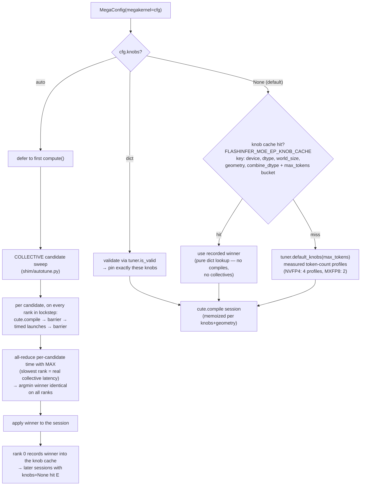
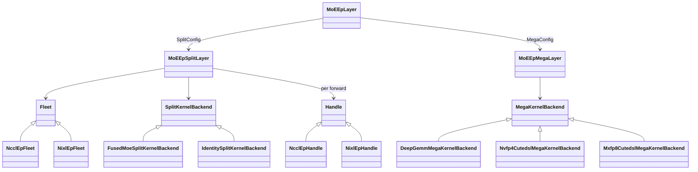
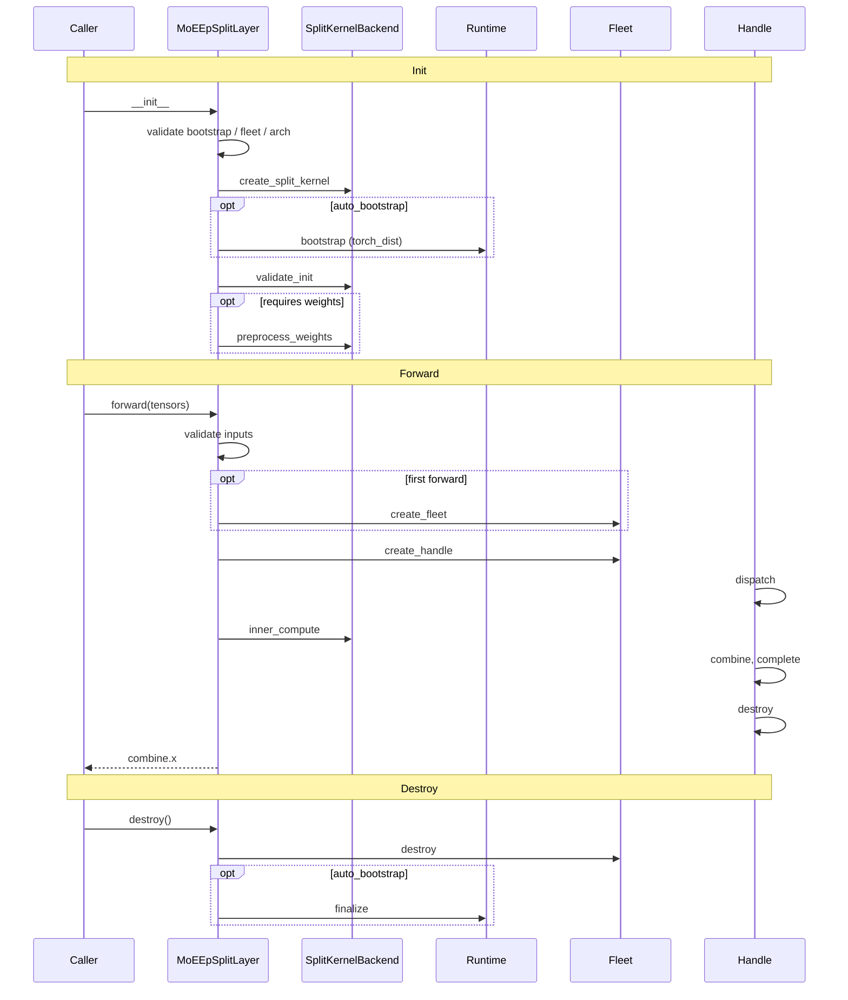
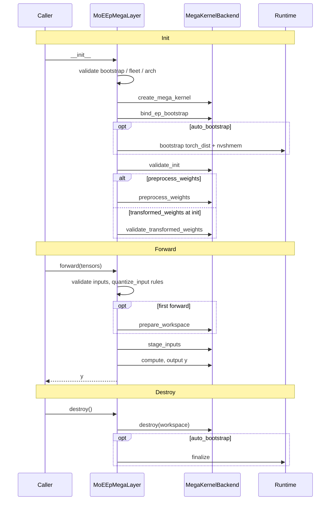

# moe_ep Design

> For build/test/how-to-extend instructions, see the
> [moe_ep runbook](./moe_ep_runbook.md).
> For the CuTeDSL mega backends' tuning surface, measured performance, and
> benchmark methodology, see
> [kernel_src/cutedsl_megamoe/TUNING.md](../../flashinfer/moe_ep/kernel_src/cutedsl_megamoe/TUNING.md).

Expert-Parallel MoE with two execution modes:

| Mode | Flow | When to use |
|------|------|-------------|
| **Split** | dispatch → inner kernel → combine | Pluggable comm + compute; NCCL-EP / NIXL-EP transport |
| **Mega** | fused comm + MoE kernel | Single symmetric-memory kernel; no separate Fleet/Handle |

Entry point: `MoEEpLayer(bootstrap, fleet_params, weights, fleet_knobs=(), backend=...)` → `MoEEpSplitLayer` or `MoEEpMegaLayer`.

## Available backends

Backends resolve by name from the config object's `kernel_name` /
`backend_name` field (three registries: mega kernels, split kernels, split
comm fleets; deprecated aliases still resolve but warn).

### Mega (fused comm + MoE kernel)

Selected via `MegaConfig(megakernel=<config>)`. One symmetric-memory kernel
owns dispatch, expert compute, and combine; output is always BF16
`[num_tokens, hidden]`.

| Backend (alias) | Activation | Weight | Output | Arch | Tuning |
|---|---|---|---|---|---|
| `sm100_nvfp4_nvfp4_bf16_cutedsl` (`nvfp4_cutedsl`) | NVFP4 (block-16) | NVFP4 (block-16) | BF16 | SM100 family | `knobs=None` → token-count heuristic; `knobs=dict` → pinned; `knobs="auto"` → collective compile+time sweep at first forward (never in serving); winners cacheable via `FLASHINFER_MOE_EP_KNOB_CACHE` |
| `sm100_mxfp8_mxfp8_bf16_cutedsl` (`mxfp8_cutedsl`) | MXFP8 (block-32 UE8M0) | MXFP8 (block-32 UE8M0) | BF16 | SM100 family | same `knobs` surface as the NVFP4 backend |
| `sm100_fp8_fp4_bf16_deepgemm` (`deep_gemm_mega`) | FP8 (E4M3, block-32 UE8M0) | FP4 (int8-packed, block-32) | BF16 | SM100 family | — (DeepGEMM selects its own JIT configs internally) |
| `sm90_fp8_fp8_bf16_pull_cutedsl` (`sm90_pull_fp8`) | FP8 (E4M3/E5M2; per-tensor or DeepGEMM-style blockwise scales) | FP8 (same `fp8_scale_mode`) | BF16 | SM90 exactly | explicit geometry knobs on the config (`swap_ab`, `mma_tiler_mnk`); no tuner/knob-cache yet |
| `sm90_fp8_fp8_bf16_push_cuda` (`sm90_push_fp8`) | FP8 (E4M3) | FP8 (E4M3) | BF16 | SM90 | — (static dimensions/protocol choices only) |

The SM90 pull-style CuTeDSL tree is process-exclusive with the SM100 CuTeDSL
tree (module names collide). Weight inputs are canonical BF16 `MoEWeightPack`
by default (the backend quantizes at `preprocess_weights`); kernel-ready
pre-quantized weights can be supplied instead.

### Split (dispatch → inner kernel → combine)

Composed via `SplitConfig(comm=..., kernel=...)`; any comm backend pairs with
any kernel backend. The comm layer moves tokens (BF16 unless the kernel
backend packs them); the kernel backend computes on this rank's expert shard.

#### Comm backends (dispatch/combine transports)

| Backend | Config | Transport | Modes | Constraints |
|---|---|---|---|---|
| `nccl_ep` | `NcclEpConfig` | NCCL (nccl4py wheel) | LL `EXPERT_MAJOR` / `RANK_MAJOR`, HT `FLAT` | LL device kernel whitelists per-token row widths and caps top-k at 8 — see the runbook's "NCCL-EP low-latency device-kernel limits" |
| `nixl_ep` | `NvepConfig` | NIXL over UCX device API (GPU-initiated RDMA) | LL `EXPERT_MAJOR` only | needs `BUILD_NIXL_EP=1` (UCX v1.21+ device headers) and `BootstrapConfig.tcp_store`; `max_tokens_per_rank ≤ 1024`; hidden ∈ {2048, 2560, 3072, 4096, 5120, 6144, 7168, 8192}; handles top-k > 8 |

#### Kernel backends (post-dispatch inner compute)

| Backend | Activation | Weight | Output | Arch | Tuning |
|---|---|---|---|---|---|
| `identity` (`IdentityConfig`) | passthrough | none | dispatch tensor unchanged | any | — |
| `fused_moe` (`FusedMoeKernelConfig`) with `TrtllmBf16Config` | BF16 | BF16 | BF16 | SM100 family | inner `MoELayer` AutoTuner: per-runner tactic search + cross-backend winner per token bucket, up to `ExecutionConfig.tune_max_num_tokens` |
| `fused_moe` with `TrtllmFp4Config` | NVFP4 (block-16, quantized post-dispatch in the bridge) | NVFP4 (block-16) | BF16 | SM100/SM103/SM107 | same `MoELayer` AutoTuner |
| `fused_moe` with `CuteDslConfig` | NVFP4 (W4A4), MXFP8 (W4A8), or BF16 (W4A16); W4A8 may use pre-dispatch packed payloads with `mxfp8_dispatch=True` | NVFP4/MXFP4 | BF16 | SM100/SM103 (W4A4/W4A16 also SM107) | same `MoELayer` AutoTuner |

`fused_moe` accepts exactly one backend candidate per `MoEConfig` (weight
views are prepared for the first match only). The W4A8 split kernel requires
hidden and intermediate sizes to be multiples of 128.

## How tuning works

Two independent tuning systems, matching the two execution modes:

- **Split** kernels tune through the generic FlashInfer `AutoTuner`: each
  `fused_moe` runner enumerates kernel *tactics*, the tuner times them per
  token bucket (up to `ExecutionConfig.tune_max_num_tokens`), and `MoELayer`
  additionally picks a cross-backend winner per bucket. Nothing moe_ep-specific
  — see the fused_moe docs.
- **Mega** CuTeDSL kernels tune through the moe_ep-owned **knob** system
  described below. The knob space is larger than a tactic id (tile, cluster,
  warp-role, and scheduling choices that must be fixed at `cute.compile` time)
  and every measurement is a **collective** — the fused kernel spans all EP
  ranks, so candidates must compile and launch in lockstep on every rank.

### Knob resolution (mega CuTeDSL)

`Sm100_*_Cutedsl_MegaMoeConfig.knobs` accepts three values; resolution happens
when the symmetric-memory session is created (and, for `"auto"`, at the first
`compute()`):


```mermaid
flowchart TD
    A["MegaConfig(megakernel=cfg)"] --> B{"cfg.knobs?"}
    B -- "dict" --> C["validate via tuner.is_valid<br/>→ pin exactly these knobs"]
    B -- "None (default)" --> D{"knob cache hit?<br/>FLASHINFER_MOE_EP_KNOB_CACHE<br/>key: device, dtype, world_size,<br/>geometry, combine_dtype + max_tokens bucket"}
    D -- "hit" --> E["use recorded winner<br/>(pure dict lookup — no compiles,<br/>no collectives)"]
    D -- "miss" --> F["tuner.default_knobs(max_tokens)<br/>measured token-count profiles<br/>(NVFP4: 4 profiles, MXFP8: 2)"]
    B -- "auto" --> G["defer to first compute()"]
    G --> H["COLLECTIVE candidate sweep<br/>(shim/autotune.py)"]
    H --> I["per candidate, on every rank in lockstep:<br/>cute.compile → barrier →<br/>timed launches → barrier"]
    I --> J["all-reduce per-candidate time with MAX<br/>(slowest rank = real collective latency)<br/>→ argmin winner identical on all ranks"]
    J --> K["apply winner to the session"]
    K --> L["rank 0 records winner into the knob cache<br/>→ later sessions with knobs=None hit E"]
    C --> M["cute.compile session<br/>(memoized per knobs+geometry)"]
    E --> M
    F --> M
```

The knobs split into two classes (`kernel_src/cutedsl_megamoe/shim/tuner.py`):

- **correctness knobs** change a code path or the output and must be kept at
  the validated value: `mma_tiler_mnk`, `cluster_shape_mnk`,
  `token_back_mode`, `load_balance_mode`, `non_ubulk_fc2_store`, and
  `in_kernel_fc2_reduce` (ikr — makes the accumulation order
  nondeterministic; pin `False` for bit-reproducibility);
- **perf knobs** are output-neutral and free to sweep: `group_hint`,
  `flag_batch`, `epi_flag_batch`.

A validity predicate (`tuner.is_valid`) mirrors the kernel team's
`inference_solver.filter_invalid` rules, so sweeps only enumerate
compilable combinations.

### Detailed example: `sm100_nvfp4_nvfp4_bf16_cutedsl`

**1. Default (`knobs=None`).** The session resolves the knob cache first;
on a miss it falls back to four measured token-count profiles keyed on the
compile-time buffer capacity (`max_tokens_per_rank * world`):

| bucket | profile |
|---|---|
| < 512 | small-batch latency: 128-wide N tile, `token_back_mode="epi_warps"` |
| 512–1023 | mid: `reuse_dispatch_warps` |
| 1024–2047 | mid-large: 256-wide N tile, `standalone_warps` |
| ≥ 2048 | large throughput: `flag_batch=8`, `reuse_dispatch_warps` |

**2. Pinned (`knobs=dict`).** E.g. a winner from the kernel team's tester
sweep:

```python
Sm100_Nvfp4_Nvfp4_Bf16_Cutedsl_MegaMoeConfig(
    intermediate_size=2048, top_k=8,
    knobs={"mma_tiler_mnk": (256, 128, 256), "cluster_shape_mnk": (2, 1, 1),
           "token_back_mode": "reuse_dispatch_warps", "flag_batch": 8,
           "group_hint": 512, "epi_flag_batch": (2, 4),
           "load_balance_mode": "atomic_counter",
           "in_kernel_fc2_reduce": False},
)
```

**3. Online (`knobs="auto"`).** At the first `compute()` every rank runs the
same ~24-candidate sweep (`nvfp4_candidates()`: tile {256×128, 256×256} ×
`flag_batch` {4, 8} × three `token_back_mode` values × ikr {off, on}, over a
fixed base of `cluster (2,1,1)`, `group_hint 512`, `epi_flag_batch (2,4)`,
`atomic_counter`). Each candidate costs one `cute.compile` (minutes), so the
sweep is a multi-minute, collective, once-per-session event — **never run it
inside a serving engine**. The winner is applied and rank 0 records it in the
knob cache.

**4. Offline CLI (the intended production flow).** Run the same sweep outside
the engine, with the production EP world size, GPU model, and geometry:

```shell
torchrun --nproc_per_node=4 -m flashinfer.moe_ep.tune \
    --dtype nvfp4 --hidden 7168 --intermediate 2048 \
    --num-experts 256 --topk 8 --max-tokens 8 512 2048
```

Winners land in the JSON knob cache (default
`~/.cache/flashinfer/moe_ep_knob_cache.json`; override or disable with
`FLASHINFER_MOE_EP_KNOB_CACHE`), keyed by (device, dtype, world_size, hidden,
intermediate, num_experts, topk, combine_dtype) plus a `max_tokens` bucket
(exact bucket when present, else the smallest recorded bucket ≥ the request,
else the largest below). The engine then constructs the layer with the
default `knobs=None` and gets the tuned winner as a pure lookup — no
compiles, no collectives, no timing on the hot path. Nondeterministic ikr
candidates are excluded from the CLI sweep unless
`--allow-nondeterministic` is passed.

Measured results, methodology, and the full knob reference live in
[kernel_src/cutedsl_megamoe/TUNING.md](../../flashinfer/moe_ep/kernel_src/cutedsl_megamoe/TUNING.md).

## Layout

```text
moe_ep/
  config.py, tensors.py, weights.py, layer.py, algo_knobs.py, errors.py
  core/comm, core/kernel, core/runtime, core/validation, core/bootstrap_utils.py
  backends/split/comm/{nccl_ep,nixl_ep}
  backends/split/kernel/{identity,fused_moe}
  backends/mega/kernel/sm100/{bf16_bf16_bf16_cutedsl,nvfp4_nvfp4_bf16_cutedsl,mxfp8_mxfp8_bf16_cutedsl,fp8_fp4_bf16_deepgemm}
  backends/mega/kernel/sm90/{fp8_fp8_bf16_pull_cutedsl,fp8_fp8_bf16_push_cuda}
  kernel_src/cutedsl_megamoe/  ← Blackwell CuTeDSL kernel src (kernel team) + FI shim
    src/                       ← VERBATIM kernel team drop (common, moe_bf16_glu, moe_nvfp4_swapab, moe_mxfp8_glu, src)
    __init__.py                ← public API consumed by the sm100 cutedsl backends
    shim/                      ← thin adapters over src/ (_paths, comm, bf16, nvfp4, mxfp8, kernel_helpers, correctness, autotune, tuner)
    SKILL.md                   ← how to resync src/ when kernel team drops a new version
    TUNING.md                  ← tuning surface, measured perf, benchmark methodology
    ACKNOWLEDGEMENT.md         ← kernel authors
  kernel_src/sm90/pull_style_cutedsl_megakernel/  ← Hopper pull-style FP8 kernel src + FI shim
    src/                       ← VERBATIM drop, fork of the sm100 kernel repo (common, src, moe_nvfp4_swapab, moe_hopper_fp8)
    shim/, __init__.py, SKILL.md  ← same layering; process-exclusive with the sm100 tree (module names collide)
  kernel_src/sm90/push_style_megamoe/  ← Hopper push-style FP8 (raw CUDA, JIT-compiled)
    src/{a2a,fp8_gemm}/        ← VERBATIM drop from flashinfer PR #4069 (.cu/.cuh)
    shim/, __init__.py, VENDOR.md  ← shim is part of the upstream PR here (vendored with it)
  modes/{split_layer,mega_layer,config}.py
```

Layout rule — taxonomy vs provenance:

- `backends/mega/kernel/` is organized by **taxonomy** (the user view):
  `sm<arch>/<act_dtype>_<weight_dtype>_<out_dtype>_<kernel_style>/`. Backends are
  thin adapters; several may wrap kernels from the same vendored repo.
- `kernel_src/` is organized by **provenance** (the kernel-dev view): one
  directory per upstream kernel repo snapshot, mirroring the vendor repo, with
  `src/` verbatim, all adaptation in `shim/`, and a `VENDOR.md` recording the
  upstream repo, pinned commit, sync date, and any pending local diffs. Never
  hand-merge two upstream states into one directory. (`kernel_src/sm90/…` is a
  separate snapshot of a fork and keeps its current path for now; fold it into
  `cutedsl_megamoe/` if upstream merges the SM90 kernel.)

Kernels register via `@register_split_kernel` / `@register_mega_kernel` when `backends` is imported; comm fleets register when their `fleet.py` is imported from `__init__.py`.

## Core types

| Type | Role |
|------|------|
| `BootstrapConfig` | `world_size`, `rank`, `stream`, `nccl_comm`, `tcp_store`, optional `process_group` (EP comm; defaults to WORLD), `auto_bootstrap=True` |
| `FleetParams` | EP sizing only (no weights); split transport fields (`algorithm`, `layout`, `dtype_bytes`) default and are ignored by mega |
| `MoEEpTensors` | `hidden_states`, `topk_ids`, `topk_weights`; optional `scales`, `fc1_alpha`, `fc2_alpha`, `fc1_norm_const`, `recv_count`, `num_tokens_per_expert` |
| `MoEWeightPack` | Canonical `w13` / `w2` (+ optional `w13_scale` / `w2_scale`); required `weights` arg at layer construction; `dummy_moe_weights()` for comm-only split |
| `SplitConfig` | `comm` + `kernel` slots (default `NcclEpConfig` + `IdentityConfig`) |
| `MegaConfig` | `megakernel`, `quantize_input`, `preprocess_weights`, optional `transformed_weights` |
| `FleetAlgoKnobFaultTolerance` | Opt-in rank masking (`enabled`, `timeout_ms`, reconcile budgets) — see **Fault tolerance** |

**Split:** pass `SplitConfig(comm=..., kernel=...)` or a comm string/config (kernel defaults to `IdentityConfig`). `fleet_knobs` tune transport. Fleet is lazy-created on first `forward()`; a new Handle per forward. `MoEEpSplitLayer.enable_timing` optionally records per-stage GPU ms in `last_timings_ms`.

**Split compute:** the `fused_moe` kernel bridges the 3D EP dispatch buffer to `flashinfer.fused_moe` (a token-major `MoEActivationPack`) via `backends/split/kernel/fused_moe/bridge.py`:

- LL **EXPERT_MAJOR** — `[num_local_experts, cap, hidden]` (`cap = max_tokens_per_rank * world`), each row pre-assigned to one expert; the bridge synthesizes `top_k=1` / `final_scales=1` and **combine owns the real top-k reweight**.
- LL **RANK_MAJOR** / **HT FLAT** — `[world, max_tokens_per_rank, hidden]` carrying received `topk_idx` / `topk_weights`; the runner uses the real `top_k` with non-local picks masked to weight 0, and combine just sums across ranks.

BF16, W4A4, W4A8, and W4A16 are supported through the unified compute path (`MoEConfig.quant.variant`); quantized activations are prepared in the bridge, and W4A8 optionally packs its MXFP8 payload before dispatch (see **Available backends**).

**Mega:** pass `MegaConfig(megakernel=...)`. Weights required as the layer's `weights` argument. Workspace allocated on first forward. Output is bf16 `[num_tokens, token_hidden_size]` where `num_tokens = MoEEpTensors.num_tokens` (may be `< max_tokens_per_rank`). `fleet_knobs` are ignored. NIXL-EP split layers require `BootstrapConfig.tcp_store` at init.

## Architecture


```mermaid
classDiagram
    direction TB

    MoEEpLayer --> MoEEpSplitLayer : SplitConfig
    MoEEpLayer --> MoEEpMegaLayer : MegaConfig

    MoEEpSplitLayer --> Fleet
    MoEEpSplitLayer --> SplitKernelBackend
    MoEEpSplitLayer --> Handle : per forward

    MoEEpMegaLayer --> MegaKernelBackend

    Fleet <|-- NcclEpFleet
    Fleet <|-- NixlEpFleet
    Handle <|-- NcclEpHandle
    Handle <|-- NixlEpHandle

    SplitKernelBackend <|-- FusedMoeSplitKernelBackend
    SplitKernelBackend <|-- IdentitySplitKernelBackend
    MegaKernelBackend <|-- DeepGemmMegaKernelBackend
    MegaKernelBackend <|-- Nvfp4CutedslMegaKernelBackend
    MegaKernelBackend <|-- Mxfp8CutedslMegaKernelBackend
```

## Built-in plugins

| Kind | Name | Config |
|------|------|--------|
| Comm | `nccl_ep` | `NcclEpConfig` (`NCCLEPConfig` alias) |
| Comm | `nixl_ep` | `NvepConfig` (needs `tcp_store`) |
| Split kernel | `identity` | `IdentityConfig` — comm-only; `dummy_moe_weights` OK |
| Split kernel | `fused_moe` | `FusedMoeKernelConfig(moe_config=...)` — bridges to `flashinfer.fused_moe`; BF16 + W4A4/W4A8/W4A16; LL EXPERT_MAJOR / RANK_MAJOR / HT FLAT |
| Mega kernel | `sm100_fp8_fp4_bf16_deepgemm` | `Sm100_Fp8_Fp4_Bf16_Deepgemm_MegaMoeConfig` — FP8/FP4, sm_100+ |
| Mega kernel | `sm100_nvfp4_nvfp4_bf16_cutedsl` | `Sm100_Nvfp4_Nvfp4_Bf16_Cutedsl_MegaMoeConfig` — NVFP4, sm_100+ |
| Mega kernel | `sm100_mxfp8_mxfp8_bf16_cutedsl` | `Sm100_Mxfp8_Mxfp8_Bf16_Cutedsl_MegaMoeConfig` — MXFP8 (`kind` e4m3/e5m2), sm_100+ |

**Mega weights:** with `preprocess_weights=True` (default), canonical bf16 or pre-quantized `MoEWeightPack` is transformed at init. With `preprocess_weights=False`, supply `MegaConfig.transformed_weights` (from `preprocess_*_mega_weights`).

**Mega activations:** with `quantize_input=True` (default), bf16 `[T, hidden]` is quantized into symm workspace at forward. Non-bf16 with `quantize_input=True` raises `MoEEpConfigError`; use `quantize_input=False` and pre-quantized activations plus `MoEEpTensors.scales`.

## Runtime

Both paths call `ensure_moe_ep_cuda_device()` at init. With `auto_bootstrap=True` (default), layers acquire a ref-counted process runtime and release it in `destroy()`.

| Requirement | Used by |
|-------------|---------|
| `torch_dist` | split comm, all mega kernels |
| `nvshmem` | `sm100_nvfp4_nvfp4_bf16_cutedsl`, `sm100_mxfp8_mxfp8_bf16_cutedsl` (skip with `MEGA_NO_DIST=1`) |

**Host framework bootstrap (e.g. vLLM):** when the host already initialized `torch.distributed` and EP uses a subgroup, pass `BootstrapConfig(process_group=ep_group, world_size=ep_size, rank=ep_rank, auto_bootstrap=False)` and call `bootstrap_moe_ep_runtime(bootstrap, reqs)` once per worker after dist init. Mega kernels resolve comm via `bootstrap_comm_group` / `bootstrap_ep_rank_world` (`MegaKernelBackend.bind_ep_bootstrap`).

When `auto_bootstrap=False`: dist must be up at layer construction if `process_group` is set; rank/world cross-checks run at init or first `forward()`; call `bootstrap_moe_ep_runtime` yourself.

## Build / availability

Split comm backends ship native libs under `backends/split/comm/*/_libs/`. Probe with `have_nccl_ep()`, `have_nixl_ep()`, `available_backends()`. Missing libs raise `MoEEpNotBuiltError`.

**Recommended build:** `docker/install/build_flashinfer_ep_pytorch.sh` builds the full NCCL-EP + Mega environment inside the NVIDIA PyTorch base image (`nvcr.io/nvidia/pytorch`): it pins the NCCL-EP runtime wheels (`nvidia-nccl-cu13`, `nccl4py`, `cuda-core`, `cuda-bindings`), installs the mega deps (DeepGEMM, NVSHMEM, CUTLASS DSL), then runs `BUILD_NIXL_EP=0 pip install --no-build-isolation -e .`. The EP backends are ON by default: NCCL-EP needs no build step (`nccl4py>=0.3.1` is a base dependency), and the NIXL-EP meson build runs best-effort unless opted out with `BUILD_NIXL_EP=0` (set `BUILD_NIXL_EP=1` to make missing build deps a hard error; `BUILD_NVEP=0` turns both backends off).

## Lifetimes

| Object | Created | Destroyed |
|--------|---------|-----------|
| Kernel backend | layer init | layer destroy |
| Process runtime | layer init (if `auto_bootstrap`) | layer destroy (ref-counted) |
| Fleet | first split forward | layer destroy |
| Handle | each split forward | end of forward |
| Mega workspace | first mega forward | layer destroy |

## Usage

```python
from flashinfer.moe_ep import (
    MoEEpLayer, BootstrapConfig, FleetParams, MoEEpTensors,
    MoEWeightPack, SplitConfig, NcclEpConfig, FusedMoeKernelConfig,
    MegaConfig, Sm100_Fp8_Fp4_Bf16_Deepgemm_MegaMoeConfig,
)

# Split: NCCL-EP + fused MoE
layer = MoEEpLayer(
    bootstrap=BootstrapConfig(world_size=4, rank=rank),
    fleet_params=FleetParams(num_experts=32, max_tokens_per_rank=256,
        token_hidden_size=2048),
    weights=MoEWeightPack(w13=..., w2=...),
    backend=SplitConfig(comm=NcclEpConfig(),
        kernel=FusedMoeKernelConfig(moe_config=moe_config)),
)
out = layer.forward(MoEEpTensors(hidden_states=..., topk_ids=..., topk_weights=...))

# Mega: wrap megakernel config in MegaConfig
layer = MoEEpLayer(..., backend=MegaConfig(
    megakernel=Sm100_Fp8_Fp4_Bf16_Deepgemm_MegaMoeConfig(intermediate_size=1024, top_k=4)))
out = layer.forward(MoEEpTensors(...))
layer.destroy()
```

Raw megakernel or split-kernel configs cannot be passed as `backend=`; wrap in `MegaConfig` / `SplitConfig`.

## Extending

See the [runbook's mega-kernel walkthrough](./moe_ep_runbook.md#adding-a-new-mega-kernel-backend) for a step-by-step example (frontend contract, config, registration).

1. **Split kernel** — `backends/split/kernel/<name>/`: subclass `SplitKernelBackend`, `@register_split_kernel`, import in `backends/split/kernel/__init__.py`.
2. **Mega kernel** — `backends/mega/kernel/sm<arch>/<act>_<weight>_<out>_<style>/`: subclass `MegaKernelBackend`, implement `compute` / `_allocate_workspace` / `stage_inputs`, override `runtime_requirements()` if needed, `@register_mega_kernel`, import in `backends/mega/kernel/__init__.py`.
3. **Comm backend** (split only) — `backends/split/comm/<name>/` with `config.py`, `fleet.py`, `handle.py`; import fleet from `moe_ep.__init__.py`.

## Tests

See the [runbook's build & test section](./moe_ep_runbook.md#build--test-environment) for the container setup and per-target requirements.

`tests/moe_ep/run_tests.sh [unit|oracle|oracle_sm90|multirank|split_path_correctness_{bf16,nvfp4,ht}|mega|mega_sm90|smoke|ft|all]`:

- **unit** — host-only pytest (mocks + single-GPU; no multirank)
- **oracle** — single-GPU torch-oracle correctness for every SM100 compute path (see **Torch oracles** below)
- **oracle_sm90** — single-GPU (Hopper) torch oracle for the sm90_fp8_fp8_bf16_pull_cutedsl mega kernel
- **multirank** — 4-GPU split path: `test_moe_ep_layer_multirank.py` + `test_split_kernels.py` over NCCL-EP (and NIXL-EP when built)
- **split_path_correctness_{bf16,nvfp4,ht}** — 4-GPU split-path numerics (LL EXPERT_MAJOR + RANK_MAJOR / NVFP4 / HT FLAT) vs a single-process `MoELayer` reference (Blackwell)
- **mega** — 4-GPU DeepGEMM + NVFP4 + MXFP8 mega parity **and multi-rank torch oracles**, plus single-rank preprocess/kernel-vs-reference checks (`MEGA_NO_DIST=1`) (Blackwell, sm_100+)
- **mega_sm90** — 4-GPU (Hopper) sm90_fp8_fp8_bf16_pull_cutedsl mega parity + multi-rank torch oracle; own torchrun process (the SM90/SM100 kernel trees share top-level module names and are mutually exclusive per process)
- **smoke** — NCCL-EP smoke script (and NIXL-EP when built)
- **ft** — 4-GPU fault-tolerance (stalled-rank pytest half + dead-rank smoke half)

`all` runs the eight Blackwell-relevant sections (everything above except the two `*_sm90` targets, which need Hopper).

Multirank/smoke/correctness need the NCCL-EP build (see **Build / availability** — `docker/install/build_flashinfer_ep_pytorch.sh`); mega additionally needs Blackwell, deep_gemm, triton.

## Torch oracles

Every compute path is anchored to plain-torch ground truth, at two levels.

**Why they exist.** The other correctness tests are *parity* tests: layer path
vs direct-shim path, or EP vs non-EP. For the split paths that is a genuine
cross-check (dispatch/combine and the compute kernel are separate stages, and
the non-EP side exercises different communication code). For the **mega**
paths it is not: communication and compute are fused into one kernel, so both
sides of a parity test run the same CUDA kernel and a kernel that is *wrong
but self-consistent* passes silently. Worse, bit-exact layer-vs-shim tests
share the preprocessing on both sides, so wrong-preprocess bugs also pass
silently (this class produced three real bugs on the day the single-GPU
oracles landed: nvfp4 weight strides, nvfp4 norm_const, split-bf16 gated
reorder). The oracles close both gaps.

**What an oracle does.**

- *Single-GPU oracles* (`run_tests.sh oracle` / `oracle_sm90`): stage inputs
  exactly as the layer does, launch the kernel once on one rank, and recompute
  the output with plain torch — dequant → fp32 `@` GEMMs → SwiGLU
  (`torch.sigmoid`) → the path's exact fc1-out quant round-trip → fp32 fc2 →
  topk combine — asserting a tight band (typically `rel_l2 < 0.02`; residual
  is quant RTNE flips + accumulation-order noise, since both sides consume the
  same quantized operands).
- *Multi-rank oracles* (inside `mega` / `mega_sm90`, 4 GPUs, names
  `test_moe_ep_*_mega_multirank_torch_oracle`): each rank stages its own
  shard and launches the fused kernel with **real cross-rank NVSHMEM
  traffic**, then `all_gather`s the *actual* operands the kernel consumed —
  the plain (pre-swizzle) quantized weight legs of every rank, and for
  mxfp8/sm90 also the staged activation payloads + routing — and recomputes
  its own output slice with torch math over the **global** expert set
  (`y[t] = Σ_k w_k · expert_{id_k}(x_t)` is per-token math, so local tokens
  vs global weights is full ground truth). The all-gather is evidence
  collection, not part of the math: it removes any reliance on cross-rank RNG
  determinism. Token 0 is force-routed to one expert per rank so cross-rank
  traffic exists by construction. This is the only test where the multi-rank
  numerics (peer-pull addressing, expert→rank ownership, peer-token dequant,
  cross-rank combine) are judged by something other than the kernel itself.
- *Variant coverage*: the nvfp4 multirank oracle is parametrized over
  `in_kernel_fc2_reduce` and the quantized combine wires (`16e2m1xbf16`,
  `32e4m3xe8m0`; the reference models the wire exactly via
  `combine_roundtrip_to_fp32` per fc2 term); mxfp8 over
  `in_kernel_fc2_reduce`; sm90 over `per_tensor`/`blockwise` × `swap_ab`.
  ikr variants keep the explicit-reduce reference and widen the band by the
  bf16 K-term accumulation bound (`_assert_ikr_close`).

**Independence contract.** No oracle executes the kernel under test or any
reference *device* kernel — GEMMs are torch fp32, elementwise is torch/triton
host code. What is *deliberately shared* is the host-side quantization recipe
(`nvfp4_quantize_per_block_16`, `per_token_cast_to_fp8/fp4`,
`combine_roundtrip_to_fp32`), so the oracle consumes the kernel's exact
operands and the band stays tight; bugs inside those shared helpers are
covered separately by the preprocess-vs-plain-quant tests (two independent
quant implementations compared bit-exactly). Provenance caveat: the
nvfp4/deep_gemm references live in the test files; the mxfp8/sm90 references
(`compute_megamoe_reference_{mxfp8,fp8}`) ship with the kernel drop —
independent in execution, same-team in authorship.

**Last passed** (update when re-validated; single-GPU + multi-rank oracle
unless noted):

| Kernel path | Last passed | Where |
|---|---|---|
| split trtllm bf16 (LL + HT share the compute kernel) | 2026-07-31 | `run_tests.sh all`, 4x GB200 (oracle + EP-vs-non-EP) |
| split trtllm nvfp4 | 2026-07-31 | same run |
| mega deep_gemm (fp8_fp4) | 2026-07-31 | same run + variant job (multirank oracle) |
| mega sm100_nvfp4_nvfp4_bf16_cutedsl (default, ikr, nvfp4/mxfp8 combine wires) | 2026-07-31 | 4x GB200 variant job |
| mega sm100_mxfp8_mxfp8_bf16_cutedsl (default, ikr) | 2026-07-31 | 4x GB200 variant job |
| mega sm90_fp8_fp8_bf16_pull_cutedsl (per_tensor/blockwise × swap_ab) | 2026-07-30 | Hopper, when landed (commit 7169aca9); not runnable on the SM100 cluster |

## Forward flow

### Split


```mermaid
sequenceDiagram
    participant Caller
    participant Layer as MoEEpSplitLayer
    participant Kernel as SplitKernelBackend
    participant Runtime
    participant Fleet
    participant Handle

    Note over Caller,Handle: Init
    Caller->>Layer: __init__
    Layer->>Layer: validate bootstrap / fleet / arch
    Layer->>Kernel: create_split_kernel
    opt auto_bootstrap
        Layer->>Runtime: bootstrap (torch_dist)
    end
    Layer->>Kernel: validate_init
    opt requires weights
        Layer->>Kernel: preprocess_weights
    end

    Note over Caller,Handle: Forward
    Caller->>Layer: forward(tensors)
    Layer->>Layer: validate inputs
    opt first forward
        Layer->>Fleet: create_fleet
    end
    Layer->>Fleet: create_handle
    Handle->>Handle: dispatch
    Layer->>Kernel: inner_compute
    Handle->>Handle: combine, complete
    Handle->>Handle: destroy
    Layer-->>Caller: combine.x

    Note over Caller,Handle: Destroy
    Caller->>Layer: destroy()
    Layer->>Fleet: destroy
    opt auto_bootstrap
        Layer->>Runtime: finalize
    end
```

### Mega


```mermaid
sequenceDiagram
    participant Caller
    participant Layer as MoEEpMegaLayer
    participant Kernel as MegaKernelBackend
    participant Runtime

    Note over Caller,Runtime: Init
    Caller->>Layer: __init__
    Layer->>Layer: validate bootstrap / fleet / arch
    Layer->>Kernel: create_mega_kernel
    Layer->>Kernel: bind_ep_bootstrap
    opt auto_bootstrap
        Layer->>Runtime: bootstrap torch_dist + nvshmem
    end
    Layer->>Kernel: validate_init
    alt preprocess_weights
        Layer->>Kernel: preprocess_weights
    else transformed_weights at init
        Layer->>Kernel: validate_transformed_weights
    end

    Note over Caller,Runtime: Forward
    Caller->>Layer: forward(tensors)
    Layer->>Layer: validate inputs, quantize_input rules
    opt first forward
        Layer->>Kernel: prepare_workspace
    end
    Layer->>Kernel: stage_inputs
    Layer->>Kernel: compute, output y
    Layer-->>Caller: y

    Note over Caller,Runtime: Destroy
    Caller->>Layer: destroy()
    Layer->>Kernel: destroy(workspace)
    opt auto_bootstrap
        Layer->>Runtime: finalize
    end
```

## Fault tolerance

Opt-in per Fleet with `FleetAlgoKnobFaultTolerance()`. Without it, a peer that
stops responding during dispatch/combine trips a GPU `trap()` and takes the job
down; with it, both transports mask the offending rank, skip it, and let the
collective complete.

**LOW_LATENCY only, on both transports** — `nccl_ep` leaves its mask buffer
NULL under HIGH_THROUGHPUT (the mask APIs then abort the process) and `nixl_ep`
has no HT mask at all. `validate_fleet_params` rejects the combination.

### Mask convention

Canonical across the package: **`int32[world_size]`, `1 = active`, `0 = masked`**,
a CUDA tensor. This matches `ncclEpMaskQuery` and vLLM's `query_active_mask()`
naming, so `nccl_ep` is a pass-through.

`nixl_ep` differs on both axes and normalizes inside its own Fleet, so nothing
else in the tree ever sees its convention:

| | nccl_ep | nixl_ep |
|---|---|---|
| polarity | `1 = active` | **nonzero = masked** (buffer is `0xFF`-memset, so an untouched entry reads back as `-1`; kernels test `!= 0`) |
| length | `world_size` | topology **capacity** (`query_mask_buffer` asserts on it) |
| normalization | identity | `active = (raw[:world_size] == 0)` — **not** `1 - raw`, which yields `2` for never-connected tail ranks |

### Fleet API

| Method | Collective? | Blocks host? | Stream-ordered? |
|---|---|---|---|
| `supports_fault_tolerance` | — | no | no |
| `query_fault()` | local | nccl no / nixl yes (small D2H) | nccl no / nixl yes |
| `query_active_mask(out=None)` | local | no | **yes** |
| `set_active_mask(mask)` | local (but must be applied identically everywhere) | no | **yes** |
| `reconcile_active_mask()` | **store-collective**, tolerates dead ranks | yes (≤ timeout) | yes |
| `clear_faults(readmit=False)` | local | no | no |
| `clear_faults(readmit=True)` | **collective over survivors** | **yes** | yes |
| `active_mask_epoch` | — | no | no |

Reconciliation goes through the bootstrap rendezvous store
(`resolve_rendezvous_store(..., subsystem="ft")`), never a `torch.distributed`
allreduce: an allreduce over the EP group would hang on exactly the rank being
masked out. See `core/comm/fault_tolerance.py` and the runbook for the protocol
and the recovery state machine.
