# `flashinfer.moe_ep` — Current Design

Authoritative package design (layout, split/mega paths, migration table) lives in
[`flashinfer/moe_ep/design.md`](../../flashinfer/moe_ep/design.md). This document
summarizes the **implemented** `core/` / `backends/` / `modes/` layout and the
split-path fused MoE compute plugin.

---

## Package layout (implemented)

```
flashinfer/moe_ep/
├── __init__.py              # Public re-exports, build probes, plugin import side-effects
├── layer.py                 # MoEEpLayer factory → MoEEpSplitLayer | MoEEpMegaLayer
├── config.py                # BootstrapConfig, FleetParams, HandleParams, I/O envelopes
├── tensors.py               # MoEEpTensors
├── weights.py               # Canonical MoEWeightPack (w13, w2, optional scales)
├── algo_knobs.py            # Fleet/Handle AlgoKnob hierarchy
├── errors.py                # MoEEpNotBuiltError
├── design.md                # Full design + migration from flat layout
├── core/
│   ├── comm/                # Fleet + Handle ABCs, create_fleet(), _BACKEND_REGISTRY
│   ├── kernel/              # Split/Mega kernel ABCs, @register_* registry
│   └── validation/          # validate_fleet_params, forward-input checks, mega validators
├── backends/
│   ├── split/
│   │   ├── comm/
│   │   │   ├── nccl_ep/     # NcclEpConfig, NcclEpFleet, NcclEpHandle, ndtensor.py
│   │   │   └── nixl_ep/     # NvepConfig, NixlEpFleet, NixlEpHandle
│   │   └── kernel/
│   │       ├── identity/    # IdentityConfig — passthrough inner kernel
│   │       └── fused_moe/   # FusedMoeKernelConfig + MoELayer compute bridge
│   └── mega/
│       └── kernel/
│           └── deep_gemm_mega/  # DeepGemmMegaMoeConfig, staging, weights
└── modes/
    ├── config.py            # SplitConfig, MegaConfig
    ├── split_layer.py       # MoEEpSplitLayer (dispatch → kernel → combine)
    └── mega_layer.py        # MoEEpMegaLayer (fused mega kernel)
```

Native transport libs (built with `BUILD_NVEP=1`) stage under
`backends/split/comm/{nccl_ep,nixl_ep}/_libs/`.

---

## Split path + fused MoE compute

`SplitConfig` (`modes/config.py`) pairs **comm** (NCCL-EP / NIXL-EP) with **kernel**
(identity or fused MoE). Defaults: `comm=NcclEpConfig()`, `kernel=IdentityConfig()`.

| Kernel | Config | Weights on `FleetParams` | Role |
|--------|--------|--------------------------|------|
| `identity` | `IdentityConfig()` | not required | Comm-only roundtrip |
| `fused_moe` | `FusedMoeKernelConfig(moe_config=...)` | required (`MoEWeightPack`) | `flashinfer.fused_moe.MoELayer` over dispatched tokens |

**Fused MoE example:**

```python
from flashinfer.fused_moe.api import MoEConfig, ...  # build moe_config
from flashinfer.moe_ep import (
    BootstrapConfig,
    FleetParams,
    FusedMoeKernelConfig,
    MoEEpLayer,
    MoEEpTensors,
    MoEWeightPack,
    NcclEpConfig,
    SplitConfig,
)

layer = MoEEpLayer(
    bootstrap=BootstrapConfig(world_size=8, rank=rank),
    fleet_params=FleetParams(
        num_experts=64,
        max_tokens_per_rank=128,
        token_hidden_size=4096,
        weights=MoEWeightPack(w13=w13_local, w2=w2_local),  # canonical bf16
    ),
    backend=SplitConfig(
        comm=NcclEpConfig(),
        kernel=FusedMoeKernelConfig(moe_config=moe_config),
    ),
)
out = layer.forward(MoEEpTensors(hidden_states=x, topk_ids=topk_ids, topk_weights=topk_weights))
```

Implementation files:
- `backends/split/kernel/fused_moe/bridge.py` — EP dispatch layout → `MoEActivationPack`
- `backends/split/kernel/fused_moe/backend.py` — `FusedMoeSplitKernelBackend`
- `backends/split/kernel/fused_moe/weights.py` — `materialize_fused_moe_weights()`
- `backends/split/kernel/fused_moe/validate.py` — EP vs `MoEConfig` consistency

**Opt-in profiling:** `MoEEpSplitLayer.enable_timing = True` records dispatch/compute/combine
GPU times in `last_timings_ms` (off by default; used by `benchmarks/bench_moe_ep.py`).

---

## End-to-end flow (split path)

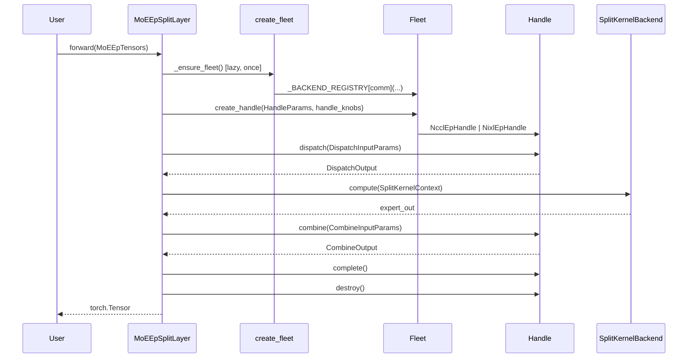

---

## Legacy note

Older flat-layout docs referenced `fleet.py`, `handle.py`, and `split_backends/` at
the package root. Those responsibilities now live under `core/comm/` and
`backends/split/comm/` respectively. Class diagrams below retain transport-backend
detail; adjust import paths to `flashinfer.moe_ep.backends.split.comm.nccl_ep`.

---

## Package layout (historical flat tree — superseded)

<details>
<summary>Pre-restructure layout (for archaeology only)</summary>

```
flashinfer/moe_ep/
├── layer.py                 # Monolithic MoEEpLayer with inline compute
├── fleet.py, handle.py
├── _compute_bridge.py
├── split_backends/
├── nccl_ep/, nixl_ep/
```

</details>

---

## End-to-end flow (historical)

<details>
<summary>Identity-only flow before split kernels</summary>

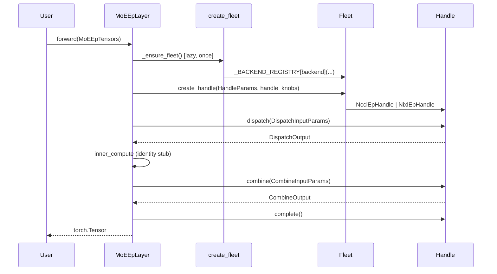

</details>

---

## Complete class diagram

### Public API & layer (split)

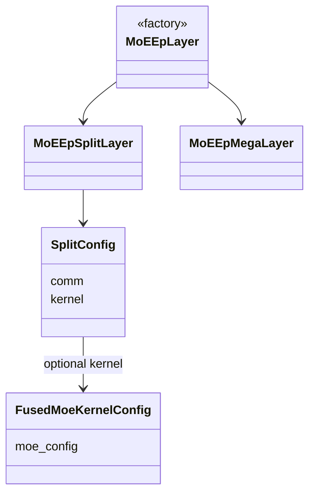

### Public API & layer (historical monolithic layer)

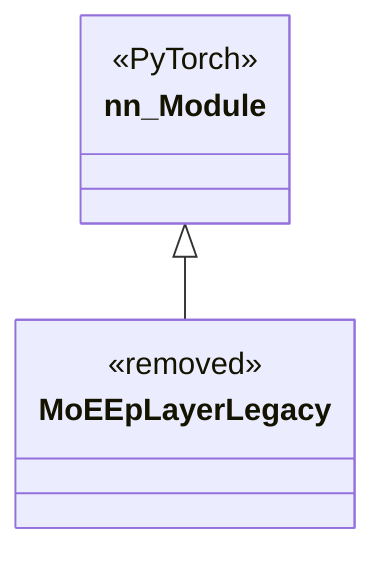

---

## Complete class diagram (transport)

### Public API & layer

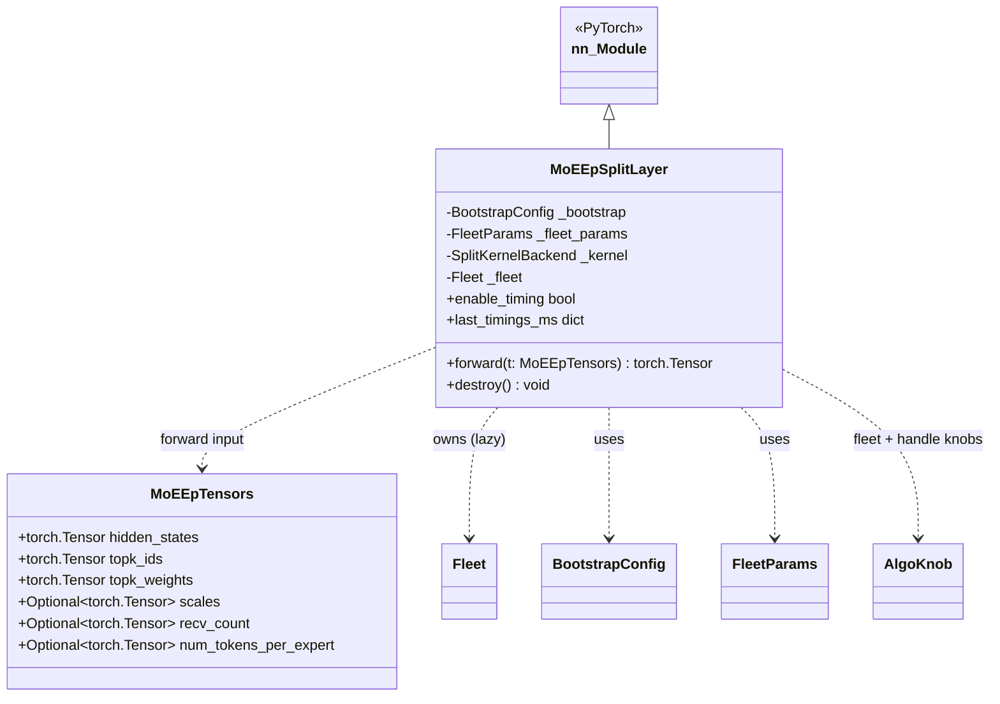

### Fleet / Handle abstraction & backends

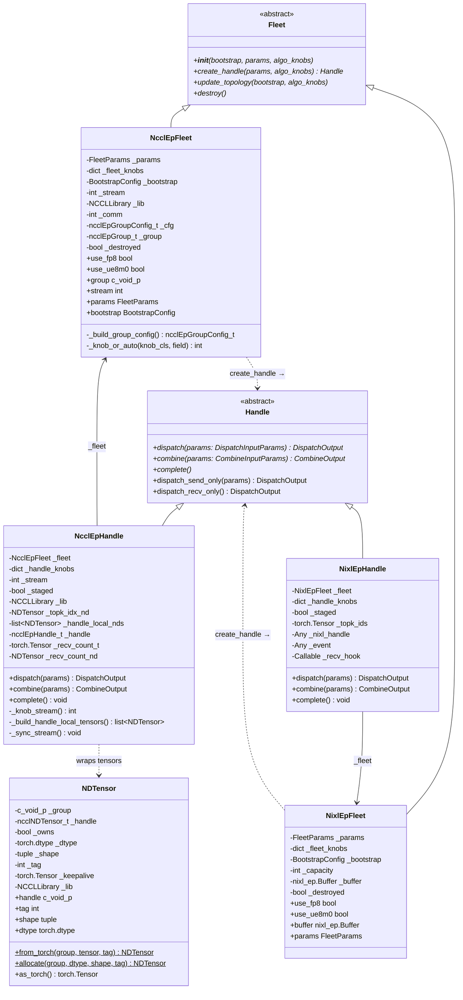

### Config, enums & I/O envelopes

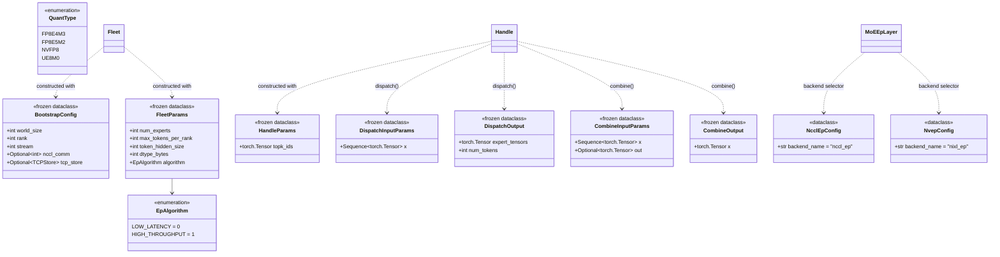

### AlgoKnob hierarchy

```mermaid
classDiagram
    direction TB

    class AlgoKnob {
        <<marker base>>
    }

    class FleetAlgoKnobQuantization {
        <<frozen dataclass>>
        +FrozenSet~QuantType~ quants
    }

    class FleetAlgoKnobNumChannelsPerRank {
        <<frozen dataclass>>
        +int n
    }

    class FleetAlgoKnobNumQpsPerRank {
        <<frozen dataclass>>
        +int n
    }

    class FleetAlgoKnobRdmaBufferSize {
        <<frozen dataclass>>
        +int bytes_
    }

    class FleetAlgoKnobTopologyCapacity {
        <<frozen dataclass>>
        +int n
    }

    class HandleAlgoKnobUserStream {
        <<frozen dataclass>>
        +int stream
    }

    class HandleAlgoKnobSplitOperation {
        <<frozen dataclass, marker>>
    }

    class HandleAlgoKnobTopKWeights {
        <<frozen dataclass>>
        +torch.Tensor weights
    }

    class HandleAlgoKnobNumReceivedTokens {
        <<frozen dataclass>>
        +torch.Tensor target
    }

    AlgoKnob <|-- FleetAlgoKnobQuantization
    AlgoKnob <|-- FleetAlgoKnobNumChannelsPerRank
    AlgoKnob <|-- FleetAlgoKnobNumQpsPerRank
    AlgoKnob <|-- FleetAlgoKnobRdmaBufferSize
    AlgoKnob <|-- FleetAlgoKnobTopologyCapacity
    AlgoKnob <|-- HandleAlgoKnobUserStream
    AlgoKnob <|-- HandleAlgoKnobSplitOperation
    AlgoKnob <|-- HandleAlgoKnobTopKWeights
    AlgoKnob <|-- HandleAlgoKnobNumReceivedTokens

    FleetAlgoKnobQuantization ..> QuantType : quants
    NcclEpFleet ..> FleetAlgoKnobQuantization : reads at init
    NcclEpFleet ..> FleetAlgoKnobRdmaBufferSize : reads at init
    NcclEpFleet ..> FleetAlgoKnobNumQpsPerRank : reads at init
    NcclEpFleet ..> FleetAlgoKnobNumChannelsPerRank : reads at init
    NixlEpFleet ..> FleetAlgoKnobTopologyCapacity : reads at init
    NcclEpHandle ..> HandleAlgoKnobUserStream : per forward
    NcclEpHandle ..> HandleAlgoKnobTopKWeights : per forward
    NcclEpHandle ..> HandleAlgoKnobSplitOperation : optional
    NcclEpHandle ..> HandleAlgoKnobNumReceivedTokens : optional
    NixlEpHandle ..> HandleAlgoKnobTopKWeights : per forward
    NixlEpHandle ..> HandleAlgoKnobSplitOperation : optional
```

### Exceptions & validation

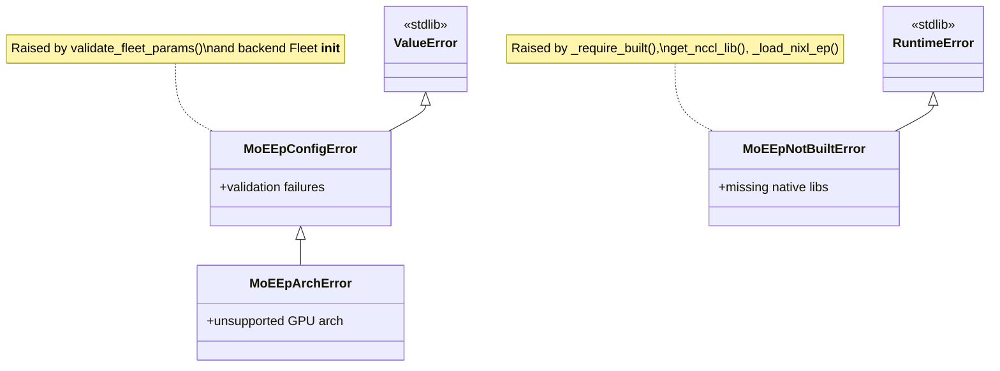

---

## Backend registry & factory

Backends self-register at import time by assigning into `_BACKEND_REGISTRY`:

| Backend key | Fleet class | Native library | Bootstrap requirement |
|-------------|-------------|----------------|----------------------|
| `"nccl_ep"` | `NcclEpFleet` | `libnccl_ep.so` + `libnccl.so.2` (wheel) | `nccl_comm` or default PG |
| `"nixl_ep"` | `NixlEpFleet` | `nixl_ep_cpp*.so` + `libnixl.so` (wheel) | `tcp_store` required |

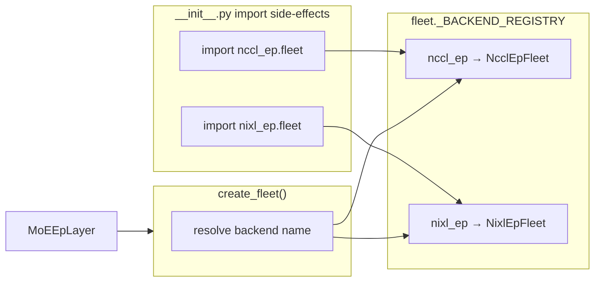

`create_fleet(bootstrap, params, algo_knobs, backend)` accepts either a string
(`"nccl_ep"` / `"nixl_ep"`) or a config object with a `.backend_name` attribute
(`NcclEpConfig`, `NvepConfig`).

---

## Module dependency graph

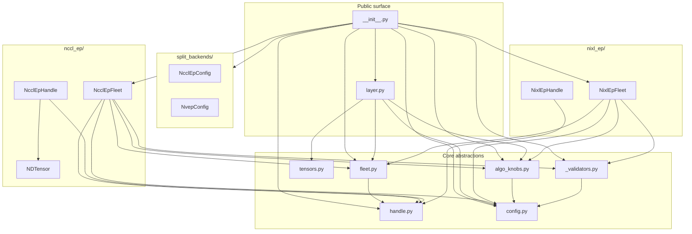

---

## Class inventory (quick reference)

| Class | Module | Role |
|-------|--------|------|
| `MoEEpLayer` | `layer.py` | Public `nn.Module`; lazy Fleet + per-forward Handle |
| `Fleet` | `fleet.py` | ABC for durable EP transport (group / buffer) |
| `Handle` | `handle.py` | ABC for one dispatch/combine iteration |
| `NcclEpFleet` | `nccl_ep/fleet.py` | NCCL-EP `ncclEpGroup_t` owner |
| `NcclEpHandle` | `nccl_ep/handle.py` | NCCL-EP `ncclEpHandle_t` per forward |
| `NDTensor` | `nccl_ep/ndtensor.py` | `ncclNDTensor_t` ↔ torch bridge |
| `NixlEpFleet` | `nixl_ep/fleet.py` | NIXL-EP `Buffer` owner |
| `NixlEpHandle` | `nixl_ep/handle.py` | NIXL per-dispatch handle tuple |
| `BootstrapConfig` | `config.py` | Rank/world + NCCL comm or TCPStore |
| `FleetParams` | `config.py` | Expert count, token sizing, algorithm |
| `HandleParams` | `config.py` | Per-iteration `topk_ids` |
| `DispatchInputParams` / `DispatchOutput` | `config.py` | Dispatch I/O envelope |
| `CombineInputParams` / `CombineOutput` | `config.py` | Combine I/O envelope |
| `MoEEpTensors` | `tensors.py` | Layer forward input bundle |
| `AlgoKnob` + 9 subclasses | `algo_knobs.py` | Typed fleet/handle tuning knobs |
| `NcclEpConfig` / `NvepConfig` | `split_backends/` | Backend selector objects |
| `MoEEpConfigError` / `MoEEpArchError` | `_validators.py` | Config / arch validation |
| `MoEEpNotBuiltError` | `__init__.py` | Missing native build artifacts |
| `EpAlgorithm` / `QuantType` | `config.py` | Enums |

### Module-level functions (not classes)

| Function | Module | Role |
|----------|--------|------|
| `create_fleet()` | `fleet.py` | Factory via `_BACKEND_REGISTRY` |
| `available_backends()` | `__init__.py` | List built backend names |
| `have_nccl_ep()` / `have_nixl_ep()` | `__init__.py` | Probe staged `.so` files |
| `validate_fleet_params()` | `_validators.py` | Backend-specific sizing checks |
| `validate_arch_for_backend()` | `_validators.py` | sm_90+ gate |
| `_index_knobs()` | `algo_knobs.py` | `Sequence[AlgoKnob]` → `dict[type, AlgoKnob]` |
| `get_nccl_lib()` | `nccl_ep/ndtensor.py` | Singleton `NCCLLibrary` |
| `_load_libnccl_ep()` | `nccl_ep/__init__.py` | Lazy dlopen of EP plugin |
| `_load_nixl_ep_cpp()` | `nixl_ep/__init__.py` | Lazy dlopen of NIXL EP extension |

---

## Ownership & lifetimes

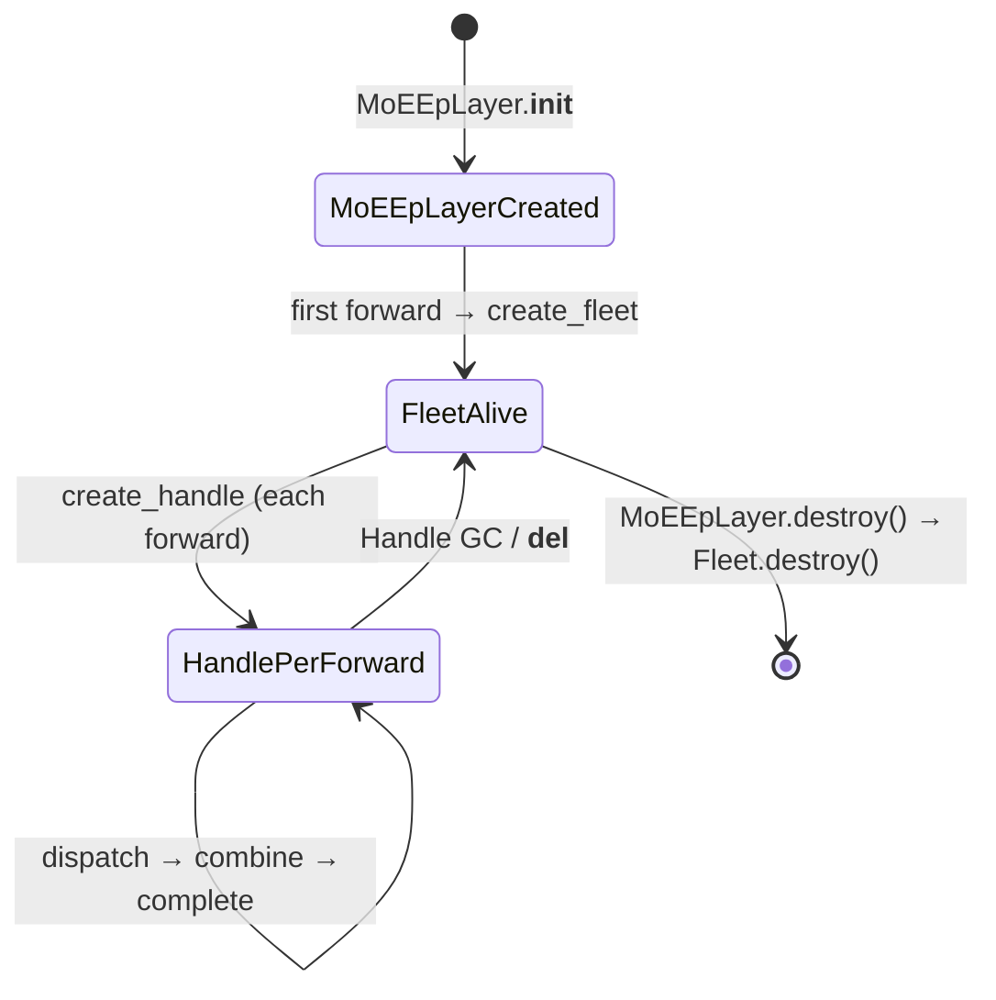

- **Fleet** — one per `MoEEpLayer` instance (lazy); owns NCCL EP group or NIXL
  buffer until `destroy()`.
- **Handle** — one per forward pass; short-lived; destroyed in `__del__`
  (`NcclEpHandle`) or stateless after combine (`NixlEpHandle`).
- **NDTensor** — per tensor slot in NCCL dispatch/combine; borrows torch storage
  (`from_torch`) or owns library allocation (`allocate`).

---

## External native dependencies

| Backend | Python binding | Staged in package | From pip wheel |
|---------|----------------|-------------------|----------------|
| NCCL-EP | `nccl_ep.NCCLLibrary` | `nccl_ep/_libs/libnccl_ep.so` | `nvidia-nccl-cu13` → `libnccl.so.2` |
| NIXL-EP | `nixl_ep.Buffer` | `nixl_ep/_libs/nixl_ep_cpp*.so` | `nixl-cu13` → `libnixl.so` + siblings |

Build gate: `BUILD_NVEP=1` (or per-backend `BUILD_NCCL_EP` / `BUILD_NIXL_EP`).
