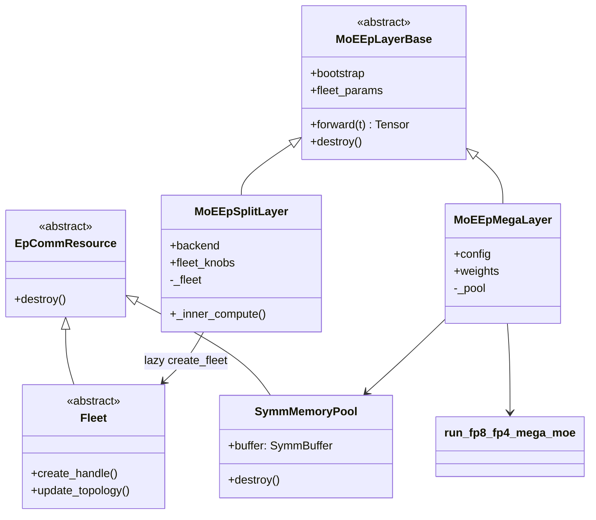
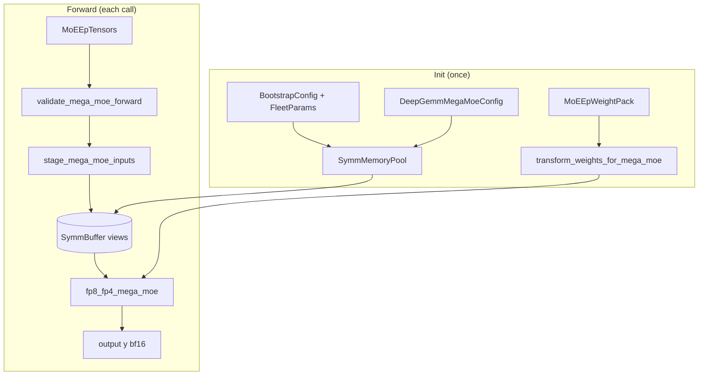

# MoE EP layer restructure + `fp8_fp4_mega_moe` integration

Design note for restructuring `flashinfer.moe_ep` into **Split** and **Mega**
layer subclasses, and wiring `deep_gemm.fp8_fp4_mega_moe` (from
[`minimal_deep_gemm_ep`](../../../minimal_deep_gemm_ep)) into the Mega path.

Reference scripts:
- `minimal_deep_gemm_ep/dummy_fp8_fp4_mega_moe.py` (multi-GPU benchmark)
- `minimal_deep_gemm_ep/example_mega_moe.py` (single-GPU smoke)

Branch: `mega_moe_integration` on fork `mhoqueanik/flashinfer-moe_ep`.

---

## Goals

1. **Split path** — keep today's Fleet/Handle pipeline (`nccl_ep`, `nixl_ep`):
   `dispatch → inner_compute → combine`.
2. **Mega path** — fused Blackwell megakernel: symm buffer + staging +
   `fp8_fp4_mega_moe` (replaces the entire forward, not `inner_compute`).
3. **Stable public API** — `MoEEpLayer(...)` remains the primary entry point;
   factory routes to `MoEEpSplitLayer` or `MoEEpMegaLayer`.
4. **Small PRs** — refactor split first (no behavior change), then add mega
   infrastructure incrementally.

---

## Two execution models (do not conflate)

| Axis | Backends | Durable resource | Per-forward |
|------|----------|------------------|-------------|
| **Split EP** | `nccl_ep`, `nixl_ep` | `Fleet` (NCCL-EP / NIXL-EP group) | `Handle` → dispatch → inner_compute → combine |
| **Mega MoE** | `deep_gemm_mega_moe` | `SymmMemoryPool` / `SymmBuffer` | stage inputs → `fp8_fp4_mega_moe` |

Mega MoE is **not** registered in `_BACKEND_REGISTRY` — there is no
`Handle.dispatch` / `Handle.combine` ABI to implement.

---

## (1) Folder structure — current vs target

Side-by-side view of `flashinfer/moe_ep/` before and after the restructure.
New paths marked with **+**; moved paths marked with **→**.

| Current (`main` today) | Target (end state) | Notes |
|------------------------|-------------------|-------|
| `layer.py` | **→** `layer/__init__.py` | Package re-export |
| — | **+** `layer/base.py` | `MoEEpLayerBase` |
| — | **+** `layer/split.py` | `MoEEpSplitLayer` (body of today's `layer.py`) |
| — | **+** `layer/mega.py` | `MoEEpMegaLayer` |
| — | **+** `layer/factory.py` | `MoEEpLayer(...)` routing |
| `config.py` | `config.py` | **+** optional `BootstrapConfig.dist_group` |
| `fleet.py` | `fleet.py` | Unchanged; split-only |
| `handle.py` | `handle.py` | Unchanged; split-only |
| `tensors.py` | `tensors.py` | Unchanged |
| `_validators.py` | `_validators.py` | **+** mega validators |
| `algo_knobs.py` | `algo_knobs.py` | Split-only knobs |
| `split_backends/` | `split_backends/` | **Split only** — `NcclEpConfig`, `NvepConfig`; no mega config |
| `split_backends/nccl_ep_comm.py` | `split_backends/nccl_ep_comm.py` | `NcclEpConfig` |
| `split_backends/nixl_ep_comm.py` | `split_backends/nixl_ep_comm.py` | `NvepConfig` |
| `nccl_ep/` | `nccl_ep/` | Unchanged |
| `nixl_ep/` | `nixl_ep/` | Unchanged |
| — | **+** `comm_resource.py` | `EpCommResource` ABC (shared `destroy()`) |
| — | **+** `mega/` | Mega-only implementation + config |
| — | **+** `mega/__init__.py` | Package exports |
| — | **+** `mega/config.py` | `DeepGemmMegaMoeConfig` (not under `split_backends/`) |
| — | **+** `mega/pool.py` | `SymmMemoryPool` wraps `get_symm_buffer_for_mega_moe` |
| — | **+** `mega/weights.py` | Load-time FP4 cast + `transform_weights_for_mega_moe` |
| — | **+** `mega/staging.py` | `stage_mega_moe_inputs()` |
| — | **+** `mega/runner.py` | `run_fp8_fp4_mega_moe()` thin wrapper |
| `__init__.py` | `__init__.py` | **+** export split/mega classes, `have_deep_gemm_mega_moe()` |

### Target tree (compact)

```
flashinfer/moe_ep/
├── __init__.py
├── comm_resource.py          # EpCommResource ABC
├── config.py
├── fleet.py                  # Fleet + _BACKEND_REGISTRY (split only)
├── handle.py
├── tensors.py
├── _validators.py
├── algo_knobs.py
├── layer/
│   ├── __init__.py           # MoEEpLayer, MoEEpSplitLayer, MoEEpMegaLayer
│   ├── base.py
│   ├── split.py
│   ├── mega.py
│   └── factory.py
├── split_backends/             # split EP configs only
│   ├── nccl_ep_comm.py         # NcclEpConfig
│   └── nixl_ep_comm.py         # NvepConfig
├── mega/
│   ├── config.py               # DeepGemmMegaMoeConfig
│   ├── pool.py
│   ├── weights.py
│   ├── staging.py
│   └── runner.py
├── nccl_ep/
└── nixl_ep/
```

### What does **not** move

Transport backends (`nccl_ep/`, `nixl_ep/`), `Fleet`, `Handle`, and
`_BACKEND_REGISTRY` stay split-only. Mega code lives under `mega/` and
`layer/mega.py`, not under `nccl_ep/`, `nixl_ep/`, or `split_backends/`.

### Config placement (`split_backends/` vs `mega/config.py`)

`split_backends/` holds **split EP transport** config adapters only
(`NcclEpConfig`, `NvepConfig`) — each maps to a `_BACKEND_REGISTRY` entry
and the Fleet/Handle pipeline.

`DeepGemmMegaMoeConfig` does **not** belong there: mega bypasses
`_BACKEND_REGISTRY` and uses `SymmMemoryPool` instead of `Fleet`. It lives
in `mega/config.py` next to pool/staging/runner.

Public API stays flat — re-export from `moe_ep/__init__.py`:

```python
from .split_backends import NcclEpConfig, NvepConfig
from .mega.config import DeepGemmMegaMoeConfig
```

Call sites unchanged: `MoEEpLayer(..., backend=DeepGemmMegaMoeConfig(...))`.
The factory still reads `backend.backend_name`; only the module path differs.

---

## (2) Classes — current vs target

| Current | Target | Change |
|---------|--------|--------|
| `MoEEpLayer` (single class, all logic inline) | `MoEEpLayerBase` | Abstract/shared ctor: `bootstrap`, `fleet_params`; abstract `destroy()` |
| — | `MoEEpSplitLayer(MoEEpLayerBase)` | Today's `layer.py` body: lazy `Fleet`, Handle pipeline, `_inner_compute_identity` |
| — | `MoEEpMegaLayer(MoEEpLayerBase)` | Owns `SymmMemoryPool` + weight pack; `forward` → `run_fp8_fp4_mega_moe` |
| `MoEEpLayer(...)` direct ctor | `MoEEpLayer(...)` **factory** | Returns `MoEEpSplitLayer` or `MoEEpMegaLayer` by `backend.backend_name` |
| `Fleet` | `Fleet(EpCommResource)` | Implements `destroy()`; unchanged API |
| — | `EpCommResource` | Minimal ABC: idempotent `destroy()` |
| — | `SymmMemoryPool(EpCommResource)` | Durable symm buffer; **not** a `Fleet` |
| `NcclEpConfig`, `NvepConfig` | Same in `split_backends/` | Split transport configs only |
| — | `DeepGemmMegaMoeConfig` in `mega/config.py` | Mega config (`intermediate_size`, `top_k`, …); re-exported from `moe_ep` |
| — | `MoEEpWeightPack` (or module buffers) | Load-time transformed L1/L2 FP4 weights for mega |
| — | `stage_mega_moe_inputs()` | Host staging: bf16 → FP8 + copy into symm views |
| — | `run_fp8_fp4_mega_moe()` | validate → stage → kernel → return `y` |

### Class hierarchy



### Factory routing

```python
def MoEEpLayer(
    bootstrap: BootstrapConfig,
    fleet_params: FleetParams,
    fleet_knobs: Sequence[AlgoKnob] = (),
    backend: str | object = "nccl_ep",
    weights: MoEEpWeightPack | None = None,
    **kwargs,
) -> MoEEpLayerBase:
    name = getattr(backend, "backend_name", backend)
    if name == "deep_gemm_mega_moe":
        return MoEEpMegaLayer(bootstrap, fleet_params, backend, weights, **kwargs)
    return MoEEpSplitLayer(bootstrap, fleet_params, fleet_knobs, backend)
```

| `backend` | Layer class | Transport |
|-----------|-------------|-----------|
| `"nccl_ep"`, `NcclEpConfig()` | `MoEEpSplitLayer` | `NcclEpFleet` |
| `"nixl_ep"`, `NvepConfig()` | `MoEEpSplitLayer` | `NixlEpFleet` |
| `"deep_gemm_mega_moe"`, `DeepGemmMegaMoeConfig()` | `MoEEpMegaLayer` | `SymmMemoryPool` |

---

## Mega MoE (`fp8_fp4_mega_moe`) integration

### Kernel contract (from `minimal_deep_gemm_ep`)

```python
deep_gemm.fp8_fp4_mega_moe(
    y,                          # [M, H] bf16 out
    transformed_l1,             # (w, sf) FP4 + scales, load-time
    transformed_l2,             # (w, sf) FP4 + scales, load-time
    sym_buffer,                 # SymmBuffer (NVLink symm mem)
    cumulative_local_expert_recv_stats=None,
    activation_clamp=10.0,
    fast_math=True,
)
```

Hard requirements: SM100+, `hidden % 128 == 0`, `intermediate % 128 == 0`,
`num_experts % world_size == 0`, `num_tokens <= max_tokens_per_rank`, `swiglu`.

### Init-time call sequence (`MoEEpMegaLayer.__init__`)

Runs once when the layer is constructed (or on first use if lazy).

```text
MoEEpMegaLayer.__init__(bootstrap, fleet_params, DeepGemmMegaMoeConfig, weights)
    │
    ├─ validate_arch_for_backend("deep_gemm_mega_moe")     # SM100+
    ├─ validate_fleet_params(..., backend="deep_gemm_mega_moe")
    ├─ have_deep_gemm_mega_moe()                           # import deep_gemm
    │
    ├─ group = bootstrap.dist_group or dist.group.WORLD
    │
    ├─ SymmMemoryPool.__init__()
    │     └─ deep_gemm.get_symm_buffer_for_mega_moe(
    │            group,
    │            fleet_params.num_experts,
    │            fleet_params.max_tokens_per_rank,   # aligned by kernel
    │            config.top_k,
    │            fleet_params.token_hidden_size,
    │            config.intermediate_size,
    │        )
    │        → symm_mem.empty + rendezvous + slice views
    │          (x, x_sf, topk_idx, topk_weights, l1_acts, …)
    │
    └─ weights (load time, if not pre-built)
          ├─ per local expert: bf16 L1/L2 → FP4 + UE8M0 scales
          └─ deep_gemm.transform_weights_for_mega_moe(l1, l2)
                → cache transformed_l1, transformed_l2 on layer
```

### Per-forward call sequence (`MoEEpMegaLayer.forward`)

```text
layer(MoEEpTensors(hidden_states, topk_ids, topk_weights))
    │
    └─ run_fp8_fp4_mega_moe(t, pool, weights, config)
          │
          ├─ validate_mega_moe_forward(t, fleet_params, config)
          │     (token cap, shapes, dtypes)
          │
          ├─ stage_mega_moe_inputs(t, pool.buffer)
          │     ├─ x_fp8, x_sf = per_token_cast_to_fp8(hidden_bf16, ue8m0, …)
          │     ├─ pool.buffer.x[:M].copy_(x_fp8)
          │     ├─ pool.buffer.x_sf[:M].copy_(x_sf)
          │     ├─ pool.buffer.topk_idx[:M].copy_(topk_ids)
          │     └─ pool.buffer.topk_weights[:M].copy_(topk_weights)
          │
          ├─ y = torch.empty(M, H, dtype=bfloat16)
          │
          └─ deep_gemm.fp8_fp4_mega_moe(
                 y, transformed_l1, transformed_l2, pool.buffer,
                 cumulative_local_expert_recv_stats=t.recv_count,
                 activation_clamp=config.activation_clamp,
                 fast_math=config.fast_math,
             )
          return y
```

Inside the megakernel (not visible to FlashInfer Python): routing warps,
NVLink symm pull (dispatch), grouped FP8×FP4 GEMMs (L1 gate+up, L2 down),
SwiGLU, combine epilogue — see
`minimal_deep_gemm_ep/deep_gemm/include/deep_gemm/impls/sm100_fp8_fp4_mega_moe.cuh`.

### Teardown

```text
layer.destroy()
    └─ MoEEpMegaLayer.destroy()
          └─ SymmMemoryPool.destroy()
                └─ symm_buffer.destroy()    # drop handle + buffer refs
```

Split path unchanged:

```text
MoEEpSplitLayer.destroy() → Fleet.destroy()
```

### Split vs Mega forward — side by side

| Step | `MoEEpSplitLayer` | `MoEEpMegaLayer` |
|------|-------------------|------------------|
| 1 | `create_fleet()` (lazy) | (pool already created at init) |
| 2 | `fleet.create_handle(topk_ids)` | — |
| 3 | `handle.dispatch(hidden_states)` | `per_token_cast_to_fp8` + stage into symm views |
| 4 | `_inner_compute(expert_tensors)` | — |
| 5 | `handle.combine(...)` | `deep_gemm.fp8_fp4_mega_moe(y, …)` |
| 6 | `handle.complete()` | — |
| Output | `combine.x` `[M, H]` bf16 | `y` `[M, H]` bf16 |

### Data-flow diagram (Mega path)



---

## Config and tensor mapping (Mega)

### `DeepGemmMegaMoeConfig` (`mega/config.py`)

Defined in `flashinfer/moe_ep/mega/config.py`, not `split_backends/`.
Same dataclass pattern as `NcclEpConfig` (`backend_name` for factory routing),
but colocated with mega implementation.

| Field | Role |
|-------|------|
| `backend_name = "deep_gemm_mega_moe"` | Factory routing |
| `intermediate_size` | L1/L2 dims; symm buffer sizing |
| `top_k` | Routing width; symm buffer layout |
| `activation_clamp` | Default `10.0` |
| `fast_math` | Default `True` |
| `normalize_topk_weights` | Default `False` (match dummy script) |

### `FleetParams` reuse (Mega)

| Field | Mega use |
|-------|----------|
| `num_experts` | Global expert count |
| `max_tokens_per_rank` | Symm buffer capacity |
| `token_hidden_size` | `hidden` |
| `dtype_bytes`, `algorithm` | Ignored |

### `MoEEpTensors` → symm buffer

| Tensor | Destination |
|--------|-------------|
| `hidden_states` `[M, H]` bf16 | `per_token_cast_to_fp8` → `x`, `x_sf` |
| `topk_ids` `[M, K]` int64 | `topk_idx` |
| `topk_weights` `[M, K]` fp32 | `topk_weights` |
| `scales` | Unused (re-quantize from bf16) |
| `recv_count` | Optional `cumulative_local_expert_recv_stats` |

---

## Incremental PR plan

| Step | PR focus | Folder / class changes | Behavior |
|------|----------|------------------------|----------|
| **1** | Split extract | `layer/` package; `MoEEpSplitLayer`; `MoEEpLayer` alias | Identical to today |
| **2** | Factory skeleton | `layer/factory.py`; stub `MoEEpMegaLayer` | Mega forward raises `NotImplementedError` |
| **3** | Design + config | This doc; `mega/config.py` (`DeepGemmMegaMoeConfig`); validators | No kernel |
| **4** | Comm abstraction | `comm_resource.py`; `EpCommResource`; `BootstrapConfig.dist_group` | No kernel |
| **5** | Mega impl | `mega/pool`, `staging`, `runner`, `weights`; wire `MoEEpMegaLayer` | Full mega path + tests |
| **6** | Host opts | Fused staging in `staging.py` | Per `OPTIMIZATIONS.md` |

---

## Pytest plan

Tests live under `tests/moe_ep/`. Existing split-path tests **must stay green**
after every step. Mega tests are **additive** and gated so CI without Blackwell /
`deep_gemm` / multi-GPU still passes.

### Existing suite (unchanged behavior)

| File | What it covers | Step 1 impact |
|------|----------------|---------------|
| `test_config.py` | `FleetParams`, `BootstrapConfig` ctor validation | None |
| `test_constraints.py` | `validate_fleet_params`, arch for nccl/nixl | None until Step 3 |
| `test_layer_single_gpu.py` | Stub `_BACKEND_REGISTRY`; dispatch→combine order | Update import if `MoEEpLayer` becomes factory; assert same log sequence |
| `nccl_ep/test_fleet_mock.py` | `NcclEpFleet` init, handle lifecycle (mocked) | None |
| `nccl_ep/test_ndtensor.py` | NCCL ND tensor wrapper | None |
| `nixl_ep/test_fleet_mock.py` | `NixlEpFleet` init, topology (mocked) | None |
| `smoke_nccl_ep.py` | Manual / CI smoke with real libs | None |
| `smoke_nixl_ep.py` | Manual / CI smoke with real libs | None |
| `test_moe_ep_layer_multirank.py` | Multi-rank identity roundtrip (`torchrun`) | None |

### Markers and skip guards

Reuse markers already registered in `tests/conftest.py`:

| Marker | Meaning | Used by |
|--------|---------|---------|
| `@pytest.mark.nvep` | `BUILD_NVEP=1` / `available_backends()` non-empty | Split integration, multirank |
| `@pytest.mark.gpu_2` / `gpu_4` / `gpu_8` | Minimum GPU count | Multirank, mega multi-GPU |
| `@pytest.mark.arch_blackwell` | `sm_100+` (`cc >= (10, 0)`) | All mega kernel tests |

**New marker** (add in Step 3):

```python
# tests/conftest.py
config.addinivalue_line(
    "markers",
    "deep_gemm_mega_moe: requires minimal_deep_gemm_ep + fp8_fp4_mega_moe",
)
```

Skip logic in `pytest_collection_modifyitems`:

```python
if "deep_gemm_mega_moe" in item.keywords:
    from flashinfer.moe_ep import have_deep_gemm_mega_moe
    if not have_deep_gemm_mega_moe():
        item.add_marker(pytest.mark.skip(reason="needs minimal_deep_gemm_ep install"))
```

Mega tests combine markers as needed, e.g.
`@pytest.mark.arch_blackwell @pytest.mark.deep_gemm_mega_moe`.

### New test files (by PR step)

#### Step 1 — `tests/moe_ep/test_layer_split.py`

| Test | Asserts |
|------|---------|
| `test_moe_ep_layer_is_split_by_default` | `MoEEpLayer(..., backend="nccl_ep")` is `MoEEpSplitLayer` (or behaves identically) |
| `test_split_forward_sequence_unchanged` | Same stub log as `test_layer_single_gpu.py` |
| `test_split_destroy_calls_fleet_destroy` | Stub fleet records `destroy` |

No CUDA required for stubbed tests; keep parity with `test_layer_single_gpu.py`.

#### Step 2 — extend `tests/moe_ep/test_layer_factory.py`

| Test | Asserts |
|------|---------|
| `test_factory_returns_split_for_nccl_ep` | `isinstance(MoEEpLayer(..., "nccl_ep"), MoEEpSplitLayer)` |
| `test_factory_returns_split_for_nvep_config` | `NvepConfig()` → split |
| `test_factory_returns_mega_for_deep_gemm_config` | `DeepGemmMegaMoeConfig()` → `MoEEpMegaLayer` |
| `test_mega_stub_forward_raises_not_implemented` | Construct mega layer; `forward()` raises with clear message |

#### Step 3 — extend `tests/moe_ep/test_constraints.py`

| Test | Asserts |
|------|---------|
| `test_mega_hidden_must_be_multiple_of_128` | `validate_fleet_params(..., backend="deep_gemm_mega_moe")` |
| `test_mega_intermediate_must_be_multiple_of_128` | via config validator |
| `test_mega_arch_requires_blackwell` | `validate_arch_for_backend("deep_gemm_mega_moe")` on sm_90 host |
| `test_have_deep_gemm_mega_moe_false_when_uninstalled` | probe returns `False` in minimal env |

Pure Python; no GPU.

#### Step 4 — `tests/moe_ep/test_comm_resource.py`

| Test | Asserts |
|------|---------|
| `test_fleet_is_ep_comm_resource` | `Fleet` subclass of `EpCommResource` |
| `test_symm_memory_pool_destroy_idempotent` | Mock pool; double `destroy()` safe |
| `test_bootstrap_dist_group_optional` | Default `None`; mega resolves to `WORLD` when dist init |

#### Step 5 — mega unit + integration

**`tests/moe_ep/mega/test_staging.py`** (CUDA optional; can mock `SymmBuffer`)

| Test | Asserts |
|------|---------|
| `test_stage_writes_correct_slices` | After `stage_mega_moe_inputs`, mock views received copies |
| `test_stage_rejects_token_overflow` | `M > max_tokens_per_rank` → error |
| `test_stage_dtype_checks` | wrong `topk_ids` dtype → error |

**`tests/moe_ep/mega/test_runner.py`**

| Test | Asserts |
|------|---------|
| `test_run_fp8_fp4_mega_moe_calls_kernel` | Mock `deep_gemm.fp8_fp4_mega_moe`; verify call order: validate → stage → kernel |
| `test_runner_returns_output_shape` | `[M, H]` bf16 |

**`tests/moe_ep/mega/test_mega_layer_single_gpu.py`**

```python
@pytest.mark.arch_blackwell
@pytest.mark.deep_gemm_mega_moe
def test_mega_layer_forward_smoke():
    """Port of minimal_deep_gemm_ep/example_mega_moe.py via MoEEpMegaLayer."""
```

Requires: 1× Blackwell GPU, `pip install -e minimal_deep_gemm_ep`, small shapes
(e.g. `H=256`, `M=64`, `experts=8`).

**`tests/moe_ep/mega/test_mega_layer_multirank.py`**

```python
@pytest.mark.arch_blackwell
@pytest.mark.deep_gemm_mega_moe
@pytest.mark.gpu_4
def test_mega_moe_multirank_smoke():
    """Port of dummy_fp8_fp4_mega_moe.py correctness check via MoEEpLayer."""
```

Launched with `torchrun` (same pattern as `test_moe_ep_layer_multirank.py`):

```bash
torchrun --nproc_per_node=4 -m pytest \
    tests/moe_ep/mega/test_mega_layer_multirank.py \
    -v -m "arch_blackwell and deep_gemm_mega_moe and gpu_4"
```

Optional: `@pytest.mark.nvep` is **not** required for mega (separate package).

#### Step 6 — staging optimization regression

| Test | Asserts |
|------|---------|
| `test_fused_staging_matches_copy_staging` | Fused vs `copy_` path: same symm buffer bytes (or same kernel output) |

### Fixtures (`tests/moe_ep/conftest.py` — new, optional)

```python
@pytest.fixture
def stubbed_fleet_registry():
    """Move shared stub from test_layer_single_gpu.py for reuse."""

@pytest.fixture
def mock_symm_buffer():
    """SimpleNamespace with x, x_sf, topk_idx, topk_weights views + record_copy()."""

@pytest.fixture
def mega_fleet_params():
    """FleetParams(num_experts=8, max_tokens_per_rank=64, token_hidden_size=256)."""

@pytest.fixture
def mega_config():
    """DeepGemmMegaMoeConfig(intermediate_size=256, top_k=2)."""
```

### Pytest ↔ PR step matrix

| PR step | New / updated tests | Run locally |
|---------|---------------------|-------------|
| **1** | `test_layer_split.py`; `test_layer_single_gpu.py` imports | `pytest tests/moe_ep/test_layer_single_gpu.py tests/moe_ep/test_layer_split.py -v` |
| **2** | `test_layer_factory.py` | `pytest tests/moe_ep/test_layer_factory.py -v` |
| **3** | `test_constraints.py` mega cases; `have_deep_gemm_mega_moe` | `pytest tests/moe_ep/test_constraints.py -v` |
| **4** | `test_comm_resource.py` | `pytest tests/moe_ep/test_comm_resource.py -v` |
| **5** | `tests/moe_ep/mega/*` | See commands below |
| **6** | `test_staging.py` fused regression | `pytest tests/moe_ep/mega/test_staging.py -v` |

### How to run

**Split path (no code changes expected after Step 1):**

```bash
# Unit (stub fleet, single GPU)
pytest tests/moe_ep/test_layer_single_gpu.py tests/moe_ep/test_config.py \
       tests/moe_ep/test_constraints.py -v

# Multi-rank (needs BUILD_NVEP=1 + 4+ GPUs)
torchrun --nproc_per_node=4 -m pytest tests/moe_ep/test_moe_ep_layer_multirank.py \
    -v -m "nvep and gpu_4" --backend=nccl_ep
```

**Mega path (Step 5+):**

```bash
# CPU / import / validator only
pytest tests/moe_ep/test_constraints.py tests/moe_ep/mega/test_staging.py -v \
    -m "not arch_blackwell"

# Single-GPU Blackwell smoke
pytest tests/moe_ep/mega/test_mega_layer_single_gpu.py -v \
    -m "arch_blackwell and deep_gemm_mega_moe"

# Multi-GPU Blackwell (4 ranks)
torchrun --nproc_per_node=4 -m pytest \
    tests/moe_ep/mega/test_mega_layer_multirank.py -v \
    -m "arch_blackwell and deep_gemm_mega_moe and gpu_4"
```

**Full moe_ep suite:**

```bash
pytest tests/moe_ep/ -v
# Mega kernel tests auto-skip off Blackwell or without deep_gemm installed.
```

### CI expectations

| Job tier | Tests collected | Mega kernel tests |
|----------|-----------------|-------------------|
| CPU / pre-sm_90 | config, constraints, factory, stub split, mocked staging | Skipped (`arch_blackwell`) |
| sm_90 + NVEP | + multirank split, smoke nccl/nixl | Skipped |
| sm_100 + deep_gemm | + mega smoke single/multi GPU | Run |

Split and mega suites are **independent**: a green NVEP job does not require
mega; a mega job does not require `BUILD_NVEP=1`.

### Non-goals for v1 tests

- No performance / TFLOPS benchmarks in pytest (keep in `dummy_fp8_fp4_mega_moe.py`).
- No golden bitwise match against vLLM reference in CI (too heavy).
- No test that mega goes through `_BACKEND_REGISTRY` (explicit negative test optional in factory step).

---

## Target usage

```python
from flashinfer.moe_ep import (
    BootstrapConfig,
    DeepGemmMegaMoeConfig,
    FleetParams,
    MoEEpLayer,
    MoEEpTensors,
    MoEEpSplitLayer,
    MoEEpMegaLayer,
)

# Split (unchanged semantics)
split = MoEEpLayer(
    bootstrap=BootstrapConfig(world_size=4, rank=rank),
    fleet_params=FleetParams(num_experts=256, max_tokens_per_rank=8192, token_hidden_size=4096),
    backend="nccl_ep",
)
# equivalent: MoEEpSplitLayer(...)

# Mega
mega = MoEEpLayer(
    bootstrap=BootstrapConfig(world_size=4, rank=rank),
    fleet_params=FleetParams(num_experts=256, max_tokens_per_rank=8192, token_hidden_size=4096),
    backend=DeepGemmMegaMoeConfig(intermediate_size=2048, top_k=6),
    weights=weight_pack,
)
out = mega(MoEEpTensors(hidden_states=x, topk_ids=ids, topk_weights=weights))
```

---

## Explicit non-goals (v1)

- Not plugging `fp8_fp4_mega_moe` into `_inner_compute` after `nccl_ep` dispatch.
- Not registering mega in `_BACKEND_REGISTRY` / fake `Handle` methods.
- Not routing `FleetAlgoKnobQuantization` through mega (kernel always FP8-dispatches).
- Not supporting activations other than `swiglu` until the kernel does.

---

## References

- Split layer today: `flashinfer/moe_ep/layer.py`
- Fleet / Handle: `flashinfer/moe_ep/fleet.py`, `handle.py`
- EP API coordination: `docs/design_docs/flashinfer_moe_api.md`
- Dummy / benchmark: `minimal_deep_gemm_ep/dummy_fp8_fp4_mega_moe.py`
- Kernel: `minimal_deep_gemm_ep/deep_gemm/include/deep_gemm/impls/sm100_fp8_fp4_mega_moe.cuh`
- Symm buffer Python: `minimal_deep_gemm_ep/deep_gemm/mega/__init__.py`
