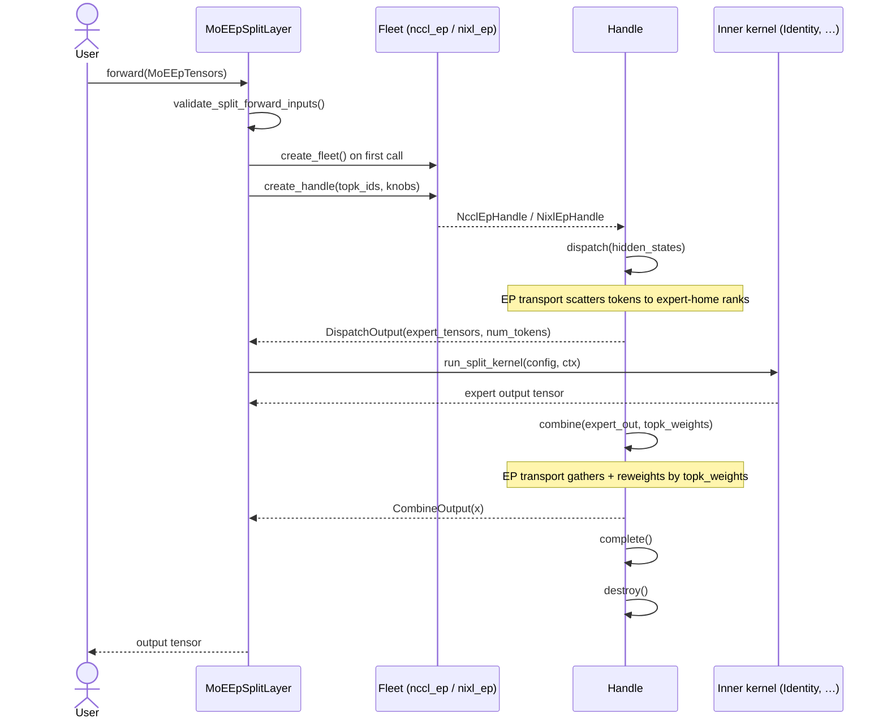
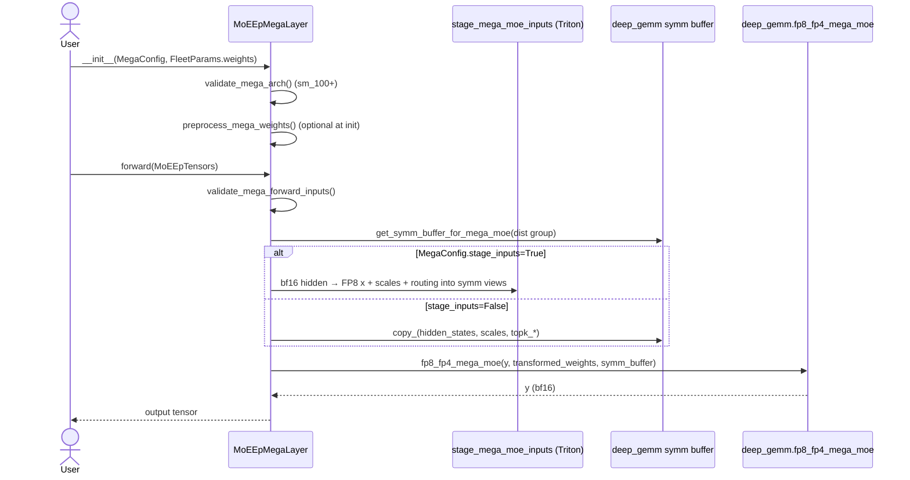

# `moe_ep_v2` vs `moe_ep`

Comparison of `flashinfer.moe_ep_v2` (new) against `flashinfer.moe_ep` (v1).
For the full mega-MoE design and migration plan, see
[`moe_ep_deep_gemm_mega_moe.md`](moe_ep_deep_gemm_mega_moe.md).

---

## Overview

`moe_ep_v2` is a **separate package** shipped alongside `moe_ep`. It does not
modify v1. Native NCCL/NIXL transport libraries are still staged under
`flashinfer/moe_ep/{nccl,nixl}_ep/_libs/` until v2 grows its own trees under
`moe_ep_v2/split/`.

| Area | `moe_ep` (v1) | `moe_ep_v2` |
|------|---------------|-------------|
| **Entry point** | `MoEEpLayer` is an `nn.Module` | `MoEEpLayer(...)` **factory** → `MoEEpSplitLayer` or `MoEEpMegaLayer` |
| **Split path** | Identity inner compute inline | `dispatch → inner kernel → combine`; `SplitConfig(comm, kernel)` |
| **Mega path** | Not present | `MoEEpMegaLayer` + `deep_gemm.fp8_fp4_mega_moe` |
| **Weights** | Not on `FleetParams` | `MoEWeightPack` on `FleetParams` |
| **Tests** | `tests/moe_ep/` | `tests/moe_ep_v2/` |

---

## Directory structure

One-line role for every file under `flashinfer/moe_ep_v2/` and
`tests/moe_ep_v2/`.

### `flashinfer/moe_ep_v2/`

```
flashinfer/moe_ep_v2/
├── __init__.py                 # Public re-exports, native-lib probes (have_nccl_ep, available_backends)
├── layer.py                    # MoEEpLayer factory: routes MegaConfig → mega, else → split
├── config.py                   # BootstrapConfig, FleetParams, HandleParams, dispatch/combine envelopes
├── fleet.py                    # Fleet ABC + create_fleet() + _BACKEND_REGISTRY
├── handle.py                   # Handle ABC (dispatch / combine / complete / destroy)
├── tensors.py                  # MoEEpTensors per-forward input bundle
├── weights.py                  # MoEWeightPack shared weight container (w13, w2, scales)
├── algo_knobs.py               # Fleet- and handle-level AlgoKnob dataclasses + _index_knobs()
├── _validators.py              # Backend/mega config and forward-input validators
├── backend_config.py           # Backward-compat re-exports of split/mega config types
│
├── split/
│   ├── __init__.py             # Re-exports MoEEpSplitLayer, SplitConfig, kernels, backend configs
│   ├── layer.py                # MoEEpSplitLayer nn.Module: fleet + handle pipeline + inner kernel
│   ├── config.py               # SplitConfig, IdentityConfig, FusedMoeKernelConfig
│   ├── backends/
│   │   ├── __init__.py         # Re-exports NcclEpConfig, NvepConfig
│   │   ├── nccl_ep_comm.py     # NcclEpConfig adapter (backend_name="nccl_ep")
│   │   └── nixl_ep_comm.py     # NvepConfig adapter (backend_name="nixl_ep")
│   ├── kernels/
│   │   ├── __init__.py         # Re-exports SplitKernelContext, run_split_kernel, registry helpers
│   │   ├── base.py             # SplitKernelContext dataclass + SplitKernel protocol
│   │   ├── identity.py         # IdentitySplitKernel — passes expert_tensors through unchanged
│   │   └── registry.py         # resolve_split_kernel() / run_split_kernel() dispatch table
│   ├── nccl_ep/
│   │   ├── __init__.py         # libnccl + libnccl_ep preload helpers (_load_libnccl_ep)
│   │   ├── fleet.py            # NcclEpFleet — owns ncclEpGroup_t, registers in _BACKEND_REGISTRY
│   │   ├── handle.py           # NcclEpHandle — per-forward ncclEpHandle_t dispatch/combine
│   │   └── ndtensor.py         # NDTensor wrapper around ncclNDTensor_t + get_nccl_lib()
│   └── nixl_ep/
│       ├── __init__.py         # libnixl + nixl_ep_cpp preload helpers (_load_nixl_ep_cpp)
│       ├── fleet.py            # NixlEpFleet — owns nixl_ep.Buffer, registers in _BACKEND_REGISTRY
│       └── handle.py           # NixlEpHandle — wraps low_latency_dispatch / low_latency_combine
│
└── mega/
    ├── __init__.py             # Re-exports MegaConfig, MoEEpMegaLayer, preprocess_mega_weights
    ├── layer.py                # MoEEpMegaLayer nn.Module: symm buffer + fp8_fp4_mega_moe forward
    ├── config.py               # MegaConfig + DeepGemmMegaMoeConfig kernel sizing
    ├── staging.py              # Triton stage_mega_moe_inputs() — bf16 activations → FP8 symm views
    └── weights.py              # preprocess_mega_weights() — bf16/fp4 layout for deep_gemm
```

Runtime native artifacts (not in git; built by `BUILD_NVEP=1`):

```
flashinfer/moe_ep_v2/split/nccl_ep/_libs/   # libnccl_ep.so (target; may fall back to moe_ep/)
flashinfer/moe_ep_v2/split/nixl_ep/_libs/   # nixl_ep_cpp*.so (target; may fall back to moe_ep/)
```

### `tests/moe_ep_v2/`

```
tests/moe_ep_v2/
├── conftest.py                      # Stub fleet registry fixture; torchrun session PG teardown
├── test_config.py                   # Dataclass + AlgoKnob unit tests
├── test_constraints.py              # validate_fleet_params, mega/split forward validators
├── test_arch_and_build.py           # Arch probes, MoEEpNotBuiltError, available_backends()
├── test_fleet_create.py             # create_fleet routing and error paths
├── test_layer_factory.py            # MoEEpLayer factory returns split vs mega
├── test_layer_single_gpu.py         # MoEEpSplitLayer forward sequencing (stubbed fleet)
├── test_split_kernels.py            # Inner-kernel registry + identity wiring + multirank identity
├── test_mega_layer_validation.py    # MoEEpMegaLayer init/forward validation (no kernel launch)
├── test_moe_ep_layer_multirank.py   # Split-path NCCL/NIXL roundtrip on 4+ GPUs
├── test_moe_ep_mega_multirank.py    # Mega-path correctness on 4+ Blackwell GPUs
├── smoke_nccl_ep.py                 # torchrun smoke: MoEEpLayer + nccl_ep identity roundtrip
├── smoke_nixl_ep.py                 # torchrun smoke: MoEEpLayer + nixl_ep identity roundtrip
├── nccl_ep/
│   ├── test_fleet_mock.py           # NcclEpFleet/Handle marshaling with mocked NCCLLibrary
│   └── test_ndtensor.py             # NDTensor from_torch / allocate unit tests
└── nixl_ep/
    └── test_fleet_mock.py           # NixlEpFleet/Handle sequencing with mocked nixl_ep.Buffer
```

---

## Class diagram


---

## Sequence diagrams

### Split path (`MoEEpSplitLayer`)



### Mega path (`MoEEpMegaLayer`)



---

## User-facing API

All symbols below are importable from `flashinfer.moe_ep_v2`.

### Shared types

| Symbol | Role |
|--------|------|
| `BootstrapConfig` | `world_size`, `rank`, `stream`, `nccl_comm`, `tcp_store` (NIXL) |
| `FleetParams` | `num_experts`, `max_tokens_per_rank`, `token_hidden_size`, optional `weights` |
| `MoEEpTensors` | `hidden_states`, `topk_ids`, `topk_weights`, optional `scales` |
| `MoEWeightPack` | Per-rank expert weights (`w13`, `w2`, optional FP4 scales) |
| `MoEEpLayer(...)` | Factory — returns `MoEEpSplitLayer` or `MoEEpMegaLayer` |
| `have_nccl_ep()`, `have_nixl_ep()`, `available_backends()` | Probe staged native libs |

### Split path

**When to use:** Expert-parallel dispatch/combine over NCCL-EP or NIXL-EP, with a
pluggable inner kernel between dispatch and combine. Requires **sm_90+**.

**Minimal (factory, NCCL-EP, identity kernel):**

```python
import torch
from flashinfer.moe_ep_v2 import (
    BootstrapConfig,
    FleetParams,
    MoEEpLayer,
    MoEEpTensors,
)

layer = MoEEpLayer(
    bootstrap=BootstrapConfig(world_size=8, rank=rank),
    fleet_params=FleetParams(
        num_experts=64,
        max_tokens_per_rank=128,
        token_hidden_size=4096,
    ),
    backend="nccl_ep",
)

out = layer(MoEEpTensors(
    hidden_states=hidden,       # [num_tokens, hidden] cuda
    topk_ids=topk_ids,          # [num_tokens, top_k] int64
    topk_weights=topk_weights,  # [num_tokens, top_k] float
))

layer.destroy()  # optional; also called from __del__
```

**Explicit comm + kernel (`SplitConfig`):**

```python
from flashinfer.moe_ep_v2 import (
    IdentityConfig,
    NCCLEPConfig,
    SplitConfig,
    MoEEpSplitLayer,
)

layer = MoEEpSplitLayer(
    bootstrap=BootstrapConfig(world_size=8, rank=rank),
    fleet_params=fleet_params,
    backend=SplitConfig(
        comm=NCCLEPConfig(),
        kernel=IdentityConfig(),
    ),
)
```

**NIXL-EP** — pass `tcp_store` in bootstrap and `backend="nixl_ep"` or
`NvepConfig()`:

```python
from flashinfer.moe_ep_v2 import BootstrapConfig, NvepConfig

bootstrap = BootstrapConfig(
    world_size=world_size,
    rank=rank,
    tcp_store=tcp_store,  # torch.distributed.TCPStore
)
layer = MoEEpLayer(..., backend=NvepConfig())
```

**Fleet-level knobs** (optional, split only):

```python
from flashinfer.moe_ep_v2 import (
    FleetAlgoKnobQuantization,
    FleetAlgoKnobTopologyCapacity,
    QuantType,
)

layer = MoEEpLayer(
    ...,
    fleet_knobs=[
        FleetAlgoKnobQuantization(quants=frozenset({QuantType.FP8E4M3})),
        FleetAlgoKnobTopologyCapacity(n=16),  # NIXL grow/shrink capacity
    ],
)
```

**Lower-level API** (no `nn.Module`):

```python
from flashinfer.moe_ep_v2 import create_fleet, HandleParams, DispatchInputParams, ...

fleet = create_fleet(bootstrap, fleet_params, fleet_knobs, backend="nccl_ep")
handle = fleet.create_handle(HandleParams(topk_ids=topk_ids), algo_knobs=[...])
d = handle.dispatch(DispatchInputParams(x=[hidden_states]))
# ... inner compute ...
c = handle.combine(...)
handle.complete()
handle.destroy()
fleet.destroy()
```

### Mega path

**When to use:** Fused Blackwell mega-MoE via `deep_gemm.fp8_fp4_mega_moe`.
Requires **sm_100+**, `torch.distributed` initialized, and `FleetParams.weights`.

```python
import torch.distributed as dist
from flashinfer.moe_ep_v2 import (
    BootstrapConfig,
    DeepGemmMegaMoeConfig,
    FleetParams,
    MegaConfig,
    MoEEpLayer,
    MoEWeightPack,
    MoEEpTensors,
)

dist.init_process_group(backend="nccl")

layer = MoEEpLayer(
    bootstrap=BootstrapConfig(world_size=8, rank=rank),
    fleet_params=FleetParams(
        num_experts=64,
        max_tokens_per_rank=64,
        token_hidden_size=4096,
        weights=MoEWeightPack(w13=w13, w2=w2),  # per-rank bf16 weights
    ),
    backend=MegaConfig(
        kernel=DeepGemmMegaMoeConfig(
            intermediate_size=2048,
            top_k=4,
        ),
        stage_inputs=True,       # Triton FP8 staging from bf16 hidden_states
        preprocess_weights=True, # FP4 transform at init
    ),
)

out = layer(MoEEpTensors(
    hidden_states=hidden_states,  # bf16 [num_tokens, hidden]
    topk_ids=topk_ids,
    topk_weights=topk_weights,
))
# out is bf16

layer.destroy()
```

**`stage_inputs=False`** — caller supplies pre-quantized `MoEEpTensors.scales`
and copies activations into the symm buffer layout directly.

**Direct construction** (skip factory):

```python
from flashinfer.moe_ep_v2 import MoEEpMegaLayer, MegaConfig, ...

mega = MoEEpMegaLayer(bootstrap, fleet_params, mega_config)
```

`fleet_knobs` passed to `MoEEpLayer(...)` are **ignored** for `MegaConfig` (warning issued).

---

## Unchanged from v1 (split path)

`BootstrapConfig`, `FleetParams`, `Fleet` / `Handle` ABC, `MoEEpTensors`, algo
knobs, and NCCL/NIXL wrappers. Default `backend="nccl_ep"` + `IdentityConfig`
matches v1's identity roundtrip.

## New in v2 only

- Fused mega-MoE (`MegaConfig` / `MoEEpMegaLayer`)
- `SplitConfig` comm/kernel decoupling and `split/kernels/` registry
- `MoEWeightPack`, per-forward `handle.destroy()`, split layer `__del__`
- `validate_mega_arch`, `validate_mega_forward_inputs`, NIXL topology-capacity checks
