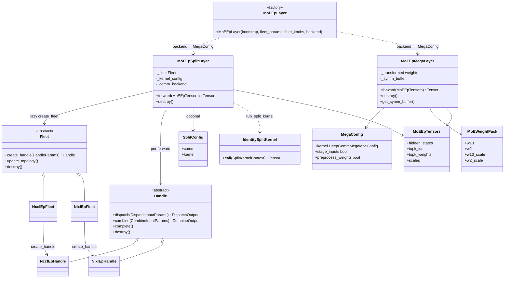
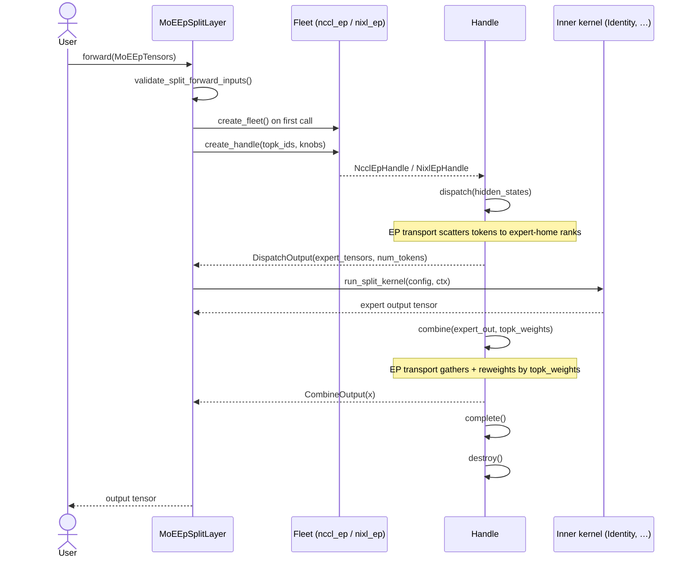
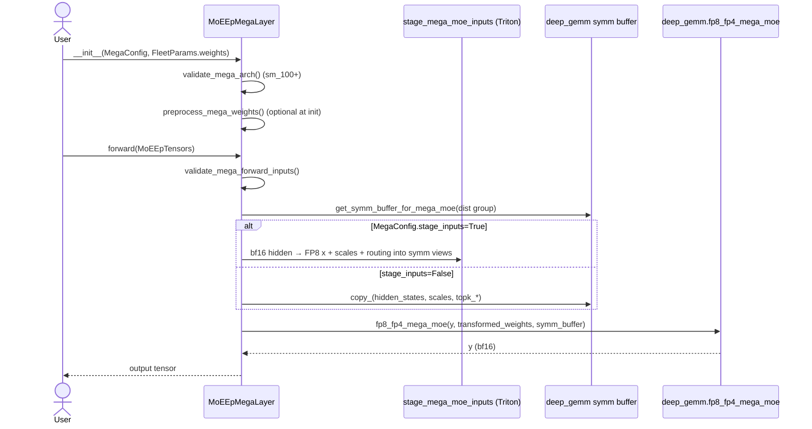

# `moe_ep` vs `moe_ep`

Comparison of `flashinfer.moe_ep` (new) against `flashinfer.moe_ep` (v1).
For the full mega-MoE design and migration plan, see
[`moe_ep_deep_gemm_mega_moe.md`](moe_ep_deep_gemm_mega_moe.md).

---

## Overview

The package uses a **plugin layout** under `core/`, `backends/`, and `modes/`.
Native NCCL/NIXL transport libraries are staged under
`flashinfer/moe_ep/backends/split/comm/{nccl_ep,nixl_ep}/_libs/` when built with
`BUILD_NVEP=1`.

| Area | Flat layout (archived) | Current (`core/` / `backends/` / `modes/`) |
|------|------------------------|-----------------------------------------------|
| **Entry point** | `MoEEpLayer` monolithic `nn.Module` | `MoEEpLayer(...)` **factory** → `MoEEpSplitLayer` or `MoEEpMegaLayer` |
| **Split path** | Inline identity / `compute_config` kwargs | `SplitConfig(comm, kernel)`; kernels in `backends/split/kernel/` |
| **Fused MoE compute** | `_compute_bridge.py` + inline `_inner_compute` | `FusedMoeKernelConfig` → `backends/split/kernel/fused_moe/` |
| **Mega path** | Not present | `MoEEpMegaLayer` + `backends/mega/kernel/deep_gemm_mega/` |
| **Weights** | `compute_config` + `fused_moe.api.MoEWeightPack` kwargs | Canonical `MoEWeightPack` on `FleetParams`; kernel materializes native views |
| **Tests** | `tests/moe_ep/` | `tests/moe_ep/` (+ `test_fused_moe_weights.py`, NVFP4 compute correctness) |

---

## Directory structure

One-line role for every file under `flashinfer/moe_ep/` and
`tests/moe_ep/`.

### `flashinfer/moe_ep/` (implemented)

See also [`flashinfer/moe_ep/design.md`](../../flashinfer/moe_ep/design.md) for the
full design, call sequences, and migration table from the flat layout.

```
flashinfer/moe_ep/
├── __init__.py                 # Public re-exports, native-lib probes
├── layer.py                    # MoEEpLayer factory
├── config.py, tensors.py, weights.py, algo_knobs.py, errors.py
├── design.md                   # Authoritative design doc
├── core/
│   ├── comm/                   # Fleet + Handle ABCs, create_fleet(), _BACKEND_REGISTRY
│   ├── kernel/                 # Split/Mega kernel ABCs + registry
│   └── validation/             # Shared validators
├── backends/
│   ├── split/
│   │   ├── comm/
│   │   │   ├── nccl_ep/        # NcclEpConfig, NcclEpFleet, NcclEpHandle, ndtensor.py
│   │   │   └── nixl_ep/        # NvepConfig, NixlEpFleet, NixlEpHandle
│   │   └── kernel/
│   │       ├── identity/       # IdentityConfig
│   │       └── fused_moe/      # FusedMoeKernelConfig, bridge, materialize_fused_moe_weights
│   └── mega/
│       └── kernel/deep_gemm_mega/
└── modes/
    ├── config.py               # SplitConfig, MegaConfig
    ├── split_layer.py          # MoEEpSplitLayer (+ opt-in enable_timing)
    └── mega_layer.py           # MoEEpMegaLayer
```

Runtime native artifacts (not in git; built by `BUILD_NVEP=1`):

```
flashinfer/moe_ep/backends/split/comm/nccl_ep/_libs/
flashinfer/moe_ep/backends/split/comm/nixl_ep/_libs/
```

### `tests/moe_ep/`

```
tests/moe_ep/
├── test_moe_ep_compute_correctness.py       # LL bf16 fused_moe vs MoELayer reference
├── test_moe_ep_compute_correctness_nvfp4.py # LL NVFP4 (SM100+)
├── test_moe_ep_ht_correctness.py            # HT bf16
├── test_fused_moe_weights.py                # materialize_fused_moe_weights unit tests
├── test_compute_bridge.py                   # dispatch → MoEActivationPack bridge
├── test_split_kernels.py                    # Kernel registry + identity wiring
├── test_layer_single_gpu.py                 # Split layer sequencing (stubbed fleet)
├── test_moe_ep_layer_multirank.py           # Identity roundtrip on 4+ GPUs
├── test_moe_ep_mega_multirank.py            # Mega-path correctness
├── smoke_nccl_ep.py, smoke_nixl_ep.py
├── nccl_ep/test_fleet_mock.py, test_ndtensor.py
└── nixl_ep/test_fleet_mock.py
```

Benchmark: `benchmarks/bench_moe_ep.py` (split path latency; uses `enable_timing`).

---

## Class diagram



---

## Sequence diagrams

### Split path (`MoEEpSplitLayer`)



### Mega path (`MoEEpMegaLayer`)



---

## User-facing API

All symbols below are importable from `flashinfer.moe_ep`.

### Shared types

| Symbol | Role |
|--------|------|
| `BootstrapConfig` | `world_size`, `rank`, `stream`, `nccl_comm`, `tcp_store` (NIXL) |
| `FleetParams` | `num_experts`, `max_tokens_per_rank`, `token_hidden_size`, optional `weights` |
| `MoEEpTensors` | `hidden_states`, `topk_ids`, `topk_weights`, optional `scales` |
| `MoEWeightPack` | Per-rank expert weights (`w13`, `w2`, optional FP4 scales) |
| `MoEEpLayer(...)` | Factory — returns `MoEEpSplitLayer` or `MoEEpMegaLayer` |
| `have_nccl_ep()`, `have_nixl_ep()`, `available_backends()` | Probe staged native libs |

### Split path

**When to use:** Expert-parallel dispatch/combine over NCCL-EP or NIXL-EP, with a
pluggable inner kernel between dispatch and combine. Requires **sm_90+**.

**Minimal (factory, NCCL-EP, identity kernel):**

```python
import torch
from flashinfer.moe_ep import (
    BootstrapConfig,
    FleetParams,
    MoEEpLayer,
    MoEEpTensors,
)

layer = MoEEpLayer(
    bootstrap=BootstrapConfig(world_size=8, rank=rank),
    fleet_params=FleetParams(
        num_experts=64,
        max_tokens_per_rank=128,
        token_hidden_size=4096,
    ),
    backend="nccl_ep",
)

out = layer(MoEEpTensors(
    hidden_states=hidden,       # [num_tokens, hidden] cuda
    topk_ids=topk_ids,          # [num_tokens, top_k] int64
    topk_weights=topk_weights,  # [num_tokens, top_k] float
))

layer.destroy()  # optional; also called from __del__
```

**Explicit comm + kernel (`SplitConfig`):**

```python
from flashinfer.moe_ep import (
    IdentityConfig,
    NCCLEPConfig,
    SplitConfig,
    MoEEpSplitLayer,
)

layer = MoEEpSplitLayer(
    bootstrap=BootstrapConfig(world_size=8, rank=rank),
    fleet_params=fleet_params,
    backend=SplitConfig(
        comm=NCCLEPConfig(),
        kernel=IdentityConfig(),
    ),
)
```

**NIXL-EP** — pass `tcp_store` in bootstrap and `backend="nixl_ep"` or
`NvepConfig()`:

```python
from flashinfer.moe_ep import BootstrapConfig, NvepConfig

bootstrap = BootstrapConfig(
    world_size=world_size,
    rank=rank,
    tcp_store=tcp_store,  # torch.distributed.TCPStore
)
layer = MoEEpLayer(..., backend=NvepConfig())
```

**Fused MoE inner compute** (`FusedMoeKernelConfig`):

```python
from flashinfer.fused_moe.api import (
    BackendOptions,
    ExecutionConfig,
    ExpertConfig,
    MoEConfig,
    QuantConfig,
    QuantVariant,
    RoutingConfig,
    TrtllmBf16Config,
)
from flashinfer.moe_ep import (
    BootstrapConfig,
    FleetParams,
    FusedMoeKernelConfig,
    MoEEpLayer,
    MoEEpTensors,
    MoEWeightPack,
    NcclEpConfig,
    SplitConfig,
)

moe_config = MoEConfig(
    routing=RoutingConfig(num_experts=64, top_k=8),
    quant=QuantConfig(variant=QuantVariant.BF16),
    experts=ExpertConfig(
        intermediate_size=2048,
        local_expert_offset=rank * (64 // world_size),
        local_num_experts=64 // world_size,
    ),
    backend=BackendOptions(candidates=(TrtllmBf16Config(),)),
    execution=ExecutionConfig(tune_max_num_tokens=8192),
)

layer = MoEEpLayer(
    bootstrap=BootstrapConfig(world_size=world_size, rank=rank),
    fleet_params=FleetParams(
        num_experts=64,
        max_tokens_per_rank=128,
        token_hidden_size=4096,
        weights=MoEWeightPack(w13=w13_local, w2=w2_local),  # canonical bf16
    ),
    backend=SplitConfig(
        comm=NcclEpConfig(),
        kernel=FusedMoeKernelConfig(moe_config=moe_config),
    ),
)
```

The kernel plugin materializes `FleetParams.weights` into
`flashinfer.fused_moe.api.MoEWeightPack` native views via
`materialize_fused_moe_weights()` during layer init.

**Fleet-level knobs** (optional, split only):

```python
from flashinfer.moe_ep import (
    FleetAlgoKnobQuantization,
    FleetAlgoKnobTopologyCapacity,
    QuantType,
)

layer = MoEEpLayer(
    ...,
    fleet_knobs=[
        FleetAlgoKnobQuantization(quants=frozenset({QuantType.FP8E4M3})),
        FleetAlgoKnobTopologyCapacity(n=16),  # NIXL grow/shrink capacity
    ],
)
```

**Lower-level API** (no `nn.Module`):

```python
from flashinfer.moe_ep import create_fleet, HandleParams, DispatchInputParams, ...

fleet = create_fleet(bootstrap, fleet_params, fleet_knobs, backend="nccl_ep")
handle = fleet.create_handle(HandleParams(topk_ids=topk_ids), algo_knobs=[...])
d = handle.dispatch(DispatchInputParams(x=[hidden_states]))
# ... inner compute ...
c = handle.combine(...)
handle.complete()
handle.destroy()
fleet.destroy()
```

### Mega path

**When to use:** Fused Blackwell mega-MoE via `deep_gemm.fp8_fp4_mega_moe`.
Requires **sm_100+**, `torch.distributed` initialized, and `FleetParams.weights`.

```python
import torch.distributed as dist
from flashinfer.moe_ep import (
    BootstrapConfig,
    DeepGemmMegaMoeConfig,
    FleetParams,
    MegaConfig,
    MoEEpLayer,
    MoEWeightPack,
    MoEEpTensors,
)

dist.init_process_group(backend="nccl")

layer = MoEEpLayer(
    bootstrap=BootstrapConfig(world_size=8, rank=rank),
    fleet_params=FleetParams(
        num_experts=64,
        max_tokens_per_rank=64,
        token_hidden_size=4096,
        weights=MoEWeightPack(w13=w13, w2=w2),  # per-rank bf16 weights
    ),
    backend=MegaConfig(
        megakernel=DeepGemmMegaMoeConfig(
            intermediate_size=2048,
            top_k=4,
        ),
        stage_inputs=True,       # Triton FP8 staging from bf16 hidden_states
        preprocess_weights=True, # FP4 transform at init
    ),
)

out = layer(MoEEpTensors(
    hidden_states=hidden_states,  # bf16 [num_tokens, hidden]
    topk_ids=topk_ids,
    topk_weights=topk_weights,
))
# out is bf16

layer.destroy()
```

**`stage_inputs=False`** — caller supplies pre-quantized `MoEEpTensors.scales`
and copies activations into the symm buffer layout directly.

**Direct construction** (skip factory):

```python
from flashinfer.moe_ep import MoEEpMegaLayer, MegaConfig, ...

mega = MoEEpMegaLayer(bootstrap, fleet_params, mega_config)
```

`fleet_knobs` passed to `MoEEpLayer(...)` are **ignored** for `MegaConfig` (warning issued).

---

## Unchanged from v1 (split path)

`BootstrapConfig`, `FleetParams`, `Fleet` / `Handle` ABC, `MoEEpTensors`, algo
knobs, and NCCL/NIXL wrappers. Default `backend="nccl_ep"` + `IdentityConfig`
matches v1's identity roundtrip.

## New in v2 only

- Fused mega-MoE (`MegaConfig` / `MoEEpMegaLayer`)
- `SplitConfig` comm/kernel decoupling and `split/kernels/` registry
- `MoEWeightPack`, per-forward `handle.destroy()`, split layer `__del__`
- `validate_mega_arch`, `validate_mega_forward_inputs`, NIXL topology-capacity checks
