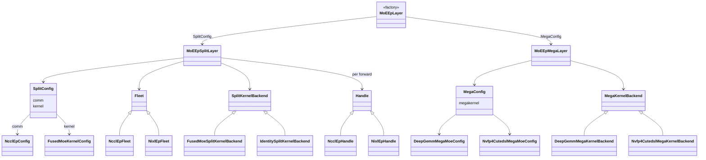

# moe_ep Design

Expert-Parallel MoE with two modes:

- **Split** — dispatch → local kernel → combine (pluggable comm + compute)
- **Mega** — fused comm + MoE kernel (no separate Fleet/Handle)

Shared types live at the package root; plugin ABCs/registries in `core/`; concrete plugins
in `backends/`; layer orchestration in `modes/`. Plugins register at import time.

## Layout

```
moe_ep/
  config.py, tensors.py, weights.py, layer.py   # shared types + MoEEpLayer factory
  core/comm, core/kernel, core/runtime, core/validation
  backends/split/comm/{nccl_ep,nixl_ep}
  backends/split/kernel/{identity,fused_moe}
  backends/mega/kernel/{deep_gemm_mega,nvfp4_cutedsl}
  modes/{split_layer,mega_layer,config}.py
```

Kernels register via `@register_*` when `backends` is imported. Comm fleets register when
their `fleet.py` is imported from `__init__.py` (config import alone is not enough).

## Key types

| Type | Role |
|------|------|
| `BootstrapConfig` | `world_size`, `rank`, `stream`, `nccl_comm`, `tcp_store`, `auto_bootstrap=True` |
| `FleetParams` | EP sizing, `algorithm` (LL/HT), `layout` (EXPERT_MAJOR / RANK_MAJOR), optional `weights` |
| `MoEEpTensors` | `hidden_states`, `topk_ids`, `topk_weights`, optional `scales` (pre-staged mega) |
| `MoEWeightPack` | Canonical `w13` / `w2` (+ optional scales); backends convert in `preprocess_weights()` |
| `SplitConfig` | `comm` + `kernel` plugin slots (default `NcclEpConfig` + `IdentityConfig`) |
| `MegaConfig` | `megakernel`, `stage_inputs`, `preprocess_weights` |

**Split path:** `MoEEpLayer(..., backend=SplitConfig(comm=..., kernel=...))` or a comm string/config
(shorthand uses `IdentityConfig`). Fleet is created on first `forward()`; a new Handle per forward.

**Mega path:** `MoEEpLayer(..., backend=MegaConfig(megakernel=...))`. Requires `FleetParams.weights`.
Workspace allocated on first forward. Output is bf16 `[num_tokens, token_hidden_size]`.

## Class diagram



## Call flow

**Split:** init kernel (+ optional runtime bootstrap) → forward: dispatch → `compute(ctx)` → combine → destroy handle.

**Mega:** init kernel → bootstrap runtime from `kernel.runtime_requirements()` → forward: `prepare_workspace` → `stage_inputs` → `compute` → destroy workspace.

Both paths call `ensure_moe_ep_cuda_device()` at init. When `BootstrapConfig.auto_bootstrap=True`
(default), layers acquire a ref-counted process runtime via `core/runtime/bootstrap.py` and
release it in `destroy()`.

| Runtime need | Who |
|--------------|-----|
| `torch_dist` (NCCL) | split comm, all mega kernels |
| `nvshmem` | `nvfp4_cutedsl` only (skip with `MEGA_NO_DIST=1`) |

Mega backends declare requirements via `MegaKernelBackend.runtime_requirements()`.

## Built-in plugins

| Kind | Name | Config |
|------|------|--------|
| Comm | `nccl_ep` | `NcclEpConfig` (`NCCLEPConfig` alias) |
| Comm | `nixl_ep` | `NvepConfig` (needs `tcp_store`) |
| Split kernel | `identity` | `IdentityConfig` |
| Split kernel | `fused_moe` | `FusedMoeKernelConfig(moe_config=...)` |
| Mega kernel | `deep_gemm_mega` | `DeepGemmMegaMoeConfig` — FP8/FP4, sm_100+ |
| Mega kernel | `nvfp4_cutedsl` | `Nvfp4CutedslMegaMoeConfig` — NVFP4, sm_100+ |

`fused_moe` bridges dispatch output to `flashinfer.fused_moe.MoELayer` and needs weights.
`identity` is comm-only (weights optional). Mega kernels always need weights.

**Mega staging:** `stage_inputs=True` accepts bf16 activations; `False` expects caller-supplied
quantized `hidden_states` + `scales` (NVFP4 packed shape `[T, hidden/2]`).

**Mega weights (`nvfp4_cutedsl`):** kernel launch expects NVFP4 + swizzled-SF expert weights.
`MoEWeightPack` may be bf16 (quantized at init when `preprocess_weights=True`, default) or
pre-quantized NVFP4 with `w13_scale` / `w2_scale`.

## Usage

Entry point: `flashinfer.moe_ep.MoEEpLayer`.

```python
from flashinfer.fused_moe.api import MoEConfig  # build moe_config for local experts
from flashinfer.moe_ep import (
    MoEEpLayer, BootstrapConfig, FleetParams, MoEEpTensors, MoEWeightPack,
    SplitConfig, NcclEpConfig, FusedMoeKernelConfig, MegaConfig, DeepGemmMegaMoeConfig,
)

# Split (NCCL-EP + fused MoE compute)
layer = MoEEpLayer(
    bootstrap=BootstrapConfig(world_size=4, rank=rank),
    fleet_params=FleetParams(
        num_experts=32, max_tokens_per_rank=256, token_hidden_size=2048,
        weights=MoEWeightPack(w13=w13_local, w2=w2_local),
    ),
    backend=SplitConfig(
        comm=NcclEpConfig(),
        kernel=FusedMoeKernelConfig(moe_config=moe_config),
    ),
)
out = layer.forward(MoEEpTensors(hidden_states=..., topk_ids=..., topk_weights=...))

# Mega (DeepGEMM or Nvfp4CutedslMegaMoeConfig)
layer = MoEEpLayer(
    bootstrap=BootstrapConfig(world_size=4, rank=rank),
    fleet_params=FleetParams(..., weights=MoEWeightPack(w13=..., w2=...)),
    backend=MegaConfig(megakernel=DeepGemmMegaMoeConfig(intermediate_size=1024, top_k=4)),
)
out = layer.forward(MoEEpTensors(...))
layer.destroy()
```

Under torchrun, dist/NVSHMEM init is automatic. Set `auto_bootstrap=False` when tests manage
runtime themselves. Useful exports: `bootstrap_moe_ep_runtime`, `finalize_moe_ep_runtime`,
`ensure_moe_ep_cuda_device`, `preprocess_mega_weights`, `preprocess_nvfp4_cutedsl_mega_weights`.

## Lifetimes

| Object | Created | Destroyed |
|--------|---------|-----------|
| Kernel backend | layer init | layer destroy |
| Process runtime | layer init (if `auto_bootstrap`) | layer destroy (ref-counted) |
| Fleet | first split forward | layer destroy |
| Handle | each split forward | end of forward |
| Mega workspace | first mega forward | layer destroy |

## Extending

**Split kernel:** `backends/split/kernel/<name>/` → subclass `SplitKernelBackend`, `@register_split_kernel`, import in `backends/split/kernel/__init__.py`.

**Mega kernel:** `backends/mega/kernel/<name>/` → subclass `MegaKernelBackend`, implement lifecycle hooks (`compute`, `prepare_workspace`, `stage_inputs`, …), override `runtime_requirements()` if needed, `@register_mega_kernel`, import in `backends/mega/kernel/__init__.py`.

**Comm backend (split only):** `backends/split/comm/<name>/` with `config.py`, `fleet.py` (`_BACKEND_REGISTRY[...]`), `handle.py`; import fleet from `moe_ep.__init__.py`.

## Tests

`tests/moe_ep/run_tests.sh mega` runs multirank DeepGEMM and NVFP4 mega parity tests
(torchrun, sm_100+, 4 GPUs). Runtime bootstrap is exercised through `MoEEpMegaLayer`, not
direct front-end init calls.
