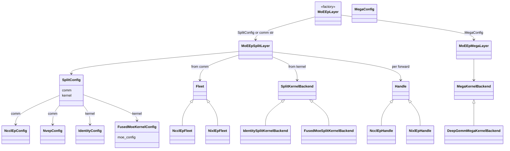
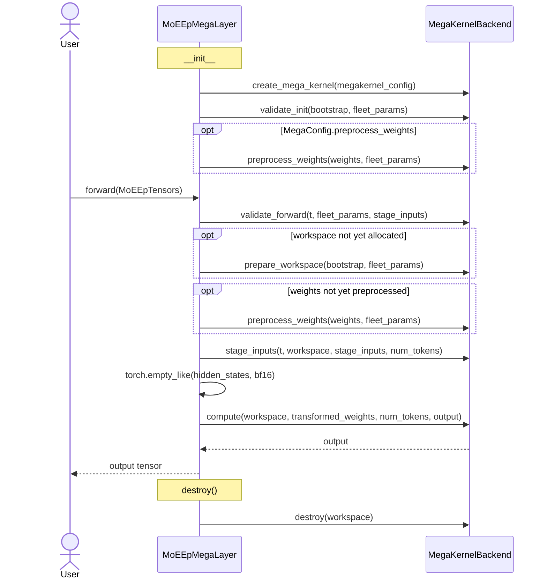

# moe_ep Design

Expert-Parallel MoE with two execution modes: **split** (dispatch → inner kernel → combine)
and **mega** (fused comm + local MoE). Shared types sit at the package root; plugin ABCs
and registries live in `core/`; concrete transport/compute plugins in `backends/`; layer
orchestration in `modes/`. Plugins register at import time via `__init__.py`.

## Package Layout

```
moe_ep/
  config.py             BootstrapConfig, FleetParams, HandleParams, I/O envelopes
  tensors.py            MoEEpTensors
  weights.py            MoEWeightPack
  algo_knobs.py         Fleet/Handle tuning knobs
  errors.py             MoEEpNotBuiltError
  layer.py              MoEEpLayer factory
  core/
    comm/                 Fleet + Handle ABCs, create_fleet(), _BACKEND_REGISTRY
    kernel/               Split/Mega kernel ABCs, @register_* decorators
    validation/           shared arch/config/forward validation helpers
  backends/
    split/
      comm/
        nccl_ep/          NcclEpConfig, NcclEpFleet, NcclEpHandle, ndtensor.py
        nixl_ep/          NvepConfig, NixlEpFleet, NixlEpHandle
      kernel/
        identity/         IdentityConfig, identity split kernel
        fused_moe/        FusedMoeKernelConfig, bridge, weights, validate
    mega/
      kernel/
        deep_gemm_mega/   DeepGemmMegaMoeConfig, staging, weights
  modes/
    config.py             SplitConfig, MegaConfig
    split_layer.py        MoEEpSplitLayer
    mega_layer.py         MoEEpMegaLayer
```

Shared dataclasses and envelopes live at the package root (`config.py`, `tensors.py`,
`weights.py`). Plugin ABCs and registries live under `core/`. Concrete transport and
compute plugins live under `backends/`. Orchestration layers compose them in `modes/`.

Plugin registration at import time:
- **Split/mega kernels** — importing `backends` (via `from . import backends` in
  `__init__.py`) loads `backends/split/kernel/` and `backends/mega/kernel/`, which
  triggers `@register_split_kernel` / `@register_mega_kernel`.
- **Comm fleets** — fleet modules must be imported explicitly; `__init__.py` does
  `from .backends.split.comm.nccl_ep import fleet` and the nixl_ep equivalent so
  `_BACKEND_REGISTRY[...] = ...` runs. Importing comm configs alone is not enough.

## SplitConfig — comm + kernel

`SplitConfig` (`modes/config.py`) pairs two independent plugin slots:

| Field | Role | Config examples | Registry key | Runtime object |
|-------|------|-----------------|--------------|----------------|
| `comm` | EP transport (dispatch/combine) | `NcclEpConfig`, `NvepConfig` | `backend_name` (`"nccl_ep"`, `"nixl_ep"`) | `Fleet` → per-forward `Handle` |
| `kernel` | Local compute after dispatch | `IdentityConfig`, `FusedMoeKernelConfig` | `kernel_name` (`"identity"`, `"fused_moe"`) | `SplitKernelBackend` |

Defaults: `comm=NcclEpConfig()`, `kernel=IdentityConfig()`.

| Kernel | Config | `FleetParams.weights` | Role |
|--------|--------|----------------------|------|
| `identity` | `IdentityConfig()` | not required (opt-in via `require_weights=True`) | Comm-only roundtrip; passes dispatch output through |
| `fused_moe` | `FusedMoeKernelConfig(moe_config=...)` | required (`MoEWeightPack`) | `flashinfer.fused_moe.MoELayer` over dispatched tokens |

`MoEEpSplitLayer` unpacks both at `__init__`: `create_split_kernel(backend.kernel)` runs
immediately; `create_fleet(..., backend=backend.comm)` runs lazily on first `forward()`.

Shorthand: passing a comm string or comm config object directly to `MoEEpLayer(..., backend=...)`
(without wrapping in `SplitConfig`) still builds `MoEEpSplitLayer`, but defaults the kernel to
`IdentityConfig()`.

Naming note: comm configs are named after the transport (`NcclEpConfig`, `NvepConfig`); kernel
configs are named after compute behavior (`IdentityConfig`, `FusedMoeKernelConfig`). `NCCLEPConfig`
is a legacy alias for `NcclEpConfig`. `NvepConfig` selects the `nixl_ep` backend (NVEP build
flag naming); runtime classes use the `NixlEp*` prefix (`NixlEpFleet`, `NixlEpHandle`).

## FleetParams — algorithm and layout

`FleetParams` (`config.py`) carries durable transport sizing plus optional weights:

| Field | Default | Meaning |
|-------|---------|---------|
| `algorithm` | `EpAlgorithm.LOW_LATENCY` | LL vs HT dispatch/combine path |
| `layout` | `EpLayout.EXPERT_MAJOR` | LL receive-buffer layout (ignored on HT) |
| `weights` | `None` | Canonical `MoEWeightPack` for compute kernels |

`EpLayout` (LL only; HT always uses the library FLAT layout):

- `EXPERT_MAJOR` — recv buffer `[num_local_experts, max_tokens_per_rank * world, hidden]`; rows
  pre-assigned to experts; combine reweights per-token on receive.
- `RANK_MAJOR` — recv buffer `[world, max_tokens_per_rank, hidden]`; tokens grouped by source
  rank with per-token `topk_idx` / `topk_weights` (valid only with `LOW_LATENCY`).

`DispatchOutput` may carry `recv_topk_idx` / `recv_topk_weights` for HT and LL RANK_MAJOR layouts.
These flow into `SplitKernelContext` and are required by the `fused_moe` kernel on those paths.

## MoEWeightPack — canonical weights

Users supply a single `MoEWeightPack` via `FleetParams.weights` (`weights.py`):

- `w13` — gate+up projection `[local_experts, 2*intermediate, hidden]`
- `w2` — down projection `[local_experts, hidden, intermediate]`
- optional `w13_scale` / `w2_scale` for quantized mega kernels

Split and mega kernel plugins materialize backend-specific layouts in
`preprocess_weights()` — callers never touch per-backend native views directly.
For `fused_moe`, `materialize_fused_moe_weights()` converts canonical weights into the
`flashinfer.fused_moe` native pack (bf16 block-major, NVFP4, etc.).

## Class Diagram



## Split Path — Call Sequence

`Fleet` is created lazily on first `forward()` and reused. A fresh `Handle` is created
and destroyed on **every** `forward()` (routing via `topk_ids` is per-iteration).

```mermaid
sequenceDiagram
    actor User
    participant Layer as MoEEpSplitLayer
    participant CreateFleet as create_fleet
    participant Fleet
    participant Handle
    participant Kernel as SplitKernelBackend

    Note over Layer: __init__
    Layer->>Kernel: create_split_kernel(kernel_config)
    Layer->>Kernel: validate_init(bootstrap, fleet_params)
    opt requires_weights
        Layer->>Kernel: preprocess_weights(weights, fleet_params)
    end

    User->>Layer: forward(MoEEpTensors)
    Layer->>Layer: validate_split_forward_inputs(...)
    opt first forward only
        Layer->>CreateFleet: create_fleet(bootstrap, fleet_params, knobs, comm)
        CreateFleet-->>Layer: Fleet
    end
    Layer->>Fleet: create_handle(HandleParams, handle_knobs)
    Fleet-->>Handle: handle

    Layer->>Handle: dispatch(DispatchInputParams)
    Handle-->>Layer: DispatchOutput(expert_tensors, num_tokens, recv_topk_*)

    Layer->>Kernel: compute(SplitKernelContext)
    Note over Kernel: ctx carries recv_topk_idx/weights for HT and RANK_MAJOR
    Kernel-->>Layer: expert_out

    Layer->>Handle: combine(CombineInputParams)
    Handle-->>Layer: CombineOutput

    Layer->>Handle: complete()
    Note over Handle: no-op on NCCL-EP; waits on NIXL-EP when staged
    Layer->>Handle: destroy()
    Layer-->>User: output tensor

    Note over Layer: destroy()
    Layer->>Fleet: destroy()
```

## Mega Path — Call Sequence

No Fleet/Handle. Workspace is allocated lazily on first forward. Requires
`FleetParams.weights` and (for `deep_gemm_mega`) `torch.distributed` initialized.



## User-Facing API

Entry point: `flashinfer.moe_ep.MoEEpLayer` (default `backend="nccl_ep"`).

| `backend` argument | Layer | Description |
|--------------------|-------|-------------|
| `SplitConfig(comm=..., kernel=...)` | `MoEEpSplitLayer` | explicit comm + kernel plugins |
| comm string (`"nccl_ep"`) or comm config (`NcclEpConfig()`) | `MoEEpSplitLayer` | comm plugin + default `IdentityConfig` kernel |
| `MegaConfig` | `MoEEpMegaLayer` | fused mega kernel (no EP transport) |

`fleet_knobs` apply to the split path only; they are ignored (with a warning) for
`MegaConfig`. NIXL-EP requires `BootstrapConfig.tcp_store`.

**Split example:**

```python
from flashinfer.moe_ep import (
    MoEEpLayer, BootstrapConfig, FleetParams, MoEEpTensors,
    SplitConfig, NcclEpConfig, IdentityConfig,
)

layer = MoEEpLayer(
    bootstrap=BootstrapConfig(world_size=4, rank=rank),
    fleet_params=FleetParams(num_experts=32, max_tokens_per_rank=256, token_hidden_size=2048),
    backend=SplitConfig(comm=NcclEpConfig(), kernel=IdentityConfig()),
)
out = layer.forward(MoEEpTensors(hidden_states=..., topk_ids=..., topk_weights=...))
```

**Split example (NIXL-EP comm + identity kernel):**

```python
from flashinfer.moe_ep import (
    MoEEpLayer, BootstrapConfig, FleetParams, MoEEpTensors,
    SplitConfig, NvepConfig, IdentityConfig,
)

layer = MoEEpLayer(
    bootstrap=BootstrapConfig(world_size=4, rank=rank, tcp_store=store),
    fleet_params=FleetParams(num_experts=32, max_tokens_per_rank=256, token_hidden_size=2048),
    backend=SplitConfig(comm=NvepConfig(), kernel=IdentityConfig()),
)
```

**Split example (fused MoE compute):**

```python
from flashinfer.fused_moe.api import MoEConfig  # build moe_config
from flashinfer.moe_ep import (
    MoEEpLayer, BootstrapConfig, FleetParams, MoEEpTensors, MoEWeightPack,
    SplitConfig, NcclEpConfig, FusedMoeKernelConfig,
)

layer = MoEEpLayer(
    bootstrap=BootstrapConfig(world_size=8, rank=rank),
    fleet_params=FleetParams(
        num_experts=64,
        max_tokens_per_rank=128,
        token_hidden_size=4096,
        weights=MoEWeightPack(w13=w13_local, w2=w2_local),
    ),
    backend=SplitConfig(
        comm=NcclEpConfig(),
        kernel=FusedMoeKernelConfig(moe_config=moe_config),
    ),
)
out = layer.forward(MoEEpTensors(hidden_states=..., topk_ids=..., topk_weights=...))
```

**Mega example:**

```python
from flashinfer.moe_ep import (
    MoEEpLayer, BootstrapConfig, FleetParams, MoEEpTensors, MoEWeightPack,
    MegaConfig, DeepGemmMegaMoeConfig,
)

layer = MoEEpLayer(
    bootstrap=BootstrapConfig(world_size=4, rank=rank),
    fleet_params=FleetParams(..., weights=MoEWeightPack(w13=..., w2=...)),
    backend=MegaConfig(megakernel=DeepGemmMegaMoeConfig(intermediate_size=1024, top_k=4)),
)
out = layer.forward(MoEEpTensors(...))
```

Key types (package root): `BootstrapConfig`, `FleetParams`, `MoEEpTensors`, `MoEWeightPack`,
`EpAlgorithm`, `EpLayout`, `AlgoKnob` hierarchy.

Split-path plugin configs (passed via `SplitConfig` or shorthand `backend=`):
- **comm:** `NcclEpConfig`, `NCCLEPConfig` (alias), `NvepConfig` (`backend_name="nixl_ep"`)
- **kernel:** `IdentityConfig`, `FusedMoeKernelConfig(moe_config=MoEConfig(...))`

Mega-path: `MegaConfig(megakernel=DeepGemmMegaMoeConfig(...))`. Flags on `MegaConfig`:
`stage_inputs=True`, `preprocess_weights=True` (both overridable). Mega requires
`FleetParams.weights`; split path only needs weights when the kernel's
`requires_weights()` is true (`IdentityConfig` defaults to false; `fused_moe` always true).

Utility exports: `SplitKernelContext`, `kernel_requires_weights()`, `run_split_kernel()`.

Build probes: `have_nccl_ep()`, `have_nixl_ep()`, `available_backends()`. Validation helpers
are exported from `core.validation` (`validate_fleet_params`, etc.).

**Opt-in profiling (split path):** set `MoEEpSplitLayer.enable_timing = True` to record
dispatch/compute/combine GPU times in `last_timings_ms` (off by default; used by
`benchmarks/bench_moe_ep.py`).

## Object lifetimes

| Object | Created | Destroyed |
|--------|---------|-----------|
| `SplitKernelBackend` / `MegaKernelBackend` | layer `__init__` | with layer |
| `Fleet` | first split `forward()` | `layer.destroy()` |
| `Handle` | every split `forward()` | `handle.destroy()` in `finally` |
| Mega workspace | first mega `forward()` | `layer.destroy()` |

## Adding a Split Kernel

1. Create `backends/split/kernel/<name>/` with `config.py` (`kernel_name: str`) and `backend.py`.
2. Subclass `core.kernel.base.SplitKernelBackend`; implement `kernel_name()`, `compute(ctx)`.
3. Register with `@register_split_kernel("<name>")` from `core.kernel.registry`.
4. Import the subpackage in `backends/split/kernel/__init__.py` so registration runs at load.
5. Use via `SplitConfig(comm=..., kernel=MyKernelConfig(...))`.

Optional hooks: `requires_weights()`, `validate_init()`, `preprocess_weights()`.

## Fused MoE split kernel

The `fused_moe` plugin bridges EP dispatch output to `flashinfer.fused_moe.MoELayer`:

| File | Role |
|------|------|
| `backends/split/kernel/fused_moe/config.py` | `FusedMoeKernelConfig(moe_config=MoEConfig(...))` |
| `backends/split/kernel/fused_moe/backend.py` | `FusedMoeSplitKernelBackend` — lifecycle + `compute()` |
| `backends/split/kernel/fused_moe/bridge.py` | EP dispatch layout → `MoEActivationPack` |
| `backends/split/kernel/fused_moe/weights.py` | `materialize_fused_moe_weights()` |
| `backends/split/kernel/fused_moe/validate.py` | EP vs `MoEConfig` consistency checks |

At init, `validate_compute_consistency()` ensures `FleetParams.num_experts`, local expert
count/offset, and `MoEConfig.routing.num_experts` agree. At compute time, the bridge selects
`build_activation_pack()` (LL EXPERT_MAJOR) or `build_activation_pack_rank_major()` (HT /
LL RANK_MAJOR) based on `FleetParams.algorithm` and `FleetParams.layout`.

## Adding a Mega Kernel

1. Create `backends/mega/kernel/<name>/` with `config.py` (`kernel_name: str`) and `backend.py`.
2. Subclass `core.kernel.base.MegaKernelBackend`; implement the lifecycle hooks.
3. Register with `@register_mega_kernel("<name>")` from `core.kernel.registry`.
4. Import the subpackage in `backends/mega/kernel/__init__.py`.
5. Use via `MegaConfig(megakernel=MyMegaConfig(...))`.

Required hooks: `kernel_name()`, `compute(...)`. Typical extras: `validate_init`,
`preprocess_weights`, `prepare_workspace`, `validate_forward`, `stage_inputs`, `destroy`.

## Adding a Comm Backend

Split-path only. Under `backends/split/comm/<name>/` add:

- `config.py` — dataclass with `backend_name: str`
- `fleet.py` — `MyFleet(Fleet)`; register at module load:
  `_BACKEND_REGISTRY["<name>"] = MyFleet` (registry lives in `core.comm.fleet`)
- `handle.py` — `MyHandle(Handle)` for per-forward dispatch/combine

Re-export the config from `backends/split/comm/__init__.py`. Import the **fleet** module
from `flashinfer.moe_ep.__init__` (config import alone does not register). Built libs
stage into `backends/split/comm/<name>/_libs/`. Use via
`SplitConfig(comm=MyCommConfig(), kernel=...)`.

## Built-in Plugins

| Kind | Name | Config | Status |
|------|------|--------|--------|
| Comm (`SplitConfig.comm`) | `nccl_ep` | `NcclEpConfig` / `NCCLEPConfig` | implemented |
| Comm (`SplitConfig.comm`) | `nixl_ep` | `NvepConfig` | implemented |
| Split kernel (`SplitConfig.kernel`) | `identity` | `IdentityConfig` | working |
| Split kernel (`SplitConfig.kernel`) | `fused_moe` | `FusedMoeKernelConfig` | implemented (bf16, NVFP4) |
| Mega kernel | `deep_gemm_mega` | `DeepGemmMegaMoeConfig` | implemented |
