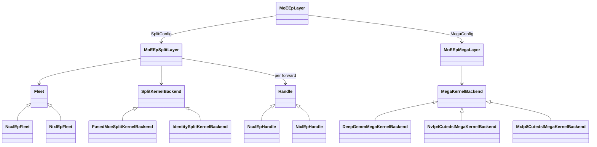
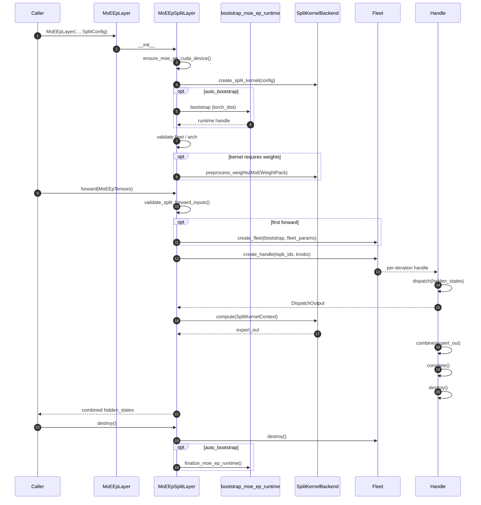
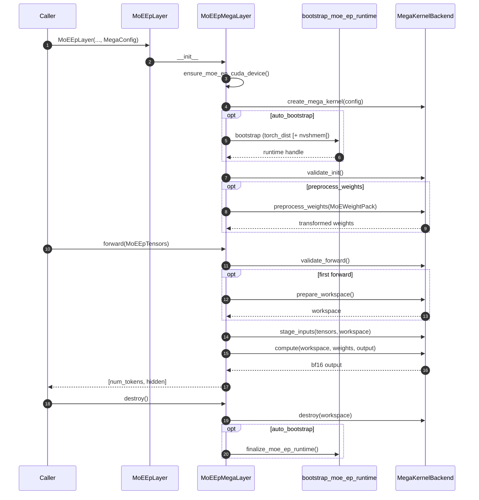

# moe_ep Design

Expert-Parallel MoE with two execution modes:

| Mode | Flow | When to use |
|------|------|-------------|
| **Split** | dispatch → local kernel → combine | Pluggable comm + compute; NCCL-EP / NIXL-EP transport |
| **Mega** | fused comm + MoE kernel | Single symmetric-memory kernel; no separate Fleet/Handle |

Entry point: `flashinfer.moe_ep.MoEEpLayer` (factory → `MoEEpSplitLayer` or `MoEEpMegaLayer`).

## Package layout

```
moe_ep/
  config.py, tensors.py, weights.py, layer.py   # shared types + factory
  algo_knobs.py                                  # split-path tuning knobs
  core/comm, core/kernel, core/runtime, core/validation
  backends/split/comm/{nccl_ep,nixl_ep}
  backends/split/kernel/{identity,fused_moe}
  backends/mega/kernel/{deep_gemm_mega,mxfp8_cutedsl,nvfp4_cutedsl}
  modes/{split_layer,mega_layer,config}.py
```

Plugins register at import time: kernels via `@register_*` when `backends` is imported;
comm fleets when their `fleet.py` is imported from `__init__.py`.

## Core types

| Type | Role |
|------|------|
| `BootstrapConfig` | `world_size`, `rank`, `stream`, `nccl_comm`, `tcp_store`, `auto_bootstrap=True` |
| `FleetParams` | EP sizing (`num_experts`, `max_tokens_per_rank`, `token_hidden_size`), `algorithm` (LL/HT), `layout` (EXPERT_MAJOR / RANK_MAJOR), optional `weights` |
| `MoEEpTensors` | `hidden_states`, `topk_ids`, `topk_weights`; optional `scales` (pre-staged mega), routing/count fields for split backends |
| `MoEWeightPack` | Canonical `w13` / `w2` (+ optional `w13_scale` / `w2_scale`); backends convert in `preprocess_weights()` |
| `SplitConfig` | `comm` + `kernel` slots (default `NcclEpConfig` + `IdentityConfig`) |
| `MegaConfig` | `megakernel`, `stage_inputs=True`, `preprocess_weights=True` |

**Split:** pass `SplitConfig(comm=..., kernel=...)` or a comm string/config (kernel defaults to `IdentityConfig`). Fleet is lazy-created on first `forward()`; a new Handle per forward.

**Mega:** pass `MegaConfig(megakernel=...)`. Requires `FleetParams.weights`. Workspace allocated on first forward. Output is bf16 `[num_tokens, token_hidden_size]`. `fleet_knobs` are ignored.

## Architecture



## Forward flow

**Split:** `dispatch` → `kernel.compute(ctx)` → `combine` → destroy handle.

**Mega:** `prepare_workspace` → `stage_inputs` → `compute` → (workspace kept until `destroy()`).

Both paths call `ensure_moe_ep_cuda_device()` at init. With `auto_bootstrap=True` (default), layers acquire a ref-counted process runtime and release it in `destroy()`.

| Runtime need | Used by |
|--------------|---------|
| `torch_dist` | split comm, all mega kernels |
| `nvshmem` | `nvfp4_cutedsl`, `mxfp8_cutedsl` only (skip with `MEGA_NO_DIST=1`) |

## Built-in plugins

| Kind | Name | Config |
|------|------|--------|
| Comm | `nccl_ep` | `NcclEpConfig` (`NCCLEPConfig` alias) |
| Comm | `nixl_ep` | `NvepConfig` (needs `tcp_store`) |
| Split kernel | `identity` | `IdentityConfig` — comm-only; weights optional |
| Split kernel | `fused_moe` | `FusedMoeKernelConfig(moe_config=...)` — bridges to `flashinfer.fused_moe.MoELayer`; needs weights |
| Mega kernel | `deep_gemm_mega` | `DeepGemmMegaMoeConfig` — FP8/FP4, sm_100+ |
| Mega kernel | `nvfp4_cutedsl` | `Nvfp4CutedslMegaMoeConfig` — NVFP4, sm_100+ |
| Mega kernel | `mxfp8_cutedsl` | `Mxfp8CutedslMegaMoeConfig` — MXFP8, sm_100+ |

**Mega weights (`nvfp4_cutedsl`):** kernel expects NVFP4 + swizzled-SF expert weights. Supply bf16 `MoEWeightPack` with `preprocess_weights=True` (default), or pre-quantized NVFP4 with `w13_scale` / `w2_scale`.

**Mega weights (`mxfp8_cutedsl`):** kernel expects MXFP8 + swizzled E8M0-SF expert weights. Supply bf16 `MoEWeightPack` with `preprocess_weights=True` (default), or pre-quantized kernel-layout fp8 weights with plain `w13_scale` / `w2_scale`.

**Mega input staging:** `stage_inputs=True` accepts bf16 activations; `False` expects caller-supplied quantized `hidden_states` + `scales` (NVFP4 packed shape `[T, hidden/2]`; MXFP8 fp8 shape `[T, hidden]` + E8M0 scales).

## Usage

```python
from flashinfer.fused_moe.api import MoEConfig
from flashinfer.moe_ep import (
    MoEEpLayer, BootstrapConfig, FleetParams, MoEEpTensors, MoEWeightPack,
    SplitConfig, NcclEpConfig, FusedMoeKernelConfig,
    MegaConfig, DeepGemmMegaMoeConfig,
)

# Split: NCCL-EP dispatch/combine + fused MoE compute
layer = MoEEpLayer(
    bootstrap=BootstrapConfig(world_size=4, rank=rank),
    fleet_params=FleetParams(
        num_experts=32, max_tokens_per_rank=256, token_hidden_size=2048,
        weights=MoEWeightPack(w13=w13_local, w2=w2_local),
    ),
    backend=SplitConfig(
        comm=NcclEpConfig(),
        kernel=FusedMoeKernelConfig(moe_config=moe_config),
    ),
)
out = layer.forward(MoEEpTensors(hidden_states=..., topk_ids=..., topk_weights=...))

# Mega: fused kernel (DeepGEMM or Nvfp4CutedslMegaMoeConfig)
layer = MoEEpLayer(
    bootstrap=BootstrapConfig(world_size=4, rank=rank),
    fleet_params=FleetParams(..., weights=MoEWeightPack(w13=..., w2=...)),
    backend=MegaConfig(megakernel=DeepGemmMegaMoeConfig(intermediate_size=1024, top_k=4)),
)
out = layer.forward(MoEEpTensors(...))
layer.destroy()
```

Under torchrun, dist/NVSHMEM init is automatic. Set `auto_bootstrap=False` when tests manage runtime themselves.

Useful exports: `bootstrap_moe_ep_runtime`, `finalize_moe_ep_runtime`, `ensure_moe_ep_cuda_device`, `preprocess_mega_weights`, `preprocess_nvfp4_cutedsl_mega_weights`, `preprocess_mxfp8_cutedsl_mega_weights`.

## Lifetimes

| Object | Created | Destroyed |
|--------|---------|-----------|
| Kernel backend | layer init | layer destroy |
| Process runtime | layer init (if `auto_bootstrap`) | layer destroy (ref-counted) |
| Fleet | first split forward | layer destroy |
| Handle | each split forward | end of forward |
| Mega workspace | first mega forward | layer destroy |

## Extending

1. **Split kernel** — `backends/split/kernel/<name>/`: subclass `SplitKernelBackend`, `@register_split_kernel`, import in `backends/split/kernel/__init__.py`.
2. **Mega kernel** — `backends/mega/kernel/<name>/`: subclass `MegaKernelBackend`, implement `compute` / `prepare_workspace` / `stage_inputs`, override `runtime_requirements()` if needed, `@register_mega_kernel`, import in `backends/mega/kernel/__init__.py`.
3. **Comm backend** (split only) — `backends/split/comm/<name>/` with `config.py`, `fleet.py`, `handle.py`; import fleet from `moe_ep.__init__.py`.

## Tests

`tests/moe_ep/run_tests.sh [unit|multirank|correctness|mega|smoke|all]`:

- **unit** — host-only pytest (no multirank)
- **multirank** — 4-GPU split path (NCCL-EP)
- **correctness** — 4-GPU LL/HT + NVFP4 numerics (Blackwell)
- **mega** — 4-GPU DeepGEMM + NVFP4 mega parity (Blackwell, sm_100+)
- **smoke** — quick NCCL-EP smoke scripts

Runtime bootstrap is exercised through layer construction, not direct front-end init calls.

## Sequence diagrams

### Split path



### Mega path


