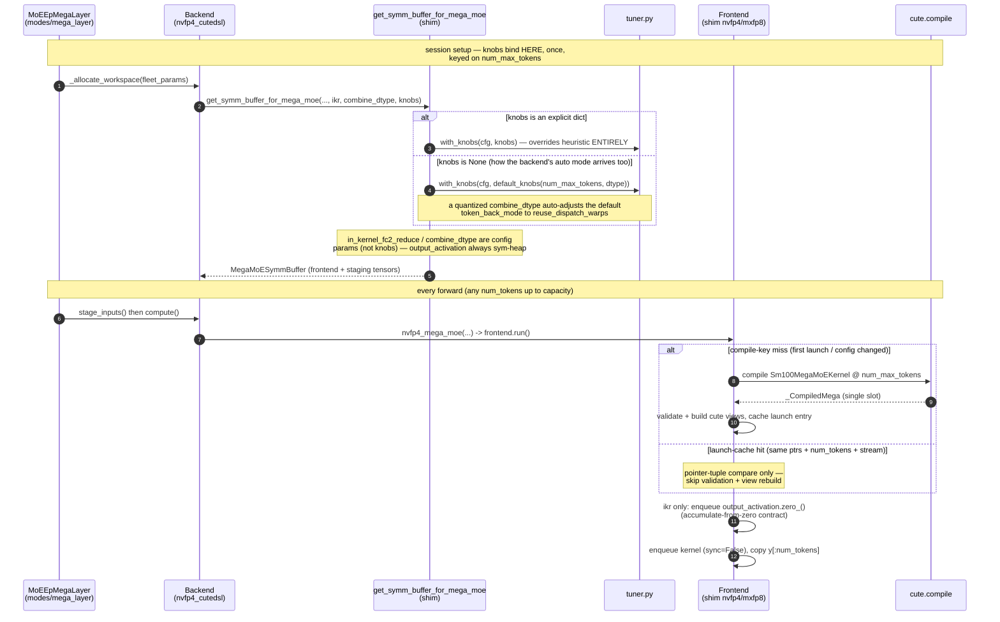
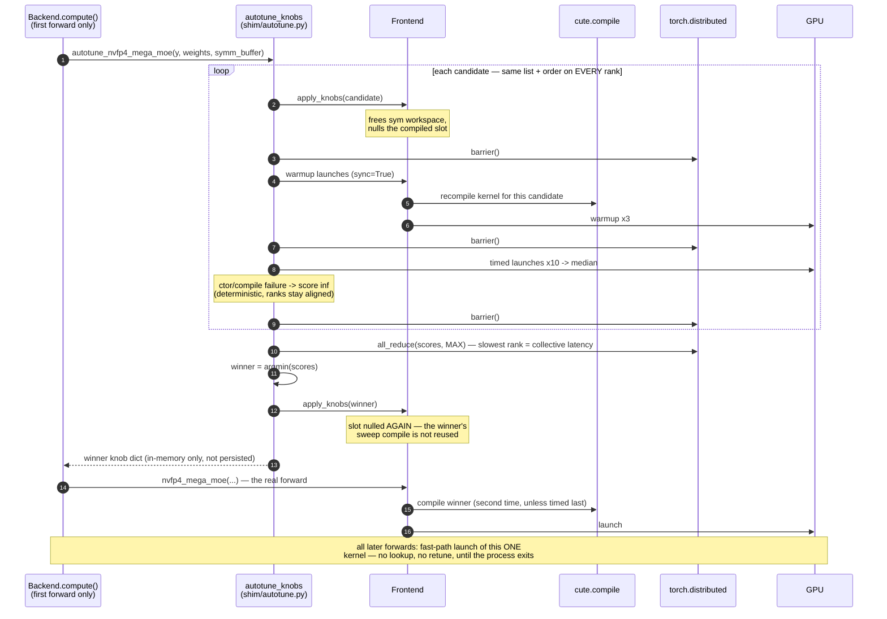

# CuTeDSL MegaMoE tuning + performance notes

This document collects the performance work on the CuTeDSL mega
backends: the tuning surface (knobs, per-size default profiles, online
autotuning), how tuning resolves at runtime, the measured results for
each backend and combine-leg variant, and the benchmark methodology
behind those numbers — including the measurement pitfalls we hit and how
to avoid them.  It is the companion to `SKILL.md`, which covers the
kernel drop-update workflow.

Unless noted otherwise, all measurements were taken 2026-07-14 on a
single GB200 node (4x GPUs, EP=4) at a DeepSeek-V3-like geometry:
256 experts, top-8, hidden 7168, intermediate 2048.  A full reproduce
recipe (hardware, container, versions, harness invocation) is in the
"Sweep methodology" and "Runbook" sections below.

## Headline result

`nvfp4_cutedsl` is **1.5-1.7x FASTER than `deep_gemm_mega` at every token
count 1..8192** through the full FI forward path (steady-state timing) in
its default configuration, and **up to 2.08x with the fp4 combine wire**
(`combine_dtype="nvfp4"`, the large-token winner — see "TRT-LLM-import
knobs" below).  An earlier "cutedsl is 2x slower than dg" reading was a
measurement artifact — see "Benchmarking lessons" below.  `mxfp8_cutedsl`
trails dg 0.5-0.7x by construction (fp8 weights move 2x the bytes of dg's
fp4; different accuracy point — dg is not its fair baseline).

Backend comparison, default configs (bf16 combine wire), full-sweep p50
(e2e_pipelined, µs; `moe_ep_benchmark/results/sweep_20260714_141327_fi_mega.csv`):

| tok/rank | dg     | nvfp4 (vs dg) | mxfp8  |
|---------:|-------:|--------------:|-------:|
| 8        | 213.0  | 133.4 (1.60x) | 380.5  |
| 64       | 286.7  | 165.9 (1.73x) | 538.7  |
| 512      | 346.1  | 234.5 (1.48x) | 626.7  |
| 1024     | 475.1  | 332.3 (1.43x) | 769.0  |
| 2048     | 823.3  | 537.6 (1.53x) | 1198.5 |
| 8192     | 3055.8 | 1841.1 (1.66x)| 4716.3 |

For the combine-leg variants of `nvfp4_cutedsl` (ikr / quantized wires),
see the "Measured results" table further down.

## The knob system (`shim/tuner.py`, `shim/autotune.py`)

- `tuner.py` mirrors the kernel team's `tester/solvers/inference_solver.py`
  knob taxonomy (re-audit on every drop).  Correctness knobs change a code
  path/output (`token_back_mode`, `mma_tiler_mnk`, `in_kernel_fc2_reduce`,
  ...); perf knobs are output-invariant (`group_hint`, `flag_batch`,
  `epi_flag_batch`).
- `default_knobs(num_tokens, dtype=...)` — the measured per-size profiles
  (provenance in the profile dict comments).  NVFP4 has FOUR profiles; the
  dominant axis is `token_back_mode`:
  - `epi_warps` wins at small batch but falls off a cliff mid-range
    (+18% at 512 tokens, +35% at 1024 — every dispatch-warp candidate beat
    every epi_warps candidate there).
  - tile (256x128 vs 256x256) and `flag_batch` are second-order (~1-5%).
  MXFP8 has ONE profile (fb4 + epi_warps at all sizes); the NVFP4-large
  fb8+dispatch-warp schedule measured ~5% slower for MXFP8 at 2048.
- Backend configs (`Nvfp4/Mxfp8CutedslMegaMoeConfig.knobs`): explicit dict
  overrides the heuristic ENTIRELY (pin every knob you care about);
  `"auto"` runs the online autotuner at the first forward.
- `autotune.py` — collective online tuner: every EP rank compiles+times the
  same candidate list in lockstep, per-candidate medians are all-reduced
  MAX (slowest rank = collective latency), argmin winner applied
  identically everywhere.  Cost: one `cute.compile` per candidate
  (~1-2 min), once per session.  Candidates mirror the tester sweep
  restriction; for NVFP4 that now INCLUDES `in_kernel_fc2_reduce`
  (24 candidates — the symm buffer's output is always sym-heap allocated,
  so the knob flips per-compile).  Note ikr won the tester's sweep at the
  tester geometry (7168/3072/384/top-6) but measured SLOWER at the FI
  default geometry (see "Measured results" below) — that is exactly why it
  is a sweep candidate rather than a default: the tuner keeps it only if
  it wins the live problem.  An ikr winner makes the output accumulation
  order nondeterministic — pin `in_kernel_fc2_reduce=False` via explicit
  knobs if bit-reproducibility matters.  MXFP8 keeps ikr config-owned
  (its kernel rejects ikr + dispatch-warp token-back).
- The kernel-repo tester remains the wide-sweep tool
  (`torchrun -m tester.tester --mode Perf --sweep --use_knob ...`); winners
  transfer via the `knobs=` dict.  Its problems (`nvfp4_perf.jsonl`) are
  top-6 with different inter/experts — never compare its numbers to
  FI-default-geometry runs directly.

## How a forward gets its knobs (runtime flow)

Knobs are **compile-time** kernel parameters, resolved **once per session**
at workspace allocation and keyed on the buffer capacity `num_max_tokens` —
never on the runtime token count.  There is no per-shape tuning, no
shape→kernel dispatch, and no on-disk tune cache; a new process starts from
scratch.  Explicitly, what does NOT happen when a shape comes in:

- **No kernel lookup by shape.**  The frontend holds exactly ONE compiled
  kernel (single-slot cache: `_mega` + `_mega_key` in `shim/nvfp4.py`),
  compiled for `num_max_tokens`.  Every incoming token count launches that
  same kernel and slices the padded buffer `[:num_tokens]`.  The per-launch
  "cache" (`_launch_cache_key`: raw data_ptrs + token count + stream) only
  decides whether validation + cute-view rebuild can be skipped — it never
  selects among kernels.  Consequence: a session sized for 2048 max tokens
  runs the throughput profile even for an 8-token decode step; size the
  buffer to the workload (or pin `knobs=`) if that matters.
- **No persistence.**  An `"auto"` winner lives on the frontend object; the
  next process pays the full sweep again (the `cute.compile`s dominate —
  the timing itself is milliseconds).  `flashinfer/autotuner.py` /
  `FLASHINFER_AUTOTUNER_LOAD_FROM_FILE` are NOT wired into this path.
- The single slot is deliberate: each `_CompiledMega` pins symmetric-heap
  (NVSHMEM) workspaces, so keeping N candidates alive would multiply
  symmetric memory.  `_mega_compile_key()` already covers every knob, so a
  per-key dict (e.g. small+large profile selected per-launch by token
  count) and persisting `"auto"` winners keyed on (geometry, dtype, world
  size, arch) are the two natural upgrades if "tune once, look up
  thereafter" is ever needed.

### Session setup + steady-state forward (`knobs=None` / explicit dict)



### `knobs="auto"`: collective online sweep at the FIRST forward

The backend defers tuning to the first `compute()` (weights + staged inputs
exist there); the symm buffer is built with the heuristic default in the
meantime.  The default candidate list is session-aware
(`nvfp4_candidates(combine_format, allow_in_kernel_fc2_reduce)`: 24 for the
bf16 wire including the ikr axis; quantized wires prune to the valid
subset).  Candidates are compiled **serially and destructively** — each
`apply_knobs` frees the previous candidate's sym workspace and nulls the
compiled slot, so nothing accumulates and the winner is recompiled once
more after the sweep (unless it happened to be timed last).



## Launch-path work (why FI now matches the bare kernel)

Steady-state cost of the full FI forward over the bare kernel launch is now
**2-13 µs** (mostly the output copy at large tokens).  What it took:

1. **Launch-kwargs cache** (`_CompiledMega.launch_*`): `frontend.run()`
   used to rebuild all 12 cute tensor views (`from_dlpack`) + a
   `SymBufferHost` on EVERY launch.  Now keyed on input data_ptrs + token
   count + stream; a hit also skips input validation (validated when the
   entry was built).  Any config change nulls the cache.
2. **No per-launch workspace reset**: workspaces are allocated zeroed and
   the kernel TAIL-CLEANS its own counters/flags (the kernel-team drivers
   and tester never host-reset; the NVLink phase slots must NOT be reset).
   `run(reset_counters=False)` is the default; `True` only recovers an
   aborted launch.  Guarded by repeated-forward bit-exact tests.
3. **Async wrappers**: `nvfp4/mxfp8_mega_moe(sync=False)` default — kernel
   + output copy are stream-enqueued, no host sync (matches dg).  Anything
   timing with `perf_counter` must pass `sync=True` (the autotuner does).
4. **Launch thunks** (`{nvfp4,mxfp8}_mega_launch_thunk`): prebuilt bare
   launch closures matching the tester's `perf_run` timed region — for
   benchmark loops, tuners, and (future) CUDA-graph capture.

## Benchmarking lessons (how the 2x-slower misread happened)

Use `moe_ep_benchmark` (`RUNBOOK.md` there) with `MEGA_TIMING`:

- `kernel` — tester-parity bare launch (back-to-back, per-iter events,
  L2 flush outside the window).  Compare THIS against the kernel team's
  tester numbers, at MATCHED geometry.
- `e2e_pipelined` — full FI forward, back-to-back.  The serving-relevant
  number.  Caveat: the bench prestages inputs, so the per-forward
  activation-quantize/staging cost is NOT in the timed region (true for
  every backend, so rankings hold; absolute layer time in a real serving
  stack is higher for all columns).
- `e2e` — full FI forward, each iter from a global barrier + idle GPU.
  A cold-start stress case: it adds ~85-90 µs of **from-idle collective
  start skew** (the collective dispatch stalls on the slowest rank's
  from-idle launch; dg shows the same effect at ~34 µs).  A pipelined
  workload never pays this; if a workload truly launches from global idle,
  CUDA-graph capture of the thunk is the fix.

The original misread combined (a) barrier-cold e2e timing of a then-heavy
launch path against dg's thin wrapper, and (b) a geometry mismatch vs the
tester problems.  Rule: match BOTH the problem shape and the timed region
before comparing MoE backends.

## TRT-LLM-import knobs (landed)

From `../todo_trtllm_import.md` (TRT-LLM PR #16190), both idea families are
plumbed through `get_symm_buffer_for_mega_moe` and the backend configs
(`Nvfp4CutedslMegaMoeConfig`):

- `in_kernel_fc2_reduce` — in-flight top-k combine via cross-rank REDG
  atomic-add; its main win is that the multi-GB per-topk combine staging
  disappears from `shared_workspace` (latency is geometry-dependent — see
  "Measured results").  Contract:
  `output_activation` lives on the sym heap (now unconditional) and is
  zeroed before EVERY launch by `frontend.run()` / the launch thunk
  (accumulate-from-zero); output accumulation order is nondeterministic AND
  the K terms accumulate in bf16 (vs fp32 in the explicit reduce), so where
  large terms nearly cancel the agreement is bounded by the bf16 ULP of the
  largest TERM — validate with a row-scaled band (tests'
  `_assert_ikr_close`: K x 2^-8 x safety 8 x row max), never a flat
  atol/rtol.  Requires `apply_topk_in_fc1=True` + bf16 combine wire.
- `combine_dtype` — quantized cross-rank combine wire (`"mxfp8"` =
  `32e4m3xe8m0`, 2x less NVLink combine traffic; `"nvfp4"` = `16e2m1xbf16`,
  4x less).  Numerics tradeoff (wire-quantizes the per-topk fc2 outputs);
  requires the explicit-reduce path with dispatch-warp token-back (the
  default knobs are adjusted automatically; explicit knobs must comply).

### What the variants mean (all share identical dispatch + fp4xfp4 compute)

The MoE forward has three legs: dispatch (tokens to experts), compute (the
two expert GEMMs), and combine (fc2 partials back to each token's home
rank + top-k sum).  The knobs only change the COMBINE leg, and the public
output is 2D `(T, hidden)` **bf16 in every variant**:

- **bf16 wire (default)** — partials travel as bf16, staged per-topk on
  the home rank, summed in fp32, cast once to bf16.  Exact terms, fp32
  sum, deterministic.
- **`+combine_nvfp4` / `+combine_mxfp8`** — the fc2 epilogue quantizes
  each partial IN REGISTERS to fp4 (e2m1 + bf16 scale per 16) or fp8
  (e4m3 + e8m0 scale per 32) *just for the wire* (4x / 2x fewer combine
  bytes); the home rank dequantizes and still sums in fp32.  Lossy terms
  (one quant round-trip per partial), fp32 sum, deterministic.
- **`+ikr`** (`in_kernel_fc2_reduce`) — no staging: each bf16 partial is
  REDG-atomic-added into the output as it arrives.  Exact terms, bf16
  unordered sum, nondeterministic; deletes the multi-GB staging region.

### Measured results (2026-07-14)

Kernel-mode p50 µs (speedup vs `deep_gemm_mega` in parens);
`e2e_pipelined` tracks within a few µs.  CSVs
`moe_ep_benchmark/results/sweep_20260714_{162351,162641,162830,163020}_fi_mega.csv`
(kernel mode) and `..._{163210,163452,163641,163832}_...` (e2e_pipelined):

| tok/rank | dg     | nvfp4 bf16     | +ikr           | +combine_nvfp4     | +combine_mxfp8 |
|---------:|-------:|---------------:|---------------:|-------------------:|---------------:|
| 8        | 213.0  | 133.8 (1.59x)  | 158.7 (1.34x)  | 142.2 (1.50x)      | 142.3 (1.50x)  |
| 64       | 286.7  | 164.9 (1.74x)  | 212.1 (1.35x)  | 185.2 (1.55x)      | 185.3 (1.55x)  |
| 512      | 345.1  | 227.3 (1.52x)  | 233.2 (1.48x)  | **209.9 (1.64x)**  | 214.8 (1.61x)  |
| 2048     | 847.4  | 528.2 (1.60x)  | 543.7 (1.56x)  | **444.9 (1.90x)**  | 472.2 (1.79x)  |
| 8192     | 3046.9 | 1804.2 (1.69x) | 1841.1 (1.66x) | **1467.7 (2.08x)** | 1545.2 (1.97x) |

Takeaways at this (single-node NVLink) geometry:
- `combine_nvfp4` is the throughput winner at >=512 tokens: -8% @512,
  -16% @2048, -19% @8192 vs the bf16 wire (2.08x vs dg at 8192; 22.3
  Mtok/s).  Slightly slower at small batch (the wire forces dispatch-warp
  token-back while the SMALL profile prefers epi_warps).  Expect larger
  wins multi-node where combine bytes dominate.
- `combine_mxfp8` sits between bf16 and the fp4 wire everywhere — the fp4
  wire dominates it at this scale.
- `+ikr` does NOT win at this geometry with the default (non-ikr-tuned)
  profiles: +19%/+29% at 8/64 tokens, ~par at 512+.  The tester's "+1-2%
  overall winner" reading was at 7168/3072/384/top-6 against a full knob
  sweep.  Its value here is the multi-GB shared-workspace saving and the
  autotune candidate space (the tuner only keeps it if it measures
  fastest for the live problem).

### Sweep methodology + environment (reproduce recipe)

**Hardware / software.**  One GB200 node, 4x NVIDIA GB200 (sm_100, cc
10.0) over NVLink, driver 580.173.02.  Pyxis container image
`flashinfer-ep-pt2605-mega_moe_ep-20260712.sqsh` (NGC 26.05 base):
torch `2.12.0a0+5aff3928d8.nv26.05`, CUDA 13.2, `cuda-bindings 13.2.0`,
`triton 3.7.0+nv26.5`, `deep_gemm 2.5.0+891d57b`,
`nvshmem4py-cu13 0.3.1`; `nvidia-cutlass-dsl` upgraded in-container to
**4.6.1** (the mega kernels require it).  FlashInfer = this branch,
editable-installed inside the container
(`PIP_CONSTRAINT="" BUILD_NIXL_EP=0 pip install --no-build-isolation -e .`).

**Harness.**  `moe_ep_benchmark/bench_moe_ep_mega.py` via
`SECTION=fi_mega GPUS=4 SEQ_LENS="8 64 512 2048 8192" run_sweep.sh`
(see that repo's RUNBOOK.md), one `torch.multiprocessing.spawn` of 4 EP
ranks per (variant, token-count) point — every point pays a fresh
`cute.compile` (amortized by cute's on-disk cache).  Variants selected
with the bench env knobs `MEGA_IKR=1` / `MEGA_COMBINE_DTYPE=nvfp4|mxfp8`
(mapped onto `Nvfp4CutedslMegaMoeConfig`); knobs left at the default
per-size heuristic profiles (`tuner.default_knobs`), which the quantized
wires auto-adjust to dispatch-warp token-back.

**Problem.**  DeepSeek-V3-like: hidden 7168, inter 2048 (post-SwiGLU),
256 experts, top-8, EP=4, `gate_up_clamp` default.  Random bf16
activations quantized at staging; random (uneven) routing from
`torch.topk` over randn scores; weights random bf16 quantized by
`preprocess_mega_weights`.

**Timed region** (`MEGA_TIMING`):
- `kernel` — tester-parity: a prebuilt zero-arg launch thunk
  (`nvfp4_mega_launch_thunk`; for `+ikr` the thunk is the required
  `output.zero_()` + launch, so the contract cost is included), 20
  warmup + 50 timed iters enqueued back-to-back with no host sync,
  per-iter CUDA events, 300 MB L2 flush outside each event window.
- `e2e_pipelined` — the FI forward compute path (launch-cache/arg handling,
  kernel, output copy), same 20/50 back-to-back event scheme.  Inputs are
  prestaged once outside the loop, so per-forward activation
  quantize/staging is NOT included (for any backend).
Reported number = rank-0 median of the 50 iters (p50); min/max in the
CSVs.  `deep_gemm_mega` has no thunk API, so its "kernel" number loops
`compute()` (includes its thin FI wrapper).

### Runbook (rerun the sweep)

The harness lives at <https://github.com/mhoqueanik/moe_ep_benchmark>
(bench env-knob reference in its README.md; SLURM/container details in
its RUNBOOK.md).  `MEGA_IKR` / `MEGA_COMBINE_DTYPE` land in bench commit
`a15fb01`.  On a SLURM + pyxis cluster with the image above:

```bash
export ROOT=/path/to/workspace          # holds the image, the bench repo,
export REPO=$ROOT/flashinfer-moe_ep     # and the flashinfer checkout
srun -A <account> -p batch -N 1 --ntasks-per-node=1 --time=04:00:00 \
  --container-image="$ROOT/flashinfer-ep-pt2605-mega_moe_ep-20260712.sqsh" \
  --container-mounts="$ROOT:$ROOT" --container-workdir="$REPO" \
  bash -lc '
    export FLASHINFER_DISABLE_VERSION_CHECK=1
    PIP_CONSTRAINT="" BUILD_NIXL_EP=0 python -m pip install --no-build-isolation -e .
    python -m pip install --upgrade "nvidia-cutlass-dsl[cu13]"   # >= 4.6.1
    export SECTION=fi_mega GPUS=4 CUDA_VISIBLE_DEVICES=0,1,2,3
    export SEQ_LENS="8 64 512 2048 8192"
    for MODE in kernel e2e_pipelined; do
      export MEGA_TIMING=$MODE
      MEGA_LIST="deep_gemm_mega nvfp4_cutedsl" \
        bash '"$ROOT"'/moe_ep_benchmark/run_sweep.sh              # baseline
      MEGA_LIST=nvfp4_cutedsl MEGA_IKR=1 \
        bash '"$ROOT"'/moe_ep_benchmark/run_sweep.sh              # +ikr
      MEGA_LIST=nvfp4_cutedsl MEGA_COMBINE_DTYPE=nvfp4 \
        bash '"$ROOT"'/moe_ep_benchmark/run_sweep.sh              # +combine_nvfp4
      MEGA_LIST=nvfp4_cutedsl MEGA_COMBINE_DTYPE=mxfp8 \
        bash '"$ROOT"'/moe_ep_benchmark/run_sweep.sh              # +combine_mxfp8
    done
  '
```

Each `run_sweep.sh` invocation writes its own timestamped CSV under
`moe_ep_benchmark/results/`; the variant is identified by the
`compute_kernel` column suffix (`+ikr`, `+combine_nvfp4`, ...).  Notes:
- The editable install lives in the container overlay — rerun it in
  every fresh container.  Verify `import flashinfer` resolves to the
  checkout, not the image copy.
- Every (variant, token-count) point pays a `cute.compile`, amortized by
  cute's on-disk cache; the 8-invocation sweep above completed in ~17 min
  warm (budget ~2 h cold).
- Geometry knobs (`HIDDEN INTER NUM_EXPERTS TOP_K GPUS`) and
  `MEGA_KNOBS` (explicit knob dict / `auto` online autotune) are
  documented in the bench README.

## Next levers

CUDA-graph capture of the launch thunk (`../todo_cuda_graph.md`; with ikr
the thunk is zero+launch, both graphable), streaming weight reload
(on demand — see `../todo_trtllm_import.md`).
