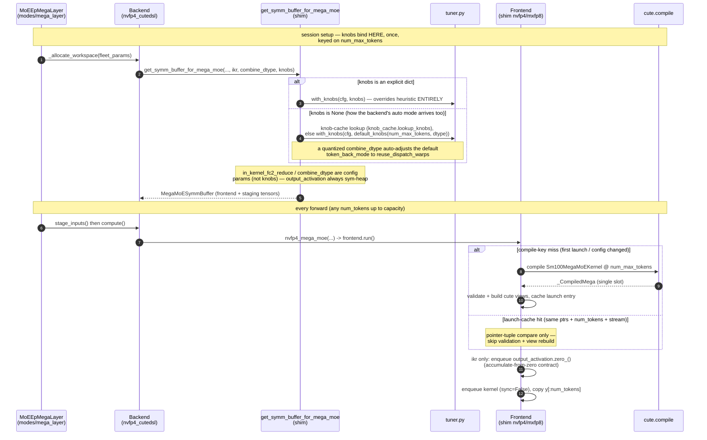

# CuTeDSL MegaMoE tuning + performance notes

This document collects the performance work on the CuTeDSL mega
backends: the tuning surface (knobs, per-size default profiles, online
autotuning), how tuning resolves at runtime, the measured results for
each backend and combine-leg variant, and the benchmark methodology
behind those numbers — including the measurement pitfalls we hit and how
to avoid them.  It is the companion to `SKILL.md`, which covers the
kernel drop-update workflow.

Unless noted otherwise, all measurements were taken 2026-07-21 on a
single GB200 node (4x GPUs, EP=4) at a DeepSeek-V3-like geometry:
256 experts, top-8, hidden 7168, intermediate 2048.  A full reproduce
recipe (hardware, container, versions, harness invocation) is in the
"Sweep methodology" and "Runbook" sections below.

## Microbenchmark results (2026-07-21, e2e_pipelined p50 µs)

Measured at the branch tip (`29e2d2f8`; includes the fused quant-stage,
launch-thunk cache, and the %64 cutedsl alignment relaxation). Default
geometry (7168 hidden / 2048 inter / 256 experts / top-8), 4x GB200,
heuristic knobs, speedup vs `deep_gemm_mega` in parens; CSV
`moe_ep_benchmark/model_shapes/results/model_shapes_20260721_111314_deepseek_v3.csv`:

| tok/rank | dg     | nvfp4 bf16     | +ikr           | +combine_nvfp4     | +combine_mxfp8 |
|---------:|-------:|---------------:|---------------:|-------------------:|---------------:|
| 8        | 212.5  | 219.5 (0.97x)  | 233.1 (0.91x)  | 226.3 (0.94x)      | 227.2 (0.94x)  |
| 64       | 284.7  | 283.6 (1.00x)  | 312.1 (0.91x)  | 301.5 (0.94x)      | 302.1 (0.94x)  |
| 512      | 340.0  | 351.8 (0.97x)  | 355.3 (0.96x)  | 321.1 (1.06x)      | 326.7 (1.04x)  |
| 1024     | 468.0  | 422.9 (1.11x)  | 422.9 (1.11x)  | **363.5 (1.29x)**  | 377.8 (1.24x)  |
| 2048     | 817.2  | 604.9 (1.35x)  | 602.9 (1.36x)  | **529.4 (1.54x)**  | 560.1 (1.46x)  |
| 4096     | 1473.5 | 981.5 (1.50x)  | 990.2 (1.49x)  | **862.7 (1.71x)**  | 912.4 (1.61x)  |
| 8192     | 2993.7 | 1896.8 (1.58x) | 1887.4 (1.59x) | **1677.3 (1.78x)** | 1672.2 (1.79x) |

[ikr = in_kernel_fc2_reduce; +combine_nvfp4 / +combine_mxfp8 = the fc2
epilogue quantizes each partial in registers to fp4 (e2m1 + bf16 scale per
16) or fp8 (e4m3 + e8m0 scale per 32) just for the wire]

Shape of the curve: **parity with dg through ~512 tok/rank, crossover
between 512 and 1024, win growing to 1.58x at 8192** (1.78x with the fp4
combine wire).  The small-batch regime is weight-load bound and fp4-vs-fp4
there is a wash.

The same sweep now also runs across real-model MoE geometries (DeepSeek V3 /
V4-Flash / V4-Pro, Kimi K2.6, Qwen3.5-397B, gpt-oss-120b — the last enabled
by the %64 relaxation; fp4 variants only, dg's wire format is hard-%128):
`moe_ep_benchmark/model_shapes/RESULTS.md`. Pattern holds everywhere:
dg-parity below ~512 tok/rank, fp4 combine-wire best at large tokens
(1.6-1.9x on 7168-hidden shapes).

The `mxfp8_cutedsl` backend (latest sweep 2026-07-15; its >=2048 rows use
the re-derived dispatch-warp default profile) runs 0.63x / 0.84x / 0.86x /
0.99x vs dg at 1024 / 2048 / 4096 / 8192 tok/rank — dg parity at 8192 at a
3x better accuracy point (6.4% vs 20.6% rel-L2).

### Accuracy

`acc_loss_pct` (global rel-L2 vs a bf16 dense-MoE reference on random data
— constant across token counts; random data is the worst case, real-model
distributions fare better — see the e2e GSM8K numbers below):

| variant                | acc loss |
|------------------------|---------:|
| deep_gemm_mega         | 20.6%    |
| nvfp4 (bf16 wire)      | 23.2%    |
| nvfp4 `+ikr`           | 23.2%    |
| nvfp4 `+combine_mxfp8` | 23.3%    |
| nvfp4 `+combine_nvfp4` | 25.0%    |
| mxfp8_cutedsl          | 6.4%     |

Note mxfp8's 6.4% vs the fp4-weight backends' ~21-25%: the perf ranking is
not the whole story.

## End-to-end results (vLLM 0.25.1, 2026-07-20)

Measured with this backend integrated into vLLM 0.25.1 (integration lands
as a separate PR): DeepSeek-V4-Flash (4096 hidden / 2048 inter /
256 experts / top-6), 4x GB200 TP4/EP4, CUDA graphs capturing all recurring
step shapes including the 4096-token prefill chunks, per-role offline knob
caches (`python -m flashinfer.moe_ep.tune`, prefill- and decode-tuned).
`fi_nvfp4` consumes the single-quant nvfp4 checkpoint directly via the
prequantized weight-pack path; native vLLM (its built-in deep_gemm mega
path) and `fi_dg` run the mxfp4 checkpoint.

| Workload                                     | native vLLM | fi_dg           | fi_nvfp4            |
|----------------------------------------------|------------:|----------------:|--------------------:|
| Prefill, 8k-token chunks (tok/s)             | 45,701      | 47,534 (1.04x)  | **53,962 (1.18x)**  |
| Decode @ 1024-seq concurrency (output tok/s) | 21,049      | 21,540 (1.02x)  | **22,614 (1.07x)**  |
| GSM8K (200q, greedy)                         | 0.965       | 0.965           | **0.975**           |

- `fi_dg` is the same deep_gemm kernel routed through this integration
  layer — parity-or-better shows the layer itself costs nothing under
  graphs; the nvfp4 deltas above it are kernel-side.
- The decode number requires graph capture to cover the prefill chunk
  shapes (e.g. vLLM `max_cudagraph_capture_size` >= the chunk size).  With
  the default small capture list the chunks run eager, the eager host path
  generates extra inter-rank launch skew that the collective kernel absorbs
  as spin, and decode reads ~4% BELOW native — a config artifact, not a
  kernel property.
- The headline decode cell reproduces at this branch tip within 0.6%.

## Historical note: nvfp4 numbers before 2026-07-15 are invalid

All `nvfp4_cutedsl` measurements taken before 2026-07-15 used a broken
weight layout and have been removed (raw CSVs archived under
`moe_ep_benchmark/results/archive_pre20260715_broken_nvfp4_layout/`): the
FI preprocess materialized fc1/fc2 weights N-stride-1 while the frontend
compiles the kernel's TMA layout from the tensor's actual strides, so those
runs used a faster-but-wrong load pattern and produced incorrect results
(the old "uniform 1.5-1.7x at every token count" claim was this artifact).
Caught by the torch-oracle tests
(`tests/moe_ep/test_nvfp4_cutedsl_kernel_vs_reference.py`); fixed in
`backends/mega/kernel/nvfp4_cutedsl/weights.py` (K-major transpose views).
`deep_gemm_mega` / `mxfp8_cutedsl` numbers were unaffected.  The corrected
2026-07-15 full sweep reproduces at the 2026-07-21 branch tip within run
noise (<= ~4% per cell); the tables above are the current reference.

## CuTe-DSL runtime sensitivity: `nvidia-cutlass-dsl[cu13]==4.5.2` (2026-07-15)

Same recipe, geometry and runbook as the microbenchmark table above, with
the only change being the CuTe-DSL runtime pinned to 4.5.2 instead of
>= 4.6.1.  Measured 2026-07-15 against a same-day 4.6.1 baseline (which the
2026-07-21 table reproduces within run noise, so the comparison stands);
CSVs `moe_ep_benchmark/results/sweep_20260715_1634*..1641*_fi_mega.csv`:

| tok/rank | dg     | nvfp4 bf16     | +ikr           | +combine_nvfp4     | +combine_mxfp8 |
|---------:|-------:|---------------:|---------------:|-------------------:|---------------:|
| 1024     | 468.8  | 583.7 (0.80x)  | 580.9 (0.81x)  | **564.2 (0.83x)**  | 566.3 (0.83x)  |
| 2048     | 813.1  | 878.6 (0.93x)  | 869.2 (0.94x)  | **834.6 (0.97x)**  | 842.8 (0.96x)  |
| 4096     | 1538.1 | 1453.1 (1.06x) | 1430.2 (1.08x) | **1385.5 (1.11x)** | 1394.7 (1.10x) |
| 8192     | 3060.7 | 2579.5 (1.19x) | 2529.0 (1.21x) | **2473.0 (1.24x)** | 2492.4 (1.23x) |

Takeaways:

- 4.5.2 **compiles and runs** this kernel drop (4.5.0 fails outright at
  `cute.compile`), and every variant/point completed without error.
- But the 4.5.2-generated code is **34-54% slower** than 4.6.1 across every
  nvfp4 variant and token count (e.g. bf16 wire 583.7 vs 428.5 µs @1024,
  2579.5 vs 1923.5 @8192 on the same-day 4.6.1 baseline;
  `+combine_nvfp4` ~+50% everywhere).  The dg baseline reproduces within
  noise across the two runtimes (≤1%), so the delta is the DSL runtime,
  not the run.
- The perf shape regresses qualitatively too: the dg crossover moves from
  ~512-1024 tok/rank out past 2048 (nvfp4 *loses* at 1024, 0.80-0.83x),
  and the 8192 win shrinks from ~1.6-1.8x to 1.19-1.24x.

Conclusion: treat **4.6.1 as a performance floor**, not just a
compile-compatibility floor — 4.5.2 is functional but leaves ~1.3-1.5x of
nvfp4 kernel performance on the table.

## The knob system (`shim/tuner.py`, `shim/autotune.py`)

- `tuner.py` mirrors the kernel team's `tester/solvers/inference_solver.py`
  knob taxonomy (re-audit on every drop).  Correctness knobs change a code
  path/output (`token_back_mode`, `mma_tiler_mnk`, `in_kernel_fc2_reduce`,
  ...); perf knobs are output-invariant (`group_hint`, `flag_batch`,
  `epi_flag_batch`).
- `default_knobs(num_tokens, dtype=...)` — the measured per-size profiles
  (provenance in the profile dict comments).  NVFP4 has FOUR profiles
  (re-validated 2026-07-15 on the corrected weight layout: the online
  autotuner confirmed all four non-ikr NVFP4 defaults within run noise;
  only ikr candidates beat them, -4..5% at >=2048, kept opt-in for
  determinism); the dominant axis is `token_back_mode`:
  - `epi_warps` wins at small batch but falls off a cliff mid-range
    (measured pre-fix as +18% at 512 tokens / +35% at 1024 with every
    dispatch-warp candidate ahead; the 07-15 re-validation kept the same
    per-bucket choices).
  - tile (256x128 vs 256x256) and `flag_batch` are second-order (~1-5%).
  MXFP8 has TWO profiles (re-derived 2026-07-15): fb4 + epi_warps below
  2048 tokens, fb4 + reuse_dispatch_warps at >=2048 (-14.5% at 2048:
  1010.6 vs 1181.6 us kernel-mode; supersedes the 07-14 "dispatch-warp is
  ~5% slower for MXFP8" reading, which conflated it with fb8).
- Backend configs (`Nvfp4/Mxfp8CutedslMegaMoeConfig.knobs`): explicit dict
  overrides the heuristic ENTIRELY (pin every knob you care about);
  `"auto"` runs the online autotuner at the first forward.
- `autotune.py` — collective online tuner: every EP rank compiles+times the
  same candidate list in lockstep, per-candidate medians are all-reduced
  MAX (slowest rank = collective latency), argmin winner applied
  identically everywhere.  Cost: one `cute.compile` per candidate
  (~1-2 min), once per session.  Candidates mirror the tester sweep
  restriction; for NVFP4 that now INCLUDES `in_kernel_fc2_reduce`
  (24 candidates — the symm buffer's output is always sym-heap allocated,
  so the knob flips per-compile).  ikr is ~par with the bf16 wire at the
  FI default geometry at >=1024 tok/rank and slower at small batch — see
  "Measured results" below; it stays a sweep candidate rather than a
  default because the tuner keeps it only if it wins the live problem.  An ikr winner makes the output accumulation
  order nondeterministic — pin `in_kernel_fc2_reduce=False` via explicit
  knobs if bit-reproducibility matters.  MXFP8 keeps ikr config-owned
  (its kernel rejects ikr + dispatch-warp token-back).
- The kernel-repo tester remains the wide-sweep tool
  (`torchrun -m tester.tester --mode Perf --sweep --use_knob ...`); winners
  transfer via the `knobs=` dict.  Its problems (`nvfp4_perf.jsonl`) are
  top-6 with different inter/experts — never compare its numbers to
  FI-default-geometry runs directly.

## How a forward gets its knobs (runtime flow)

Knobs are **compile-time** kernel parameters, resolved **once per session**
at workspace allocation and keyed on the buffer capacity `num_max_tokens` —
never on the runtime token count.  `knobs=None` resolves through the
persistent knob cache (`shim/knob_cache.py`, offline-tuned winners keyed on
device/dtype/world-size/geometry/wire/token-bucket; path via
`FLASHINFER_MOE_EP_KNOB_CACHE`) before falling back to the built-in
`default_knobs` heuristic — a pure dict lookup, no compiles or collectives.
Populate it with the offline CLI (`python -m flashinfer.moe_ep.tune`) or a
one-off `knobs="auto"` run outside the engine.  There is no per-shape
tuning and no shape→kernel dispatch.  Explicitly, what does NOT happen when
a shape comes in:

- **No kernel lookup by shape.**  The frontend holds exactly ONE compiled
  kernel (single-slot cache: `_mega` + `_mega_key` in `shim/nvfp4.py`),
  compiled for `num_max_tokens`.  Every incoming token count launches that
  same kernel and slices the padded buffer `[:num_tokens]`.  The per-launch
  "cache" (`_launch_cache_key`: raw data_ptrs + token count + stream) only
  decides whether validation + cute-view rebuild can be skipped — it never
  selects among kernels.  Consequence: a session sized for 2048 max tokens
  runs the throughput profile even for an 8-token decode step; size the
  buffer to the workload (or pin `knobs=`) if that matters.
- **No in-engine tuning.**  Persistence is write-once/offline: rank 0
  records `"auto"` winners into the knob cache, and later `knobs=None`
  sessions look them up — but nothing tunes inside a serving process
  (the ~24 `cute.compile`s + collective barriers of a live sweep are why
  `"auto"` is unusable in-engine).  `flashinfer/autotuner.py` /
  `FLASHINFER_AUTOTUNER_LOAD_FROM_FILE` are NOT wired into this path.
- The single slot is deliberate: each `_CompiledMega` pins symmetric-heap
  (NVSHMEM) workspaces, so keeping N candidates alive would multiply
  symmetric memory.  `_mega_compile_key()` already covers every knob, so a
  per-key dict (e.g. small+large profile selected per-launch by token
  count) is the natural upgrade if per-shape dispatch is ever needed;
  today the deployment pattern is per-role knob caches instead (one
  prefill-tuned and one decode-tuned cache file, selected per engine role
  via `FLASHINFER_MOE_EP_KNOB_CACHE` — validated in the vLLM e2e runs).

### Session setup + steady-state forward (`knobs=None` / explicit dict)



### `knobs="auto"`: collective online sweep at the FIRST forward

The backend defers tuning to the first `compute()` (weights + staged inputs
exist there); the symm buffer is built with the heuristic default in the
meantime.  The default candidate list is session-aware
(`nvfp4_candidates(combine_format, allow_in_kernel_fc2_reduce)`: 24 for the
bf16 wire including the ikr axis; quantized wires prune to the valid
subset).  Candidates are compiled **serially and destructively** — each
`apply_knobs` frees the previous candidate's sym workspace and nulls the
compiled slot, so nothing accumulates and the winner is recompiled once
more after the sweep (unless it happened to be timed last).


## Launch-path work (why FI now matches the bare kernel)

Steady-state cost of the full FI forward over the bare kernel launch is now
**2-13 µs** (mostly the output copy at large tokens).  What it took:

1. **Launch-kwargs cache** (`_CompiledMega.launch_*`): `frontend.run()`
   used to rebuild all 12 cute tensor views (`from_dlpack`) + a
   `SymBufferHost` on EVERY launch.  Now keyed on input data_ptrs + token
   count + stream; a hit also skips input validation (validated when the
   entry was built).  Any config change nulls the cache.
2. **No per-launch workspace reset**: workspaces are allocated zeroed and
   the kernel TAIL-CLEANS its own counters/flags (the kernel-team drivers
   and tester never host-reset; the NVLink phase slots must NOT be reset).
   `run(reset_counters=False)` is the default; `True` only recovers an
   aborted launch.  Guarded by repeated-forward bit-exact tests.
3. **Async wrappers**: `nvfp4/mxfp8_mega_moe(sync=False)` default — kernel
   + output copy are stream-enqueued, no host sync (matches dg).  Anything
   timing with `perf_counter` must pass `sync=True` (the autotuner does).
4. **Launch thunks** (`{nvfp4,mxfp8}_mega_launch_thunk`): prebuilt bare
   launch closures matching the tester's `perf_run` timed region — for
   benchmark loops, tuners, and (future) CUDA-graph capture.

## Benchmarking lessons (how the 2x-slower misread happened)

Use `moe_ep_benchmark` (`RUNBOOK.md` there) with `MEGA_TIMING`:

- `kernel` — tester-parity bare launch (back-to-back, per-iter events,
  L2 flush outside the window).  Compare THIS against the kernel team's
  tester numbers, at MATCHED geometry.
- `e2e_pipelined` — full FI forward, back-to-back.  The serving-relevant
  number.  Caveat: the bench prestages inputs, so the per-forward
  activation-quantize/staging cost is NOT in the timed region (true for
  every backend, so rankings hold; absolute layer time in a real serving
  stack is higher for all columns).
- `e2e` — full FI forward, each iter from a global barrier + idle GPU.
  A cold-start stress case: it adds ~85-90 µs of **from-idle collective
  start skew** (the collective dispatch stalls on the slowest rank's
  from-idle launch; dg shows the same effect at ~34 µs).  A pipelined
  workload never pays this; if a workload truly launches from global idle,
  CUDA-graph capture of the thunk is the fix.

The original misread combined (a) barrier-cold e2e timing of a then-heavy
launch path against dg's thin wrapper, and (b) a geometry mismatch vs the
tester problems.  Rule: match BOTH the problem shape and the timed region
before comparing MoE backends.

## TRT-LLM-import knobs (landed)

Imported from TRT-LLM PR #16190, both idea families are
plumbed through `get_symm_buffer_for_mega_moe` and the backend configs
(`Nvfp4CutedslMegaMoeConfig`):

- `in_kernel_fc2_reduce` — in-flight top-k combine via cross-rank REDG
  atomic-add; its main win is that the multi-GB per-topk combine staging
  disappears from `shared_workspace` (latency is geometry-dependent — see
  "Measured results").  Contract:
  `output_activation` lives on the sym heap (now unconditional) and is
  zeroed before EVERY launch by `frontend.run()` / the launch thunk
  (accumulate-from-zero); output accumulation order is nondeterministic AND
  the K terms accumulate in bf16 (vs fp32 in the explicit reduce), so where
  large terms nearly cancel the agreement is bounded by the bf16 ULP of the
  largest TERM — validate with a row-scaled band (tests'
  `_assert_ikr_close`: K x 2^-8 x safety 8 x row max), never a flat
  atol/rtol.  Requires `apply_topk_in_fc1=True` + bf16 combine wire.
- `combine_dtype` — quantized cross-rank combine wire (`"mxfp8"` =
  `32e4m3xe8m0`, 2x less NVLink combine traffic; `"nvfp4"` = `16e2m1xbf16`,
  4x less).  Numerics tradeoff (wire-quantizes the per-topk fc2 outputs);
  requires the explicit-reduce path with dispatch-warp token-back (the
  default knobs are adjusted automatically; explicit knobs must comply).

### What the variants mean (all share identical dispatch + fp4xfp4 compute)

The MoE forward has three legs: dispatch (tokens to experts), compute (the
two expert GEMMs), and combine (fc2 partials back to each token's home
rank + top-k sum).  The knobs only change the COMBINE leg, and the public
output is 2D `(T, hidden)` **bf16 in every variant**:

- **bf16 wire (default)** — partials travel as bf16, staged per-topk on
  the home rank, summed in fp32, cast once to bf16.  Exact terms, fp32
  sum, deterministic.
- **`+combine_nvfp4` / `+combine_mxfp8`** — the fc2 epilogue quantizes
  each partial IN REGISTERS to fp4 (e2m1 + bf16 scale per 16) or fp8
  (e4m3 + e8m0 scale per 32) *just for the wire* (4x / 2x fewer combine
  bytes); the home rank dequantizes and still sums in fp32.  Lossy terms
  (one quant round-trip per partial), fp32 sum, deterministic.
- **`+ikr`** (`in_kernel_fc2_reduce`) — no staging: each bf16 partial is
  REDG-atomic-added into the output as it arrives.  Exact terms, bf16
  unordered sum, nondeterministic; deletes the multi-GB staging region.

### Measured results

The full per-variant table lives in the microbenchmark section above (one
table, 8-8192 tok/rank, all combine-leg variants); accuracy in the table
right below it.

Takeaways at this (single-node NVLink) geometry, from the 2026-07-21 sweep:
- Small batch (8-64 tok/rank): plain nvfp4 is dg-parity (219.5/283.6 µs vs
  dg 212.5/284.7) and every variant is slightly slower than plain there —
  ikr +14/+29 µs, the quantized wires +7/+19 µs — so the bf16 wire is the
  small-batch default.
- `combine_nvfp4` is the throughput winner from 512 tok/rank up (-12..-14%
  vs the bf16 wire at 1024-8192; 1.78x vs dg and ~19.5 Mtok/s at 8192),
  buying that for ~1.8pt of extra quantization loss (25.0% vs 23.2%
  rel-L2).  Expect larger wins multi-node where combine bytes dominate.
- `combine_mxfp8` sits between the bf16 and fp4 wires up to 4096 and ties
  the fp4 wire at 8192, at ~0.1pt extra loss.
- `+ikr` is ~par with the bf16 wire at >=1024 with the default profiles
  and slower at small batch; it stays an autotune candidate rather than a
  default, and in the vLLM e2e runs at DSV4-Flash geometry it lost both
  phases — its value is geometry-dependent (and it deletes the multi-GB
  combine staging region, which can be the point).  An ikr winner makes
  the output accumulation order nondeterministic — pin
  `in_kernel_fc2_reduce=False` if bit-reproducibility matters.
- The quantized wires also did NOT transfer to the vLLM e2e geometry
  (4096 hidden / top-6: the wire-forced dispatch-warp token-back costs
  more than the combine-traffic saving there) — the bf16 wire is the e2e
  production default at DSV4; re-check the wires at higher
  combine-traffic geometries.

### Sweep methodology + environment (reproduce recipe)

**Hardware / software.**  One GB200 node, 4x NVIDIA GB200 (sm_100, cc
10.0) over NVLink, driver 580.173.02.  Pyxis container image
`flashinfer-ep-pt2605-mega_moe_ep-20260712.sqsh` (NGC 26.05 base):
torch `2.12.0a0+5aff3928d8.nv26.05`, CUDA 13.2, `cuda-bindings 13.2.0`,
`triton 3.7.0+nv26.5`, `deep_gemm 2.5.0+891d57b`,
`nvshmem4py-cu13 0.3.1`; `nvidia-cutlass-dsl` upgraded in-container to
**4.6.1** (the mega kernels require it).  FlashInfer = this branch,
editable-installed inside the container
(`PIP_CONSTRAINT="" BUILD_NIXL_EP=0 pip install --no-build-isolation -e .`).

**Harness.**  `moe_ep_benchmark/bench_moe_ep_mega.py` via
`SECTION=fi_mega GPUS=4 SEQ_LENS="1024 2048 4096 8192" run_sweep.sh`
(see that repo's RUNBOOK.md), one `torch.multiprocessing.spawn` of 4 EP
ranks per (variant, token-count) point — every point pays a fresh
`cute.compile` (amortized by cute's on-disk cache).  Variants selected
with the bench env knobs `MEGA_IKR=1` / `MEGA_COMBINE_DTYPE=nvfp4|mxfp8`
(mapped onto `Nvfp4CutedslMegaMoeConfig`); knobs left at the default
per-size heuristic profiles (`tuner.default_knobs`), which the quantized
wires auto-adjust to dispatch-warp token-back.

**Problem.**  DeepSeek-V3-like: hidden 7168, inter 2048 (post-SwiGLU),
256 experts, top-8, EP=4, `gate_up_clamp` default.  Random bf16
activations quantized at staging; random (uneven) routing from
`torch.topk` over randn scores; weights random bf16 quantized by
`preprocess_mega_weights`.

**Timed region** (`MEGA_TIMING`):
- `kernel` — tester-parity: a prebuilt zero-arg launch thunk
  (`nvfp4_mega_launch_thunk`; for `+ikr` the thunk is the required
  `output.zero_()` + launch, so the contract cost is included), 20
  warmup + 50 timed iters enqueued back-to-back with no host sync,
  per-iter CUDA events, 300 MB L2 flush outside each event window.
- `e2e_pipelined` — the FI forward compute path (launch-cache/arg handling,
  kernel, output copy), same 20/50 back-to-back event scheme.  Inputs are
  prestaged once outside the loop, so per-forward activation
  quantize/staging is NOT included (for any backend).
Reported number = rank-0 median of the 50 iters (p50); min/max in the
CSVs.  `deep_gemm_mega` has no thunk API, so its "kernel" number loops
`compute()` (includes its thin FI wrapper).

### Runbook (rerun the sweep)

The harness lives at <https://github.com/mhoqueanik/moe_ep_benchmark>
(bench env-knob reference in its README.md; SLURM/container details in
its RUNBOOK.md).  `MEGA_IKR` / `MEGA_COMBINE_DTYPE` land in bench commit
`a15fb01`.  On a SLURM + pyxis cluster with the image above:

```bash
export ROOT=/path/to/workspace          # holds the image, the bench repo,
export REPO=$ROOT/flashinfer-moe_ep     # and the flashinfer checkout
srun -A <account> -p batch -N 1 --ntasks-per-node=1 --time=04:00:00 \
  --container-image="$ROOT/flashinfer-ep-pt2605-mega_moe_ep-20260712.sqsh" \
  --container-mounts="$ROOT:$ROOT" --container-workdir="$REPO" \
  bash -lc '
    export FLASHINFER_DISABLE_VERSION_CHECK=1
    PIP_CONSTRAINT="" BUILD_NIXL_EP=0 python -m pip install --no-build-isolation -e .
    python -m pip install --upgrade "nvidia-cutlass-dsl[cu13]"   # >= 4.6.1
    export SECTION=fi_mega GPUS=4 CUDA_VISIBLE_DEVICES=0,1,2,3
    export SEQ_LENS="1024 2048 4096 8192"
    for MODE in kernel e2e_pipelined; do
      export MEGA_TIMING=$MODE
      MEGA_LIST="deep_gemm_mega nvfp4_cutedsl" \
        bash '"$ROOT"'/moe_ep_benchmark/run_sweep.sh              # baseline
      MEGA_LIST=nvfp4_cutedsl MEGA_IKR=1 \
        bash '"$ROOT"'/moe_ep_benchmark/run_sweep.sh              # +ikr
      MEGA_LIST=nvfp4_cutedsl MEGA_COMBINE_DTYPE=nvfp4 \
        bash '"$ROOT"'/moe_ep_benchmark/run_sweep.sh              # +combine_nvfp4
      MEGA_LIST=nvfp4_cutedsl MEGA_COMBINE_DTYPE=mxfp8 \
        bash '"$ROOT"'/moe_ep_benchmark/run_sweep.sh              # +combine_mxfp8
    done
  '
```

Each `run_sweep.sh` invocation writes its own timestamped CSV under
`moe_ep_benchmark/results/`; the variant is identified by the
`compute_kernel` column suffix (`+ikr`, `+combine_nvfp4`, ...).  Notes:
- The editable install lives in the container overlay — rerun it in
  every fresh container.  Verify `import flashinfer` resolves to the
  checkout, not the image copy.
- Every (variant, token-count) point pays a `cute.compile`, amortized by
  cute's on-disk cache; the 8-invocation sweep above completed in ~17 min
  warm (budget ~2 h cold).
- Geometry knobs (`HIDDEN INTER NUM_EXPERTS TOP_K GPUS`) and
  `MEGA_KNOBS` (explicit knob dict / `auto` online autotune) are
  documented in the bench README.

## Next levers

CUDA-graph capture of the launch thunk (landed — `MoEEpMegaLayer.warmup()`
+ capture guards, `tests/moe_ep/test_mega_cuda_graph*.py`; with ikr
the thunk is zero+launch, both graphable), streaming weight reload
(on demand — from TRT-LLM PR #16190: a load/reload lifecycle with
partial-group coverage tracking for serving-oriented live weight updates;
import only if the FI serving integration needs reload).
