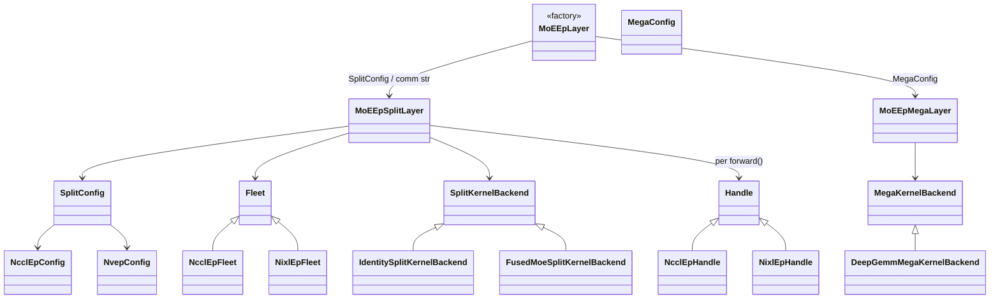
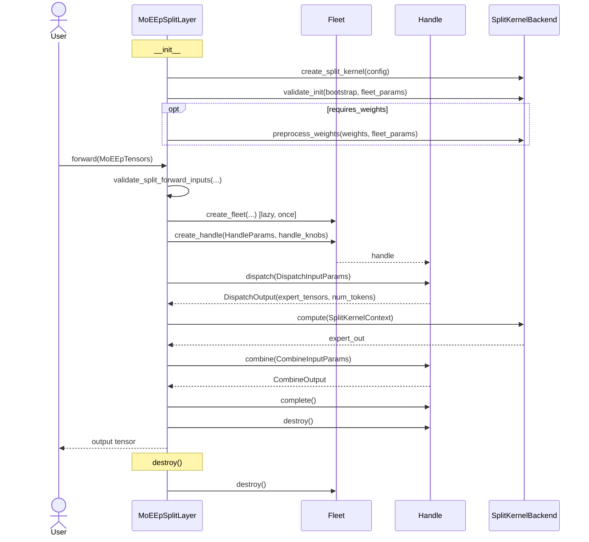
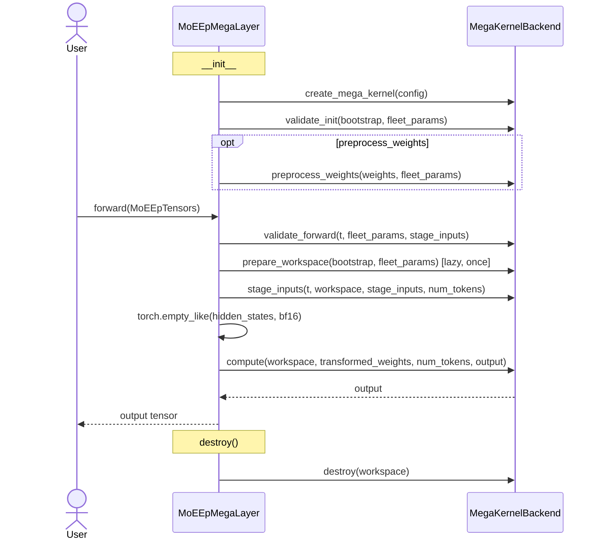

# moe_ep_v2 Design

Expert-Parallel MoE with two execution modes: **split** (dispatch → inner kernel → combine)
and **mega** (fused comm + local MoE). Shared types sit at the package root; plugin ABCs
and registries live in `core/`; concrete transport/compute plugins in `backends/`; layer
orchestration in `modes/`. Plugins register at import time via `__init__.py`.

## Package Layout

```
moe_ep_v2/
  config.py             BootstrapConfig, FleetParams, HandleParams, I/O envelopes
  tensors.py            MoEEpTensors
  weights.py            MoEWeightPack
  algo_knobs.py         Fleet/Handle tuning knobs
  errors.py             MoEEpNotBuiltError
  layer.py              MoEEpLayer factory
  core/
    comm/                 Fleet + Handle ABCs, create_fleet(), _BACKEND_REGISTRY
    kernel/               Split/Mega kernel ABCs, @register_* decorators
    validation/           shared arch/config/forward validation helpers
  backends/
    split/
      comm/
        nccl_ep/          NcclEpConfig, NcclEpFleet, NcclEpHandle
        nixl_ep/          NvepConfig, NixlEpFleet, NixlEpHandle
      kernel/
        identity/         IdentityConfig, identity split kernel
        fused_moe/        FusedMoeKernelConfig (stub)
    mega/
      kernel/
        deep_gemm_mega/   DeepGemmMegaMoeConfig, staging, weights
  modes/
    config.py             SplitConfig, MegaConfig
    split_layer.py        MoEEpSplitLayer
    mega_layer.py         MoEEpMegaLayer
```

Shared dataclasses and envelopes live at the package root (`config.py`, `tensors.py`,
`weights.py`). Plugin ABCs and registries live under `core/`. Concrete transport and
compute plugins live under `backends/`. Orchestration layers compose them in `modes/`.
Import `flashinfer.moe_ep_v2` (or `from . import backends` at the bottom of
`__init__.py`) to run plugin registration side effects.

## Class Diagram



## Split Path — Call Sequence

One `forward()` iteration. Fleet is created lazily on first call and reused.



## Mega Path — Call Sequence

No Fleet/Handle. Workspace is allocated lazily on first forward.



## User-Facing API

Entry point: `flashinfer.moe_ep_v2.MoEEpLayer`.

| Config | Layer | Description |
|--------|-------|-------------|
| `SplitConfig` or comm string/config | `MoEEpSplitLayer` | dispatch → kernel → combine |
| `MegaConfig` | `MoEEpMegaLayer` | fused mega kernel (no EP transport) |

**Split example:**

```python
from flashinfer.moe_ep_v2 import (
    MoEEpLayer, BootstrapConfig, FleetParams, MoEEpTensors,
    SplitConfig, NcclEpConfig, IdentityConfig,
)

layer = MoEEpLayer(
    bootstrap=BootstrapConfig(world_size=4, rank=rank),
    fleet_params=FleetParams(num_experts=32, max_tokens_per_rank=256, token_hidden_size=2048),
    backend=SplitConfig(comm=NcclEpConfig(), kernel=IdentityConfig()),
)
out = layer.forward(MoEEpTensors(hidden_states=..., topk_ids=..., topk_weights=...))
```

**Mega example:**

```python
from flashinfer.moe_ep_v2 import (
    MoEEpLayer, BootstrapConfig, FleetParams, MoEEpTensors, MoEWeightPack,
    MegaConfig, DeepGemmMegaMoeConfig,
)

layer = MoEEpLayer(
    bootstrap=BootstrapConfig(world_size=4, rank=rank),
    fleet_params=FleetParams(..., weights=MoEWeightPack(w13=..., w2=...)),
    backend=MegaConfig(megakernel=DeepGemmMegaMoeConfig(intermediate_size=1024, top_k=4)),
)
out = layer.forward(MoEEpTensors(...))
```

Key types (package root): `BootstrapConfig`, `FleetParams`, `MoEEpTensors`, `MoEWeightPack`,
`AlgoKnob` hierarchy. Comm configs: `NcclEpConfig` / `NCCLEPConfig` (alias), `NvepConfig`
(`backend_name="nixl_ep"`). Probes: `have_nccl_ep()`, `have_nixl_ep()`, `available_backends()`.
Validation helpers are exported from `core.validation` (`validate_fleet_params`, etc.).

## Adding a Split Kernel

1. Create `backends/split/kernel/<name>/` with `config.py` (`kernel_name: str`) and `backend.py`.
2. Subclass `core.kernel.base.SplitKernelBackend`; implement `kernel_name()`, `compute(ctx)`.
3. Register with `@register_split_kernel("<name>")` from `core.kernel.registry`.
4. Import the subpackage in `backends/split/kernel/__init__.py` so registration runs at load.
5. Use via `SplitConfig(comm=..., kernel=MyKernelConfig(...))`.

Optional hooks: `requires_weights()`, `validate_init()`, `preprocess_weights()`.

## Adding a Mega Kernel

1. Create `backends/mega/kernel/<name>/` with `config.py` (`kernel_name: str`) and `backend.py`.
2. Subclass `core.kernel.base.MegaKernelBackend`; implement the lifecycle hooks.
3. Register with `@register_mega_kernel("<name>")` from `core.kernel.registry`.
4. Import the subpackage in `backends/mega/kernel/__init__.py`.
5. Use via `MegaConfig(megakernel=MyMegaConfig(...))`.

Required hooks: `kernel_name()`, `compute(...)`. Typical extras: `validate_init`,
`preprocess_weights`, `prepare_workspace`, `validate_forward`, `stage_inputs`, `destroy`.

## Adding a Comm Backend

Split-path only. Under `backends/split/comm/<name>/` add:

- `config.py` — dataclass with `backend_name: str`
- `fleet.py` — `MyFleet(Fleet)`; register at module load:
  `_BACKEND_REGISTRY["<name>"] = MyFleet` (registry lives in `core.comm.fleet`)
- `handle.py` — `MyHandle(Handle)` for per-forward dispatch/combine

Re-export the config from `backends/split/comm/__init__.py`. Import the fleet module from
`flashinfer.moe_ep_v2.__init__` (or `backends.split.comm`) so registration runs at package load.
Built libs stage into `backends/split/comm/<name>/_libs/`.

## Built-in Plugins

| Kind | Name | Config | Status |
|------|------|--------|--------|
| Comm | `nccl_ep` | `NcclEpConfig` | implemented |
| Comm | `nixl_ep` | `NvepConfig` | implemented |
| Split kernel | `identity` | `IdentityConfig` | working |
| Split kernel | `fused_moe` | `FusedMoeKernelConfig` | registered stub |
| Mega kernel | `deep_gemm_mega` | `DeepGemmMegaMoeConfig` | implemented |
