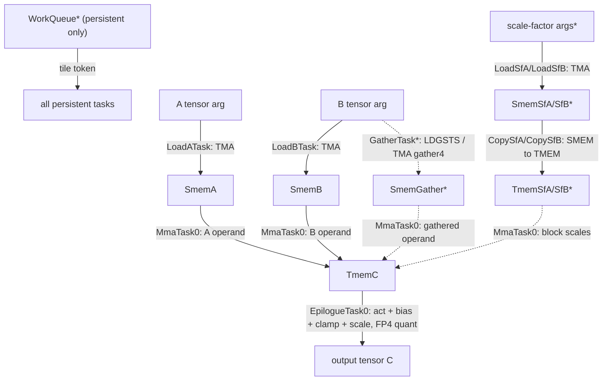

<!--
Copyright (c) 2026 by FlashInfer team.

Licensed under the Apache License, Version 2.0 (the "License");
you may not use this file except in compliance with the License.
You may obtain a copy of the License at

  http://www.apache.org/licenses/LICENSE-2.0

Unless required by applicable law or agreed to in writing, software
distributed under the License is distributed on an "AS IS" BASIS,
WITHOUT WARRANTIES OR CONDITIONS OF ANY KIND, either express or implied.
See the License for the specific language governing permissions and
limitations under the License.
-->

# BatchedGemm TS Example

This example implements a Blackwell batched / grouped GEMM kernel with CUTLASS
Primitives and the Task Scheduling (TS). It is the kernel behind MoE expert projections —
FC1 (gate+up) and FC2 — where each expert owns a contiguous block of tokens and the
problem is a batch of independent GEMMs rather than one dense GEMM.

The design centers on **block-to-expert assignment**: one GPU block processes at
most one expert. FC1 gathers tokens from a contiguous tensor using LDGSTS or
TMA.GATHER4 instructions, and the batch dimension is carried through tiling,
scheduling, and the epilogue so one launch covers all experts.

## Source Structure

```text
batched_gemm/
|-- __init__.py
|-- batched_gemm_config.py        # static config, enums, stage + warp/register budgets
|-- batched_gemm_run.py           # CLI: schedule validation, correctness, benchmark
|-- batched_gemm_kernel.py        # task-manager assembly + host-side launcher
|-- batched_gemm_tasks.py         # task factories (schedules only; bodies live in resources)
|-- batched_gemm_resources.py     # re-exports the public resource classes
|-- gmem_ab_resources.py          # GMEM A/B operand sources (TMA descriptors, coords)
|-- gmem_c_resources.py           # GMEM C output (store path, C/gate scale, FP4 quant)
|-- gmem_sf_resources.py          # GMEM scale-factor A/B sources
|-- smem_ab_resources.py          # SMEM A/B buffers: TMA / LDGSTS-gather / TMA-gather4
|-- smem_sf_resources.py          # SMEM scale-factor buffers: TMA / gather / LDGSTS
|-- smem_misc_resources.py        # WorkQueue, work-throttle barrier, cluster proxy barrier
|-- tmem_c_resources.py           # TMEM C accumulator (MMA dest, epilogue source)
`-- tmem_sf_resources.py          # TMEM scale factors (A / B / AB / routed / CastA)
```

## Feature Support Matrix

| Feature            | `batched_gemm`                                                            |
|--------------------|---------------------------------------------------------------------------|
| Workload           | Batched / grouped GEMM for MoE FC1 (gate+up) and FC2; batch over M or N   |
| GPU target         | Blackwell (tcgen05 UTCMMA, block-scale MMA)                               |
| A×B dtypes         | NvFP4×NvFP4, MXFP4×MXFP8, BF16×BF16, MXFP4×BF16, FP8×FP8 per-tensor       |
| Accumulation       | FP32                                                                      |
| Output dtype       | FP16, BF16, FP8, MXFP8, MXFP4, NvFP4 (scale factors when quantized)       |
| Tile N             | 8, 16, 32, 64, 128, 256                                                   |
| Tile K             | flexible — 16 (BF16 MoE) up to the SMEM limit; 256/512 typical            |
| Scheduling         | Static HW grid; dynamic persistent CLC scheduling                         |
| Clustering         | `cluster_m` = 1 or 2 (multi-CTA barrier routing)                          |
| Scale-factor paths | TMA route, LDGSTS gather, TMA.GATHER4, compact STTM, fused UTCCP          |
| Activation         | fused gated activation (SwiGLU, GeGLU, SILU, ReLU²) or none               |
| Epilogue           | per-channel bias, clamp, fused quantization                               |
| Partial tiles      | TMA-OOB optimization with `mn_limit` predication                          |
| Perf features      | programmatic dependent launch (PDL)                                       |

The table above describes the standalone batched GEMM kernel. The Python MoE
backend in `flashinfer/fused_moe/backends/prims_ts` maps a smaller curated set of
FC1/FC2 configurations from `flashinfer/prims_ts/moe/prims_ts_moe_configs.json`
and reuses the TRT-LLM routing/finalize code.

## MoE Integration Parity Gaps

PrimsTS MoE is intended to track the TRT-LLM Gen MoE backend, but it is not at
feature parity yet. The current integration is limited to SM100/SM103, shuffled
`WeightLayout.MajorK` or `WeightLayout.BlockMajorK` weights, and the following
dtype families:

- BF16 activations and BF16 weights.
- FP8 per-tensor E4M3 activations and E4M3 weights.
- FP8 block-scale DeepSeek FP8 and MXFP8 activations/weights.
- FP4 block-scale NVFP4 x NVFP4, MXFP4 x MXFP8, and MXFP4 x BF16.

Known gaps versus `flashinfer/fused_moe/backends/trtllm` and
`flashinfer/fused_moe/core.py` are listed below. "Integration/config" means the
torch wrapper, support predicate, tensor adapter, runner, or JSON tactic mapping
needs wiring. "Kernel" means the PrimsTS kernel resources, operand layouts, or
epilogue need changes.

| Area | TRT-LLM Gen behavior | PrimsTS status / work needed |
| --- | --- | --- |
| Dtypes and layouts | TRT-LLM Gen exposes MXINT4/BF16 MoE. | MXINT4 and unshuffled dispatch still need integration wiring and kernel coverage. |
| LoRA | TRT-LLM Gen routed MoE exposes `gemm1_lora_delta` for BF16, FP8 block-scale, and MXINT4. | PrimsTS BF16 and FP8 block-scale reject `gemm1_lora_delta`. This needs kernel epilogue/adapter work plus torch API wiring because the delta must be added to FC1 before activation. |
| Fused shared experts | TRT-LLM Gen supports `num_fused_shared_experts` for the FP8 block-scale logits path when all routed experts are local. | PrimsTS rejects fused shared experts. This is primarily routing/integration/config work, with kernel work only if the additional expert rows require a layout the current adapters cannot express. |
| Routing replay | TRT-LLM Gen validates and tests `routing_replay_out`. | PrimsTS logits paths can pass the buffer into TRT routing, but routed PrimsTS wrappers do not expose replay output and there is no dedicated parity test. This is integration/test work. |
| Routing policies | TRT-LLM Gen documents the full routing enum used by the shared routing kernels: Default, Renormalize, DeepSeekV3, Llama4, RenormalizeNaive, TopK, SigmoidRenorm, MiniMax2, and Sigmoid. | BF16 PrimsTS rejects Sigmoid and DeepSeekV3. FP8 per-tensor rejects Sigmoid and only allows DeepSeekV3 for gated activations; `use_routing_scales_on_input` is only wired for Llama4. Most of this is integration/test work because routing is shared with TRT; policies that need per-token scale-B configs may also require PrimsTS config or kernel work. |
| Activations | TRT-LLM Gen APIs expose SwiGLU, GeGLU, ReLU2, and Identity combinations across the tested dtype paths; BF16 and MxFP8 OA params are restricted to SwiGLU. | PrimsTS activation support is config-driven. The raw enum is wider than the local MoE JSON config set, so missing BF16/FP4/FP8 activation combinations are usually JSON config/tensor-adapter work. DeepSeek FP8 currently exposes SwiGLU only; non-SwiGLU DeepSeek support may need kernel/adapter changes. |
| Split-K | TRT-LLM Gen supports DSMEM (distributed shared memory) split-K, reducing partial-K results across a cluster to boost occupancy on K-heavy shapes. | PrimsTS kernels do not implement DSMEM split-K. Adding it is kernel work (cluster reduction over partial-K accumulators) plus integration/config wiring to expose and select the split-K tactics. |

Kernel-level performance/configuration gaps inherited by the MoE backend:

- `use_clc_fast_drain` is not implemented.
- `use_unroll_loop_2x_for_mma` is not implemented.
- `RouteImpl.LDG_PLUS_STS` for activation or scale-factor gathering is not
  implemented.
- DeepSeek FP8 PrimsTS configs are restricted to tile-K 128, `cluster_m == 1`,
  one epilogue subtile, and no max-TMEM-overlap path. Treat this as a PrimsTS
  kernel/config limitation; the current TRT-LLM Gen tests do not establish
  DeepSeek FP8 `ClusterDimX=2` or tile-N 256 support.
- Output block scaling and sub-byte output formats are only available in the
  supported swap-AB/gated epilogue forms. The MXFP4 x BF16 cast-A path currently
  stores plain BF16/FP16 output.

Tests that define the current boundary:

- Raw PrimsTS kernel coverage lives under `tests/prims_ts`.
- PrimsTS MoE support/config mapping is covered by
  `tests/prims_ts/test_moe_bf16_support.py` and
  `tests/prims_ts/test_moe_fp8_block_support.py`.
- PrimsTS MoE smoke/parity coverage lives in `tests/moe`, especially the
  PrimsTS-marked cases in `test_trtllm_gen_fused_moe.py`,
  `test_trtllm_gen_routed_fused_moe.py`, and
  `test_prims_ts_fp8_block_scale_moe.py`.
- Broader TRT-LLM Gen coverage lives in `tests/moe/test_trtllm_gen_*.py`,
  including LoRA, routing replay, fused shared experts, per-token scaling, and
  autotuned tactic sweeps that are not yet mirrored by PrimsTS.

## Flow Chart

Blocks are TS resources and arrows are task-owned actions. `*` marks optional,
feature-dependent paths (scale factors, gather routing, persistent scheduling,
clustering).

```text
Legend
  +----------+  TS resource
  --Task-->    task-owned action
  *            optional or feature-dependent path

  A/B tensor args                         scale-factor args*           page/route args*
        |                                       |                            |
        | LoadA/LoadB: TMA                       | LoadSfA/LoadSfB: TMA       | Gather*: LDGSTS
        v                                       v                            | or TMA gather4
  +-----+----+                          +-------+--------+                   v
  | SmemA/B  |                          | SmemSfA/SfB    |          +--------+---------+
  | A/B buffer |                          | SF buffer        |          | SmemGather*      |
  +-----+----+                          +-------+--------+          +--------+---------+
        |                                       |                            |
        |                                       | CopySfA/CopySfB: SMEM->TMEM
        |                                       v                            |
        |                              +--------+--------+                   |
        |                              | TmemSfA/SfB     | <-----------------+
        |                              | (block scales)  |
        |                              +--------+--------+
        |                                       |
        +------------------+--------------------+
                           |
                           | MmaTask0: tcgen05 UTCMMA  A x B (+ block scales) -> C
                           | (tile256 fuses UTCCP)
                           v
                     +-----+------+
                     | TmemC      |
                     | FP32 accum |
                     +-----+------+
                           |
                           | EpilogueTask0: activation (SwiGLU/...) + bias + clamp
                           | + C/gate scale, optional FP4 quant
                           v
                     +-----+------+
                     | GmemC      | --> output tensor C
                     +------------+

  +------------+   persistent scheduling: WorkScheduleTask publishes work tiles
  | WorkQueue* |   to every persistent task via the CLC scheduler. Static HW
  +------------+   launches omit it. WorkThrottleBarrier* paces clustered loads.
```

## Mermaid Flow Chart



## Resource and Task Responsibilities

Resources (see `*_resources.py`). Each resource is a node in the
producer→consumer dataflow graph. The **Producer task** and **Consumer task**
columns name the task whose body calls this resource's `producer_work` /
`consumer_work` function. A graph **source** — the `Gmem*` inputs the host fills
in before launch — has no producer task (its `producer_work` is never defined),
shown as *— (source node)*; a graph **sink** such as `GmemCResource` has no
consumer task, shown as *— (terminal)*.

| Resource | Producer task | Consumer task | Notes |
|----------|---------------|---------------|-------|
| `GmemAResource` / `GmemBResource` | — (source node) | `LoadA/BTask` | A/B operand sources; per-expert base offset; B supports gather4 (BF16). |
| `GmemCResource` | `EpilogueTask0` store | — (terminal) | C output store; global C/gate scale; FP4 output quant; TMA-OOB partial tiles. |
| `GmemSfAResource` / `GmemSfBResource` | — (source node) | `LoadSfA/BTask` | A/B scale-factor sources; per-expert base offset. |
| `SmemAResource` / `SmemBResource` | `LoadA/BTask` | `MmaTask0` | Non-routed activations or weights in SMEM, produced by TMA loading from GMEM to SMEM (`num_stages_a/b` stages); swizzled MMA descriptors. |
| `SmemGatherResource` / `SmemTmaGatherResource` | `GatherTask` | `MmaTask0` | Gathered activations in SMEM, produced by LDGSTS or TMA.GATHER4 loading from GMEM to SMEM. |
| `SmemSfAResource` / `SmemSfBResource` | `LoadSfA/BTask` | `CopySfA/BTask` | Scale factors in SMEM, produced by TMA loading from GMEM to SMEM. |
| `SmemSfGather*` / `SmemSfLdgsts*` | `GatherTask` | `CopySf*Task` | Routed scale factors in SMEM, produced by LDGSTS or TMA.GATHER4 loading from GMEM to SMEM. |
| `BatchedGemmWorkQueue` | `WorkScheduleTask` | all persistent tasks | CLC work-tile distribution; persistent only. |
| `WorkThrottleBarrierResource` | load tasks | load tasks | per-work-tile load throttle for clustered persistent kernels. |
| `ProxyClusterBarrierResource` | cluster | cluster | cross-CTA readiness signaling for `cluster_m == 2`. |
| `TmemCResource` | `MmaTask0` | `EpilogueTask0` | FP32 C accumulator, produced by the tensor cores and consumed by LDTM loading from TMEM to registers (`num_stages_tmem_acc` stages). |
| `TmemSfAResource` / `TmemSfBResource` / `TmemSfABResource` | `CopySf*Task` | `MmaTask0` | Per-operand / merged block scale factors in TMEM, copied to TMEM using STTM or UTCCP in the producer work. |
| `TmemSfRouteAResource` / `TmemSfRouteBResource` | `CopySfAbTask` | `MmaTask0` | Routed (low-N) scale factors in TMEM, copied to TMEM using STTM in the producer work. |
| `TmemCastAResource` | `CastATask` | `MmaTask0` | Producer work casts MXFP4 to BF16 and copies it to TMEM. |

Tasks (see `batched_gemm_tasks.py`). The warp counts, warp indices, and register
budgets below are the `batched_gemm_config.py` defaults for **one** configuration —
they are not fixed: they vary per config (tile size, dtype, enabled features). For
that default, `threads_per_cta = 512` → 16 warps.

| Task | Warp(s) | Register budget | Main schedule responsibility |
|------|---------|-----------------|------------------------------|
| `EpilogueTask0` | 0–3 (4 warps) | `epilogue_regs` (160) | Read `TmemC`; apply activation / bias / clamp + C/gate scale; FP4 quant; store C. |
| `CopySfBTask` | 4–7 (4 warps) | `copy_sf_regs` (48) | SMEM→TMEM scale-factor-B copy feeding block-scale MMA. |
| `LoadBTask` | 8 (1 warp) | `load_regs` (48) | TMA B tiles into the `SmemB` buffer. |
| `LoadSfBTask` | 9 (1 warp) | `load_sf_regs` (48) | TMA scale-factor B into the `SmemSfB` buffer. |
| `LoadATask` | 10 (1 warp) | `load_regs` (48) | TMA A tiles into the `SmemA` buffer. |
| `LoadSfATask` | 11 (1 warp) | `load_sf_regs` (48) | TMA scale-factor A into the `SmemSfA` buffer. |
| `CopySfATask` | 12 (1 warp) | `copy_sf_regs` (48) | SMEM→TMEM scale-factor-A copy. |
| `MmaTask0` | 13 (1 warp) | `mma_regs` (48) | Issue tcgen05 block-scale UTCMMA A×B → `TmemC`; tile256 fuses UTCCP. |
| `WorkScheduleTask` | 14 (1 warp) | `workid_regs` (48) | CLC: fetch the next work tile, publish via `BatchedGemmWorkQueue` (persistent only). |
| `PaddingTask` | 14–15 (≤2 warps) | `padding_regs` (48) | Keep warp-group count balanced so `setmaxnreg` reallocation stays accounted for. Empty body. |
| `GatherTask` | route-dependent | `load_regs` (48) | LDGSTS / TMA-gather4 routing for gathered operands. |
| `SyncTask` | `sync_warp_idx` | — | Cross-warp sync point for routed SF / cluster. |
| `CopySfAbTask` | tile256 path | `copy_sf_regs` (48) | Merged SF-AB SMEM→TMEM copy for the fused tile256 variant. |
| `CastATask` | from warp 0 (off by default) | `cast_a_regs` (160) | MXFP4→BF16 cast warp group (CastA path). |

Note the **warp-14 overlap**: `WorkScheduleTask` owns warp 14 in persistent / CLC
mode; otherwise `PaddingTask` does. They are mutually exclusive by scheduling mode.

## Notable optimizations

- **Swap A/B with output transposition.** Mapping the activation matrix to operand
  B lets the tensor core's `mma_n` dimension carry the tokens. Because `mma_n` can
  be as small as 8, this enables smaller tile sizes and reduces the wasted math and
  memory traffic in low-latency (small-token) cases.
- **In-kernel gather of tokens and scale factors (FC1).** Tokens and their scale
  factors are gathered directly from the contiguous input tensor, so the kernel
  never has to rewrite TMA descriptors in flight or prepare an expanded per-expert
  input.
- **Persistent scheduling with early exit and fast drain.** The kernel launches for
  the maximum number of CTAs and exits the unneeded ones at runtime based on device
  information, which makes it usable for MoE under CUDA Graphs.
- **Other fused / hardware optimizations.** Fused gated activation, fused
  quantization, TMA out-of-bounds predication, and 2-CTA TMA with tensor cores.

## Commands

To run the schedule validation without a GPU:

```bash
python -m batched_gemm.batched_gemm_run --validate-only
```

To run the correctness check (it runs by default; default FP4 FC2 shape):

```bash
python -m batched_gemm.batched_gemm_run
```

To run the performance benchmark (single shape; CUDA-event timed, cold-L2).
`--benchmark` runs the correctness check first; add `--skip-ref-check` for pure
timing:

```bash
python -m batched_gemm.batched_gemm_run --benchmark --skip-ref-check
```

> Run as a **module** from the `dense_gemm_ts/` directory — the runner uses
> package-relative imports. Shape and feature knobs (`--tile-n`, `--dtype-a`,
> `--tile-scheduler`, …) are listed in `--help`.

To run the unit tests:

```bash
pytest tests/prims_ts/
```
